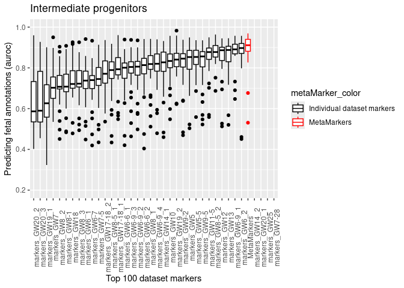
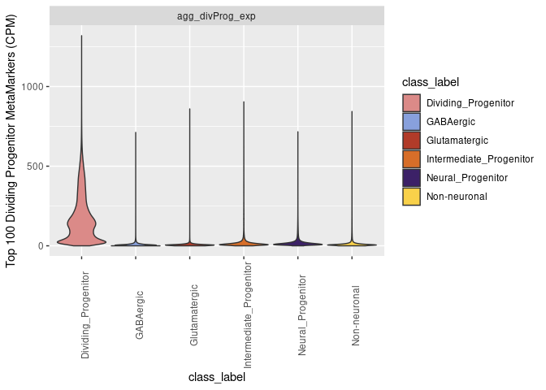

Werner and Gillis 2024 figure plots and code
================
Jonathan Werner
2024-08-27

This markdown file contains the code for generating all plots for the
publication: Werner and Gillis, Preservation of Co-expression defines
the primary tissue fidelity of human neural organoids, 2024

All data for these plots is provided at
<https://github.com/JonathanMWerner/meta_organoid_analysis/tree/main/data_for_plots>

``` r
library(ggplot2)
library(dplyr)
```

    ## 
    ## Attaching package: 'dplyr'

    ## The following objects are masked from 'package:stats':
    ## 
    ##     filter, lag

    ## The following objects are masked from 'package:base':
    ## 
    ##     intersect, setdiff, setequal, union

``` r
library(viridis)
```

    ## Loading required package: viridisLite

``` r
library(MetBrewer)
```

``` r
class_palette = met.brewer("Archambault", 20)
class_palette
```

<!-- -->

``` r
fetal_class_palette = c('Non-neuronal' = class_palette[20], 'GABAergic' = class_palette[1], 'Glutamatergic' = class_palette[14], 'Neural_Progenitor' = class_palette[4], 
                  'Dividing_Progenitor' = class_palette[10], 'Intermediate_Progenitor' = class_palette[16], 'Microglia/Immune' = class_palette[18],
                  'other' = 'grey')
fetal_class_palette
```

    ##            Non-neuronal               GABAergic           Glutamatergic 
    ##               "#F9D14A"               "#88A0DC"               "#B13B29" 
    ##       Neural_Progenitor     Dividing_Progenitor Intermediate_Progenitor 
    ##               "#3C2167"               "#DB8A88"               "#D76E29" 
    ##        Microglia/Immune                   other 
    ##               "#EDA035"                  "grey"

## Figure 2C

``` r
#The metaMarker_auroc_df dataframe
load(file = 'data_for_plots/cross_dataset_auroc_class_results_metaMarker_all_fetal.Rdata')

#metaMarker_auroc_df$num_markers = as.character(metaMarker_auroc_df$num_markers )
metaMarker_auroc_df$num_markers = factor(metaMarker_auroc_df$num_markers, levels = c('10','20','50','100','250','500') )
metaMarker_auroc_df$celltype = factor(metaMarker_auroc_df$celltype, levels = c('Dividing_Progenitor','Neural_Progenitor','Intermediate_Progenitor',
                                                                               'GABAergic','Glutamatergic','Non-neuronal', 'Microglia/Immune'))


ggplot(filter(metaMarker_auroc_df, celltype != 'Microglia/Immune'), aes(x = num_markers, y = auroc, fill = num_markers)) + geom_boxplot() + facet_wrap(~celltype) +
  ylim(.5, 1) + scale_fill_manual(values = magma(6)) + geom_hline( yintercept = .5, color = 'red', linetype = 'dashed') +
  xlab('Number of Primary tissue MetaMarkers') + ylab('Predicting Primary tissue cell-types (AUROC)')
```

    ## Warning: Removed 27 rows containing non-finite outside the scale range
    ## (`stat_boxplot()`).

<!-- -->

## Supp. Fig. 1A

``` r
#contains nProg_fetal_1v1_mat, divProg_fetal_1v1_mat, intProg_fetal_1v1_mat, gaba_fetal_1v1_mat, glut_fetal_1v1_mat, nonN_fetal_1v1_mat
load(file = 'data_for_plots/cell_type_1v1_mats.Rdata')

#Adding the metaMarker scores to each matrix

metaMarker_100_scores_nProg = filter(metaMarker_auroc_df, num_markers == 100, celltype == 'Neural_Progenitor')
metaMarker_100_scores_divProg = filter(metaMarker_auroc_df, num_markers == 100, celltype == 'Dividing_Progenitor')
metaMarker_100_scores_intProg = filter(metaMarker_auroc_df, num_markers == 100, celltype == 'Intermediate_Progenitor')
metaMarker_100_scores_gaba = filter(metaMarker_auroc_df, num_markers == 100, celltype == 'GABAergic')
metaMarker_100_scores_glut = filter(metaMarker_auroc_df, num_markers == 100, celltype == 'Glutamatergic')
metaMarker_100_scores_nonN = filter(metaMarker_auroc_df, num_markers == 100, celltype == 'Non-neuronal')

age_order = c('linnarsson_GW5' ,'linnarsson_GW5_point_5' ,'linnarsson_GW6_1' ,'linnarsson_GW6_2' ,'linnarsson_GW6_point_6_1' ,'linnarsson_GW6_point_6_2' ,'linnarsson_GW6_point_7',
    'linnarsson_GW6_point_9_1','linnarsson_GW6_point_9_2' ,'linnarsson_GW6_point_9_3' ,'linnarsson_GW6_point_9_4' , 'linnarsson_GW7' ,'linnarsson_GW7_point_5' ,'linnarsson_GW8_1' ,
    'linnarsson_GW8_2' ,'linnarsson_GW8_3' ,'linnarsson_GW8_point_1' ,'linnarsson_GW8_point_5_1' ,'linnarsson_GW8_point_5_2' ,'linnarsson_GW9_point_2','linnarsson_GW9_point_5',
    'linnarsson_GW10' ,'linnarsson_GW11_point_5' ,'linnarsson_GW12' ,'linnarsson_GW13','linnarsson_GW14' ,'areal_GW14' ,'poliodakis_1' ,'poliodakis_2','areal_GW18_2' ,'areal_GW19',
    'areal_GW19_2' , 'areal_GW20', 'areal_GW20_31' ,'areal_GW20_34','areal_GW25','fan_fu')

nProg_fetal_1v1_mat = cbind(nProg_fetal_1v1_mat, 
                            'MetaMarkers' = metaMarker_100_scores_nProg[match(age_order,metaMarker_100_scores_nProg$dataset), 'auroc' ])
divProg_fetal_1v1_mat = cbind(divProg_fetal_1v1_mat, 
                            'MetaMarkers' = metaMarker_100_scores_divProg[match(age_order,metaMarker_100_scores_divProg$dataset), 'auroc' ])
intProg_fetal_1v1_mat = cbind(intProg_fetal_1v1_mat, 
                            'MetaMarkers' = metaMarker_100_scores_intProg[match(age_order,metaMarker_100_scores_intProg$dataset), 'auroc' ])
gaba_fetal_1v1_mat = cbind(gaba_fetal_1v1_mat, 
                            'MetaMarkers' = metaMarker_100_scores_gaba[match(age_order,metaMarker_100_scores_gaba$dataset), 'auroc' ])
glut_fetal_1v1_mat = cbind(glut_fetal_1v1_mat, 
                            'MetaMarkers' = metaMarker_100_scores_glut[match(age_order,metaMarker_100_scores_glut$dataset), 'auroc' ])
nonN_fetal_1v1_mat = cbind(nonN_fetal_1v1_mat, 
                            'MetaMarkers' = metaMarker_100_scores_nonN[match(age_order,metaMarker_100_scores_nonN$dataset), 'auroc' ])

#Neural progenitors
#Order by median performance for that datasets markers
nProg_fetal_1v1_melt = reshape2::melt(nProg_fetal_1v1_mat)
nProg_order = nProg_fetal_1v1_melt %>% group_by(Var2) %>% summarize(median = median(value, na.rm = T)) %>% arrange(median)
nProg_fetal_1v1_melt$Var2 = factor(nProg_fetal_1v1_melt$Var2, levels = nProg_order$Var2)
#add a color vector to have the MetaMarkers stand out
metaMarker_color = rep('Individual dataset markers', length = nrow(nProg_fetal_1v1_melt))
metaMarker_color[nProg_fetal_1v1_melt$Var2=='MetaMarkers'] = 'MetaMarkers'
ggplot(nProg_fetal_1v1_melt, aes( x = Var2, y = value, color = metaMarker_color)) + geom_boxplot() + ylim(.2, 1) +
  xlab('Top 100 dataset markers') + ylab('Predicting fetal annotations (auroc)') + ggtitle('Neural progenitors') +
  scale_color_manual(values = c('Individual dataset markers' = 'black', 'MetaMarkers' = 'red')) +
  theme(axis.text.x = element_text(angle = 90))
```

<!-- -->

``` r
#Dividing progenitors
#Order by median performance for that datasets markers
divProg_fetal_1v1_melt = reshape2::melt(divProg_fetal_1v1_mat)
divProg_order = divProg_fetal_1v1_melt %>% group_by(Var2) %>% summarize(median = median(value, na.rm = T)) %>% arrange(median)
divProg_fetal_1v1_melt$Var2 = factor(divProg_fetal_1v1_melt$Var2, levels = divProg_order$Var2)
#add a color vector to have the MetaMarkers stand out
metaMarker_color = rep('Individual dataset markers', length = nrow(divProg_fetal_1v1_melt))
metaMarker_color[divProg_fetal_1v1_melt$Var2=='MetaMarkers'] = 'MetaMarkers'
ggplot(divProg_fetal_1v1_melt, aes( x = Var2, y = value, color = metaMarker_color)) + geom_boxplot() + ylim(.2, 1) +
  xlab('Top 100 dataset markers') + ylab('Predicting fetal annotations (auroc)') + ggtitle('Dividing progenitors') +
  scale_color_manual(values = c('Individual dataset markers' = 'black', 'MetaMarkers' = 'red')) +
  theme(axis.text.x = element_text(angle = 90))
```

<!-- -->

``` r
#Intermediate progenitors
#Order by median performance for that datasets markers
intProg_fetal_1v1_melt = reshape2::melt(intProg_fetal_1v1_mat)
intProg_order = intProg_fetal_1v1_melt %>% group_by(Var2) %>% summarize(median = median(value, na.rm = T)) %>% arrange(median)
intProg_fetal_1v1_melt$Var2 = factor(intProg_fetal_1v1_melt$Var2, levels = intProg_order$Var2)
#add a color vector to have the MetaMarkers stand out
metaMarker_color = rep('Individual dataset markers', length = nrow(intProg_fetal_1v1_melt))
metaMarker_color[intProg_fetal_1v1_melt$Var2=='MetaMarkers'] = 'MetaMarkers'
ggplot(intProg_fetal_1v1_melt, aes( x = Var2, y = value, color = metaMarker_color)) + geom_boxplot() + ylim(.2, 1) +
  xlab('Top 100 dataset markers') + ylab('Predicting fetal annotations (auroc)') + ggtitle('Intermediate progenitors') +
  scale_color_manual(values = c('Individual dataset markers' = 'black', 'MetaMarkers' = 'red')) +
  theme(axis.text.x = element_text(angle = 90))
```

    ## Warning: Removed 284 rows containing non-finite outside the scale range
    ## (`stat_boxplot()`).

<!-- -->

``` r
#GABAergic
#Order by median performance for that datasets markers
gaba_fetal_1v1_melt = reshape2::melt(gaba_fetal_1v1_mat)
gaba_order = gaba_fetal_1v1_melt %>% group_by(Var2) %>% summarize(median = median(value, na.rm = T)) %>% arrange(median)
gaba_fetal_1v1_melt$Var2 = factor(gaba_fetal_1v1_melt$Var2, levels = gaba_order$Var2)
#add a color vector to have the MetaMarkers stand out
metaMarker_color = rep('Individual dataset markers', length = nrow(gaba_fetal_1v1_melt))
metaMarker_color[gaba_fetal_1v1_melt$Var2=='MetaMarkers'] = 'MetaMarkers'
ggplot(gaba_fetal_1v1_melt, aes( x = Var2, y = value, color = metaMarker_color)) + geom_boxplot() + ylim(.2, 1) +
  xlab('Top 100 dataset markers') + ylab('Predicting fetal annotations (auroc)') + ggtitle('GABAergic neurons') +
  scale_color_manual(values = c('Individual dataset markers' = 'black', 'MetaMarkers' = 'red')) +
  theme(axis.text.x = element_text(angle = 90))
```

<!-- -->

``` r
#Glutamatergic
#Order by median performance for that datasets markers
glut_fetal_1v1_melt = reshape2::melt(glut_fetal_1v1_mat)
glut_order = glut_fetal_1v1_melt %>% group_by(Var2) %>% summarize(median = median(value, na.rm = T)) %>% arrange(median)
glut_fetal_1v1_melt$Var2 = factor(glut_fetal_1v1_melt$Var2, levels = glut_order$Var2)
#add a color vector to have the MetaMarkers stand out
metaMarker_color = rep('Individual dataset markers', length = nrow(glut_fetal_1v1_melt))
metaMarker_color[glut_fetal_1v1_melt$Var2=='MetaMarkers'] = 'MetaMarkers'
ggplot(glut_fetal_1v1_melt, aes( x = Var2, y = value, color = metaMarker_color)) + geom_boxplot() + ylim(.2, 1) +
  xlab('Top 100 dataset markers') + ylab('Predicting fetal annotations (auroc)') + ggtitle('Glutamatergic neurons') +
  scale_color_manual(values = c('Individual dataset markers' = 'black', 'MetaMarkers' = 'red')) +
  theme(axis.text.x = element_text(angle = 90))
```

<!-- -->

``` r
#Non-neuronal
#Order by median performance for that datasets markers
nonN_fetal_1v1_melt = reshape2::melt(nonN_fetal_1v1_mat)
nonN_order = nonN_fetal_1v1_melt %>% group_by(Var2) %>% summarize(median = median(value, na.rm = T)) %>% arrange(median)
nonN_fetal_1v1_melt$Var2 = factor(nonN_fetal_1v1_melt$Var2, levels = nonN_order$Var2)
#add a color vector to have the MetaMarkers stand out
metaMarker_color = rep('Individual dataset markers', length = nrow(nonN_fetal_1v1_melt))
metaMarker_color[nonN_fetal_1v1_melt$Var2=='MetaMarkers'] = 'MetaMarkers'
ggplot(nonN_fetal_1v1_melt, aes( x = Var2, y = value, color = metaMarker_color)) + geom_boxplot() + ylim(.2, 1) +
  xlab('Top 100 dataset markers') + ylab('Predicting fetal annotations (auroc)') + ggtitle('Non-neuronal') +
  scale_color_manual(values = c('Individual dataset markers' = 'black', 'MetaMarkers' = 'red')) +
  theme(axis.text.x = element_text(angle = 90))
```

<!-- -->

## Figure 2D

``` r
#Summarize with the ranks per cell-type of each dataset's markers and the MetaMarkers
nProg_order$rank = c(1:nrow(nProg_order))
intProg_order$rank = c(1:nrow(intProg_order))
gaba_order$rank = c(1:nrow(gaba_order))
glut_order$rank = c(1:nrow(glut_order))
nonN_order$rank = c(1:nrow(nonN_order))

rank_marker_df = rbind(nProg_order,intProg_order, gaba_order, glut_order, nonN_order )

rank_order_df = rank_marker_df %>% group_by(Var2) %>% summarize(median = median(rank)) %>% arrange(median)
rank_marker_df$Var2 = factor(rank_marker_df$Var2, levels = rank_order_df$Var2)

meta_marker_color = rep('Individual dataset markers', length = nrow(rank_marker_df))
meta_marker_color[rank_marker_df$Var2=='MetaMarkers'] = 'MetaMarkers'

rank_marker_df$color_vec = meta_marker_color

ggplot(rank_marker_df, aes(x = Var2, y = rank, color = color_vec)) + geom_boxplot() +
  scale_color_manual(values = c('Individual dataset markers' = 'black', 'MetaMarkers' = 'red')) +
  ylab('Ranked auroc performance over all cell-types') +
  theme(axis.text.x = element_text(angle = 90))
```

<!-- -->

## Supp. Fig. 1B

``` r
#contains agg_exp_df
load(file = 'data_for_plots/cross_dataset_aggregated_exp_metaMarker_all_fetal.Rdata')


dataset_color_vec = c('Fetal dataset 1' = 'grey','Fetal dataset 2' = 'grey','Fetal dataset 3' = 'grey','Fetal dataset 4' = 'grey','Fetal dataset 5' = 'grey',
                      'Fetal dataset 6' = 'grey','Fetal dataset 7' = 'grey','Fetal dataset 8' = 'grey','Fetal dataset 9' = 'grey','Fetal dataset 10' = 'grey', 
                      'Fetal dataset 11' = 'grey', 'Fetal dataset 12' = 'grey','Fetal dataset 13' = 'grey','Fetal dataset 14' = 'grey','Fetal dataset 15' = 'grey',
                      'Fetal dataset 16' = 'grey','Fetal dataset 17' = 'grey','Fetal dataset 18' = 'grey','Fetal dataset 19' = 'grey','Fetal dataset 20' = 'grey','Fetal dataset 21' = 'grey',
                      'Fetal dataset 22' = 'grey','Fetal dataset 23' = 'grey','Fetal dataset 24' = 'grey','Fetal dataset 25' = 'grey','Fetal dataset 26' = 'grey','Fetal dataset 27' = 'grey',
                      'Fetal dataset 28' = 'grey','Fetal dataset 29' = 'grey','Fetal dataset 30' = 'grey','Fetal dataset 31' = 'grey','Fetal dataset 32' = 'grey','Fetal dataset 33' = 'grey',
                      'Fetal dataset 34' = 'grey','Fetal dataset 35' = 'grey','Fetal dataset 36' = 'grey','Fetal dataset 37' = 'grey')


gaba_order = filter(agg_exp_df, metaMarker_set == 'agg_gaba_exp' & class_label == 'GABAergic') %>% group_by(dataset) %>% 
  summarize(mean_exp = mean(agg_exp)) %>% arrange(mean_exp)

just_gaba_agg_df = filter(agg_exp_df, !class_label %in% c('other', 'Microglia/Immune') & metaMarker_set == 'agg_gaba_exp')
just_gaba_agg_df$dataset = factor(just_gaba_agg_df$dataset, levels = gaba_order$dataset)

ggplot(just_gaba_agg_df, aes(x = class_label, y = agg_exp, color = dataset, fill = class_label)) + 
  geom_violin(scale = 'width') + facet_wrap(~metaMarker_set) +
  scale_color_manual(values = dataset_color_vec, guide = 'none') + scale_fill_manual(values = fetal_class_palette) +
  ylab('Top 100 GABAergic MetaMarkers (CPM)') +
  theme(axis.text.x = element_text(angle = 90))
```

<!-- -->

``` r
glut_order = filter(agg_exp_df, metaMarker_set == 'agg_glut_exp' & class_label == 'Glutamatergic') %>% group_by(dataset) %>% 
  summarize(mean_exp = mean(agg_exp)) %>% arrange(mean_exp)

just_glut_agg_df = filter(agg_exp_df, !class_label %in% c('other', 'Microglia/Immune') & metaMarker_set == 'agg_glut_exp')
just_glut_agg_df$dataset = factor(just_glut_agg_df$dataset, levels = glut_order$dataset)

ggplot(just_glut_agg_df, aes(x = class_label, y = agg_exp, color = dataset, fill = class_label)) + 
  geom_violin(scale = 'width') + facet_wrap(~metaMarker_set) +
  scale_color_manual(values = dataset_color_vec, guide = 'none') + scale_fill_manual(values = fetal_class_palette) +
  ylab('Top 100 Glutamatergic MetaMarkers (CPM)') +
  theme(axis.text.x = element_text(angle = 90))
```

<!-- -->

``` r
nonN_order = filter(agg_exp_df, metaMarker_set == 'agg_nonN_exp' & class_label == 'Non-neuronal') %>% group_by(dataset) %>% 
  summarize(mean_exp = mean(agg_exp)) %>% arrange(mean_exp)

just_nonN_agg_df = filter(agg_exp_df, !class_label %in% c('other', 'Microglia/Immune') & metaMarker_set == 'agg_nonN_exp')
just_nonN_agg_df$dataset = factor(just_nonN_agg_df$dataset, levels = nonN_order$dataset)

ggplot(just_nonN_agg_df, aes(x = class_label, y = agg_exp, color = dataset, fill = class_label)) + 
  geom_violin(scale = 'width') + facet_wrap(~metaMarker_set) +
  scale_color_manual(values = dataset_color_vec, guide = 'none') + scale_fill_manual(values = fetal_class_palette) +
  ylab('Top 100 Non-neuronal MetaMarkers (CPM)') +
  theme(axis.text.x = element_text(angle = 90))
```

<!-- -->

``` r
nProg_order = filter(agg_exp_df, metaMarker_set == 'agg_nProg_exp' & class_label == 'Neural_Progenitor') %>% group_by(dataset) %>% 
  summarize(mean_exp = mean(agg_exp)) %>% arrange(mean_exp)

just_nProg_agg_df = filter(agg_exp_df,!class_label %in% c('other', 'Microglia/Immune') & metaMarker_set == 'agg_nProg_exp')
just_nProg_agg_df$dataset = factor(just_nProg_agg_df$dataset, levels = nProg_order$dataset)

ggplot(just_nProg_agg_df, aes(x = class_label, y = agg_exp, color = dataset, fill = class_label)) + 
  geom_violin(scale = 'width') + facet_wrap(~metaMarker_set) +
  scale_color_manual(values = dataset_color_vec, guide = 'none') + scale_fill_manual(values = fetal_class_palette) +
  ylab('Top 100 Neural Progenitors MetaMarkers (CPM)') +
  theme(axis.text.x = element_text(angle = 90))
```

<!-- -->

``` r
intProg_order = filter(agg_exp_df, metaMarker_set == 'agg_intProg_exp' & class_label == 'Intermediate_Progenitor') %>% 
  group_by(dataset) %>% 
  summarize(mean_exp = mean(agg_exp)) %>% arrange(mean_exp)

just_intProg_agg_df = filter(agg_exp_df, !class_label %in% c('other', 'Microglia/Immune') & metaMarker_set == 'agg_intProg_exp')
just_intProg_agg_df$dataset = factor(just_intProg_agg_df$dataset, levels = intProg_order$dataset)

ggplot(just_intProg_agg_df, aes(x = class_label, y = agg_exp, color = dataset, fill = class_label)) + 
  geom_violin(scale = 'width') + facet_wrap(~metaMarker_set) +
  scale_color_manual(values = dataset_color_vec, guide = 'none') + scale_fill_manual(values = fetal_class_palette) +
  ylab('Top 100 Intermediate Progenitors MetaMarkers (CPM)') +
  theme(axis.text.x = element_text(angle = 90))
```

<!-- -->

``` r
divProg_order = filter(agg_exp_df, metaMarker_set == 'agg_divProg_exp' & class_label == 'Dividing_Progenitor') %>% 
  group_by(dataset) %>% 
  summarize(mean_exp = mean(agg_exp)) %>% arrange(mean_exp)

just_divProg_agg_df = filter(agg_exp_df, !class_label %in% c('other', 'Microglia/Immune') & metaMarker_set == 'agg_divProg_exp')
just_divProg_agg_df$dataset = factor(just_divProg_agg_df$dataset, levels = divProg_order$dataset)

ggplot(just_divProg_agg_df, aes(x = class_label, y = agg_exp, color = dataset, fill = class_label)) + 
  geom_violin(scale = 'width') + facet_wrap(~metaMarker_set) +
  scale_color_manual(values = dataset_color_vec, guide = 'none') + scale_fill_manual(values = fetal_class_palette) +
  ylab('Top 100 Dividing Progenitors MetaMarkers (CPM)') +
  theme(axis.text.x = element_text(angle = 90))
```

<!-- -->

## Figure 2E

``` r
just_glut_agg_df = filter(agg_exp_df, !class_label %in% c('other', 'Microglia/Immune')& metaMarker_set == 'agg_glut_exp')
ggplot(just_glut_agg_df, aes(x = class_label, y = agg_exp, fill = class_label)) + 
  geom_violin(scale = 'width') + facet_wrap(~metaMarker_set) +
  scale_fill_manual(values = fetal_class_palette) +
  ylab('Top 100 Glutamatergic MetaMarkers (CPM)') +
  theme(axis.text.x = element_text(angle = 90))
```

<!-- -->

``` r
just_gaba_agg_df = filter(agg_exp_df, !class_label %in% c('other', 'Microglia/Immune') & metaMarker_set == 'agg_gaba_exp')
ggplot(just_gaba_agg_df, aes(x = class_label, y = agg_exp, fill = class_label)) + 
  geom_violin(scale = 'width') + facet_wrap(~metaMarker_set) +
  scale_fill_manual(values = fetal_class_palette) +
  ylab('Top 100 GABAergic MetaMarkers (CPM)') +
  theme(axis.text.x = element_text(angle = 90))
```

<!-- -->

``` r
just_nonN_agg_df = filter(agg_exp_df, !class_label %in% c('other', 'Microglia/Immune') & metaMarker_set == 'agg_nonN_exp')
ggplot(just_nonN_agg_df, aes(x = class_label, y = agg_exp, fill = class_label)) + 
  geom_violin(scale = 'width') + facet_wrap(~metaMarker_set) +
  scale_fill_manual(values = fetal_class_palette) +
  ylab('Top 100 Non-neuronal MetaMarkers (CPM)') +
  theme(axis.text.x = element_text(angle = 90))
```

<!-- -->

``` r
just_intProg_agg_df = filter(agg_exp_df, !class_label %in% c('other', 'Microglia/Immune') & metaMarker_set == 'agg_intProg_exp')
ggplot(just_intProg_agg_df, aes(x = class_label, y = agg_exp, fill = class_label)) + 
  geom_violin(scale = 'width') + facet_wrap(~metaMarker_set) +
  scale_fill_manual(values = fetal_class_palette) +
  ylab('Top 100 Intermediate Progenitor MetaMarkers (CPM)') +
  theme(axis.text.x = element_text(angle = 90))
```

<!-- -->

``` r
just_divProg_agg_df = filter(agg_exp_df, !class_label %in% c('other', 'Microglia/Immune') & metaMarker_set == 'agg_divProg_exp')
ggplot(just_divProg_agg_df, aes(x = class_label, y = agg_exp, fill = class_label)) + 
  geom_violin(scale = 'width') + facet_wrap(~metaMarker_set) +
  scale_fill_manual(values = fetal_class_palette) +
  ylab('Top 100 Dividing Progenitor MetaMarkers (CPM)') +
  theme(axis.text.x = element_text(angle = 90))
```

<!-- -->

``` r
just_nProg_agg_df = filter(agg_exp_df,!class_label %in% c('other', 'Microglia/Immune') & metaMarker_set == 'agg_nProg_exp')
ggplot(just_nProg_agg_df, aes(x = class_label, y = agg_exp, fill = class_label)) + 
  geom_violin(scale = 'width') + facet_wrap(~metaMarker_set) +
  scale_fill_manual(values = fetal_class_palette) +
  ylab('Top 100 Neural Progenitor MetaMarkers (CPM)') +
  theme(axis.text.x = element_text(angle = 90))
```

<!-- -->

## Figure 3B

Need to shave back the size of the co-expression networks, don’t need
the full 3.5Gb files for the plots

## Figure 3D

``` r
#EGAD scores for all the individual datasets
load('data_for_plots/organoid_egad_results_ranked_6_26_24.Rdata')
load('data_for_plots/fetal_egad_results_ranked_6_26_24.Rdata')
load('data_for_plots/unannot_fetal_egad_results_ranked_6_26_24.Rdata')
#EGAD score for the aggregate networks
load('data_for_plots/ranked_agg_organoid_egad_results_6_26_24.Rdata')
load('data_for_plots/ranked_agg_fetal_egad_results_6_26_24.Rdata')
load('data_for_plots/ranked_agg_unannot_fetal_egad_results_6_26_24.Rdata')


#Prepping the individual network results
avg_go_auc_organoids = filter(organoid_egad_results, !grepl('markers', goterms) & variable == 'auc') %>% group_by(dataset) %>% summarise(value = mean(value, na.rm = T))
avg_go_auc_organoids$goterms = rep('avg_goterm_auc',  nrow(avg_go_auc_organoids))
avg_go_auc_organoids$sample_label = rep('organoid',  nrow(avg_go_auc_organoids))

avg_go_auc_fetal = filter(fetal_egad_results, !grepl('markers', goterms) & variable == 'auc') %>% group_by(dataset) %>% summarise(value = mean(value, na.rm = T))
avg_go_auc_fetal$goterms = rep('avg_goterm_auc',  nrow(avg_go_auc_fetal))
avg_go_auc_fetal$sample_label = rep('fetal',  nrow(avg_go_auc_fetal))

avg_go_auc_unannot_fetal = filter(unannot_fetal_egad_results, !grepl('markers', goterms) & variable == 'auc') %>% group_by(dataset) %>% summarise(value = mean(value, na.rm = T))
avg_go_auc_unannot_fetal$goterms = rep('avg_goterm_auc',  nrow(avg_go_auc_unannot_fetal))
avg_go_auc_unannot_fetal$sample_label = rep('unannot_fetal',  nrow(avg_go_auc_unannot_fetal))

avg_go_all_datasets = rbind(avg_go_auc_organoids, avg_go_auc_fetal, avg_go_auc_unannot_fetal)
avg_go_all_datasets$goterms = factor(avg_go_all_datasets$goterms, levels = c('avg_goterm_auc','intProg_markers','gaba_markers',
                                                                                     'glut_markers','nProg_markers','divProg_markers', 'nonN_markers'))

#All the marker set scores per dataset
marker_set_organoid_egad_scores = filter(organoid_egad_results, grepl('markers', goterms) & variable == 'auc' & goterms != 'micro_markers')
marker_set_organoid_egad_scores$sample_label = rep('organoid', nrow(marker_set_organoid_egad_scores))

marker_set_fetal_egad_scores = filter(fetal_egad_results, grepl('markers', goterms) & variable == 'auc'& goterms != 'micro_markers')
marker_set_fetal_egad_scores$sample_label = rep('fetal', nrow(marker_set_fetal_egad_scores))

marker_set_unannot_fetal_egad_scores = filter(unannot_fetal_egad_results, grepl('markers', goterms) & variable == 'auc'& goterms != 'micro_markers')
marker_set_unannot_fetal_egad_scores$sample_label = rep('unannot_fetal', nrow(marker_set_unannot_fetal_egad_scores))

marker_set_all_datasets = rbind(marker_set_organoid_egad_scores, marker_set_fetal_egad_scores, marker_set_unannot_fetal_egad_scores)
marker_set_all_datasets$goterms = factor(marker_set_all_datasets$goterms, levels = c('avg_goterm_auc','intProg_markers','gaba_markers',
                                                                                     'glut_markers','nProg_markers','divProg_markers', 'nonN_markers'))
#Drop the variable column
marker_set_all_datasets = marker_set_all_datasets %>% mutate(variable = NULL)

#Merge the two to plot
comb_df = rbind(avg_go_all_datasets,marker_set_all_datasets)
comb_df$sample_label = factor(comb_df$sample_label, levels = c('fetal','unannot_fetal','organoid'))


#Prepping the aggregate network results
organoid_ranked_agg_network_egad_results = as.data.frame(organoid_ranked_agg_network_egad_results)
org_goterm_avg = colMeans(filter(organoid_ranked_agg_network_egad_results, !grepl('marker', rownames(organoid_ranked_agg_network_egad_results)) ), na.rm = T)

fetal_ranked_agg_network_egad_results = as.data.frame(fetal_ranked_agg_network_egad_results)
fetal_goterm_avg = colMeans(filter(fetal_ranked_agg_network_egad_results, !grepl('marker', rownames(fetal_ranked_agg_network_egad_results)) ), na.rm = T)

unannot_fetal_ranked_agg_network_egad_results = as.data.frame(unannot_fetal_ranked_agg_network_egad_results)
unannot_fetal_goterm_avg = colMeans(filter(unannot_fetal_ranked_agg_network_egad_results, !grepl('marker', rownames(unannot_fetal_ranked_agg_network_egad_results)) ), na.rm = T)


org_marker_set = filter(organoid_ranked_agg_network_egad_results, grepl('marker', rownames(organoid_ranked_agg_network_egad_results)) & !grepl('micro', rownames(organoid_ranked_agg_network_egad_results))  )
fetal_marker_set = filter(fetal_ranked_agg_network_egad_results, grepl('marker', rownames(fetal_ranked_agg_network_egad_results)) & !grepl('micro', rownames(fetal_ranked_agg_network_egad_results))  )
unannot_fetal_marker_set = filter(unannot_fetal_ranked_agg_network_egad_results, 
                                  grepl('marker', rownames(unannot_fetal_ranked_agg_network_egad_results)) & !grepl('micro', rownames(unannot_fetal_ranked_agg_network_egad_results))  )

agg_network_auc = data.frame(goterms = rep(c('avg_goterm_auc','gaba_markers','glut_markers','nonN_markers','nProg_markers','intProg_markers','divProg_markers'), 3), 
                             sample_label = c(rep('organoid', 7), rep('fetal', 7), rep('unannot_fetal', 7)), 
                             value = rep(NA, 21))

agg_network_auc$value[agg_network_auc$goterms == 'avg_goterm_auc' & agg_network_auc$sample_label == 'organoid' ] = org_goterm_avg['auc'] 
agg_network_auc$value[agg_network_auc$goterms == 'avg_goterm_auc' & agg_network_auc$sample_label == 'fetal' ] = fetal_goterm_avg['auc'] 
agg_network_auc$value[agg_network_auc$goterms == 'avg_goterm_auc' & agg_network_auc$sample_label == 'unannot_fetal' ] = unannot_fetal_goterm_avg['auc'] 
agg_network_auc$value[grepl('markers',agg_network_auc$goterms)  & agg_network_auc$sample_label == 'organoid' ] = org_marker_set[ ,'auc']
agg_network_auc$value[grepl('markers',agg_network_auc$goterms)  & agg_network_auc$sample_label == 'fetal' ] = fetal_marker_set[ ,'auc']
agg_network_auc$value[grepl('markers',agg_network_auc$goterms)  & agg_network_auc$sample_label == 'unannot_fetal' ] = unannot_fetal_marker_set[ ,'auc']

agg_network_auc$goterms = factor(agg_network_auc$goterms, levels = c('avg_goterm_auc','intProg_markers','gaba_markers',
                                                                                     'glut_markers','nProg_markers','divProg_markers', 'nonN_markers'))
agg_network_auc$sample_label = factor(agg_network_auc$sample_label, levels = c('fetal','unannot_fetal','organoid'))


egad_marker_palette = c('avg_goterm_auc' = 'grey50',
                        'intProg_markers' = class_palette[16],
                        'gaba_markers' = class_palette[1], 
                        'nonN_markers' = class_palette[20],
                        'glut_markers' = class_palette[14],
                        'nProg_markers' = class_palette[4],
                        'divProg_markers' = class_palette[10])

sample_palette = c('fetal'='black', 'unannot_fetal'='grey', 'organoid'='white')
alpha_values= c('fetal'=1, 'unannot_fetal'=1, 'organoid'=.6)

shape_values = c('fetal' = 23, 'unannot_fetal' = 24,'organoid' = 22  )
position_values = c( 'fetal' = position_nudge(x = -0.2), 'unannot_fetal' = position_nudge(x = -0.2),'organoid' = position_nudge(x = 0.2))  


ggplot(comb_df, aes(x = goterms, y = value, fill = goterms, color = sample_label, alpha = sample_label )) + geom_boxplot() +
  geom_hline(yintercept = .5, linetype = 'dashed', color = 'red') +
  geom_point(data = agg_network_auc, aes(x = goterms, y = value, shape = sample_label), 
             size = 2.5, color = 'black', show.legend = F, position = position_dodge(width = .75), alpha = 1) +
  ylim(.4 ,1) + ylab('EGAD auroc') +
  scale_fill_manual(values = egad_marker_palette) + scale_color_manual(values = sample_palette) + 
  scale_alpha_manual(values = alpha_values, guide = 'none') + scale_shape_manual(values = shape_values) +
  scale_x_discrete(guide = guide_axis(n.dodge=2))
```

    ## Warning: Removed 7 rows containing non-finite outside the scale range
    ## (`stat_boxplot()`).

<!-- -->

## Figure 3E and Supp. Fig. 5B

``` r
#Contains the cross_marker_set_coexp_df
load('data_for_plots/cross_marker_set_coexp_df.Rdata')


shape_values = c('Aggregate organoid' = 22, 'Aggregate unannotated fetal' = 24 )
fill_values = c('Organoid' = 'darkorchid', 'Unannotated Primary tissue' = 'firebrick', 'Primary tissue' = 'darkorange')

ggplot(filter(cross_marker_set_coexp_df, dataset_type != 'Aggregate'), aes(x = celltype_label, y = mean_score, fill = fill_label)) + geom_boxplot(alpha = .5) +
  scale_x_discrete(guide = guide_axis(n.dodge=2)) +
  geom_point(data = filter(cross_marker_set_coexp_df, dataset_type == 'Aggregate'), aes(x = celltype_label, y = mean_score, fill = fill_label, shape = dataset_label), 
             size = 2.5, color = 'black', show.legend = T, position = position_dodge(width = .75), alpha = 1) + 
  scale_shape_manual(values = shape_values) +
  scale_fill_manual(values = fill_values) +
  ylab('Inter-marker set co-expression score')
```

<!-- -->

``` r
ggplot(filter(cross_marker_set_coexp_df, dataset_type != 'Aggregate'), aes(x = celltype_label, y = norm_scores, fill = fill_label)) + geom_boxplot(alpha = .5) +
  scale_x_discrete(guide = guide_axis(n.dodge=2)) +
  geom_point(data = filter(cross_marker_set_coexp_df, dataset_type == 'Aggregate'), aes(x = celltype_label, y = norm_scores, fill = fill_label, shape = dataset_label), 
             size = 2.5, color = 'black', show.legend = T, position = position_dodge(width = .75), alpha = 1) + 
  scale_shape_manual(values = shape_values) +
  scale_fill_manual(values = fill_values) +
  ylab('Inter-marker set co-expression score')
```

<!-- -->
