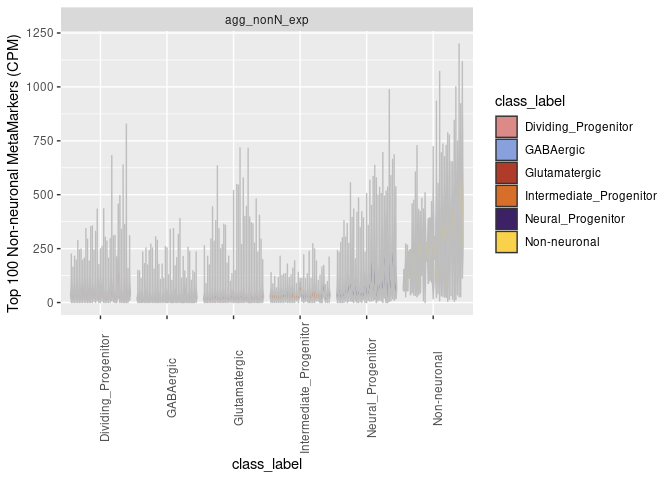
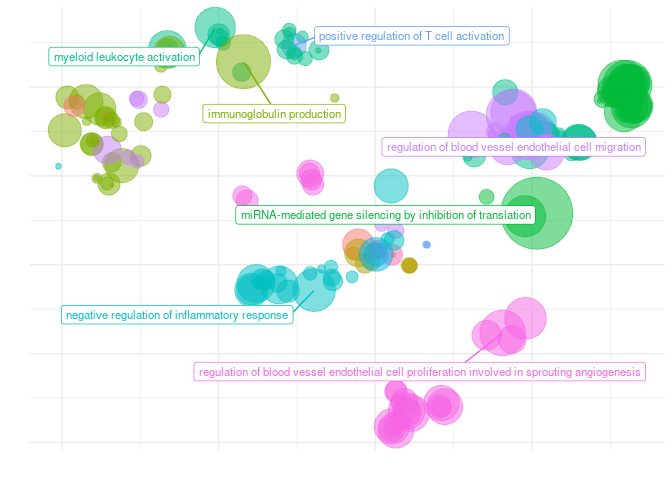
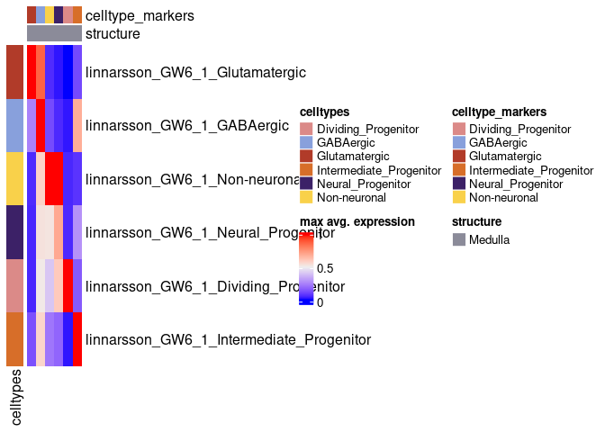
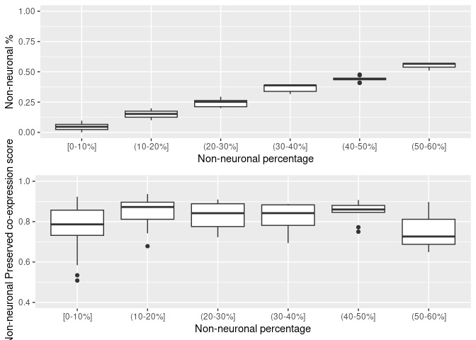
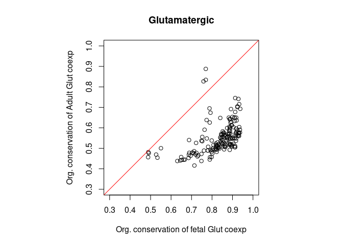
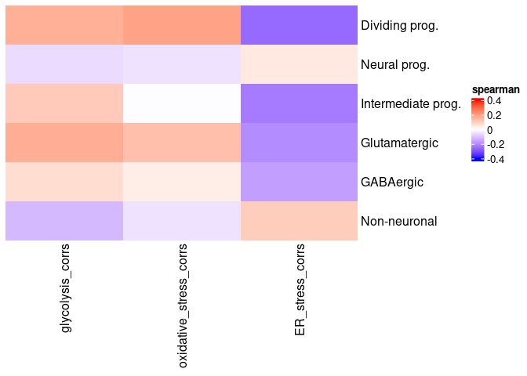

Werner and Gillis 2024 figure plots and code
================
Jonathan Werner
2024-08-27

This markdown file contains the code for generating all plots for the
publication: Werner and Gillis, Preservation of Co-expression defines
the primary tissue fidelity of human neural organoids, 2024

All data for these plots is provided at
<https://github.com/JonathanMWerner/meta_organoid_analysis/tree/main/data_for_plots>

``` r
library(ggplot2)
library(gridExtra)
library(dplyr)
```

    ## 
    ## Attaching package: 'dplyr'

    ## The following object is masked from 'package:gridExtra':
    ## 
    ##     combine

    ## The following objects are masked from 'package:stats':
    ## 
    ##     filter, lag

    ## The following objects are masked from 'package:base':
    ## 
    ##     intersect, setdiff, setequal, union

``` r
library(viridis)
```

    ## Loading required package: viridisLite

``` r
library(MetBrewer)
library(circlize)
```

    ## ========================================
    ## circlize version 0.4.16
    ## CRAN page: https://cran.r-project.org/package=circlize
    ## Github page: https://github.com/jokergoo/circlize
    ## Documentation: https://jokergoo.github.io/circlize_book/book/
    ## 
    ## If you use it in published research, please cite:
    ## Gu, Z. circlize implements and enhances circular visualization
    ##   in R. Bioinformatics 2014.
    ## 
    ## This message can be suppressed by:
    ##   suppressPackageStartupMessages(library(circlize))
    ## ========================================

``` r
library(ComplexHeatmap)
```

    ## Loading required package: grid

    ## ========================================
    ## ComplexHeatmap version 2.20.0
    ## Bioconductor page: http://bioconductor.org/packages/ComplexHeatmap/
    ## Github page: https://github.com/jokergoo/ComplexHeatmap
    ## Documentation: http://jokergoo.github.io/ComplexHeatmap-reference
    ## 
    ## If you use it in published research, please cite either one:
    ## - Gu, Z. Complex Heatmap Visualization. iMeta 2022.
    ## - Gu, Z. Complex heatmaps reveal patterns and correlations in multidimensional 
    ##     genomic data. Bioinformatics 2016.
    ## 
    ## 
    ## The new InteractiveComplexHeatmap package can directly export static 
    ## complex heatmaps into an interactive Shiny app with zero effort. Have a try!
    ## 
    ## This message can be suppressed by:
    ##   suppressPackageStartupMessages(library(ComplexHeatmap))
    ## ========================================

``` r
library(rrvgo)
```

    ## 

``` r
library(MetaMarkers)
```

``` r
class_palette = met.brewer("Archambault", 20)
class_palette
```

<!-- -->

``` r
fetal_class_palette = c('Non-neuronal' = class_palette[20], 'GABAergic' = class_palette[1], 'Glutamatergic' = class_palette[14], 'Neural_Progenitor' = class_palette[4], 
                  'Dividing_Progenitor' = class_palette[10], 'Intermediate_Progenitor' = class_palette[16], 'Microglia/Immune' = class_palette[18],
                  'other' = 'grey')
fetal_class_palette
```

    ##            Non-neuronal               GABAergic           Glutamatergic 
    ##               "#F9D14A"               "#88A0DC"               "#B13B29" 
    ##       Neural_Progenitor     Dividing_Progenitor Intermediate_Progenitor 
    ##               "#3C2167"               "#DB8A88"               "#D76E29" 
    ##        Microglia/Immune                   other 
    ##               "#EDA035"                  "grey"

## Figure 1B

``` r
all_sample_meta = read.csv('data_for_plots/all_data_just_meta_seurat_with_addl_features_v2.csv')


#Get palette for the grouped described protocols
table(all_sample_meta$Protocol.classification.region)
```

    ## 
    ##            directed brainstem           directed cerebellum 
    ##                             1                             1 
    ##       directed choroid plexus             directed cortical 
    ##                             3                            25 
    ##     directed dorsal forebrain directed hypothalamic arcuate 
    ##                            42                            13 
    ##                  directed MGE             directed thalamic 
    ##                             4                             2 
    ##     directed ventral midbrain                iPSC-microglia 
    ##                            27                             1 
    ##                    undirected     undirected neuro-vascular 
    ##                            45                             2 
    ##             vascular organoid       vascularized undirected 
    ##                             1                             6

``` r
sample_region_grouped_palette = met.brewer('Renoir', n = 14)
names(sample_region_grouped_palette) = names(table(all_sample_meta$Protocol.classification.region))


org_samp_df = all_sample_meta %>% count(Protocol.classification.region) %>% arrange(desc(n))
org_samp_df$Protocol.classification= factor(org_samp_df$Protocol.classification, levels = c(org_samp_df$Protocol.classification) )
ggplot(org_samp_df, aes(x = Protocol.classification, y = n, fill = Protocol.classification)) + geom_bar( stat = 'identity') +
  scale_fill_manual(values =sample_region_grouped_palette, name = 'Organoid type') +
  ylab('# of datasets') + xlab('Organoid type') + ggtitle('Human neural organoid scRNA-seq datasets') +
  theme(axis.text.x = element_blank(), axis.ticks.x = element_blank(), 
        legend.key.size = unit(.25, 'cm'))
```

<!-- -->

## Figure 2C

``` r
#The metaMarker_auroc_df dataframe
load(file = 'data_for_plots/cross_dataset_auroc_class_results_metaMarker_all_fetal.Rdata')

#metaMarker_auroc_df$num_markers = as.character(metaMarker_auroc_df$num_markers )
metaMarker_auroc_df$num_markers = factor(metaMarker_auroc_df$num_markers, levels = c('10','20','50','100','250','500') )
metaMarker_auroc_df$celltype = factor(metaMarker_auroc_df$celltype, levels = c('Dividing_Progenitor','Neural_Progenitor','Intermediate_Progenitor',
                                                                               'GABAergic','Glutamatergic','Non-neuronal', 'Microglia/Immune'))


ggplot(filter(metaMarker_auroc_df, celltype != 'Microglia/Immune'), aes(x = num_markers, y = auroc, fill = num_markers)) + geom_boxplot() + facet_wrap(~celltype) +
  ylim(.5, 1) + scale_fill_manual(values = magma(6)) + geom_hline( yintercept = .5, color = 'red', linetype = 'dashed') +
  xlab('Number of Primary tissue MetaMarkers') + ylab('Predicting Primary tissue cell-types (AUROC)')
```

    ## Warning: Removed 27 rows containing non-finite outside the scale range
    ## (`stat_boxplot()`).

<!-- -->

## Supp. Fig. 1A

``` r
#contains nProg_fetal_1v1_mat, divProg_fetal_1v1_mat, intProg_fetal_1v1_mat, gaba_fetal_1v1_mat, glut_fetal_1v1_mat, nonN_fetal_1v1_mat
load(file = 'data_for_plots/cell_type_1v1_mats.Rdata')

#Adding the metaMarker scores to each matrix

metaMarker_100_scores_nProg = filter(metaMarker_auroc_df, num_markers == 100, celltype == 'Neural_Progenitor')
metaMarker_100_scores_divProg = filter(metaMarker_auroc_df, num_markers == 100, celltype == 'Dividing_Progenitor')
metaMarker_100_scores_intProg = filter(metaMarker_auroc_df, num_markers == 100, celltype == 'Intermediate_Progenitor')
metaMarker_100_scores_gaba = filter(metaMarker_auroc_df, num_markers == 100, celltype == 'GABAergic')
metaMarker_100_scores_glut = filter(metaMarker_auroc_df, num_markers == 100, celltype == 'Glutamatergic')
metaMarker_100_scores_nonN = filter(metaMarker_auroc_df, num_markers == 100, celltype == 'Non-neuronal')

age_order = c('linnarsson_GW5' ,'linnarsson_GW5_point_5' ,'linnarsson_GW6_1' ,'linnarsson_GW6_2' ,'linnarsson_GW6_point_6_1' ,'linnarsson_GW6_point_6_2' ,'linnarsson_GW6_point_7',
    'linnarsson_GW6_point_9_1','linnarsson_GW6_point_9_2' ,'linnarsson_GW6_point_9_3' ,'linnarsson_GW6_point_9_4' , 'linnarsson_GW7' ,'linnarsson_GW7_point_5' ,'linnarsson_GW8_1' ,
    'linnarsson_GW8_2' ,'linnarsson_GW8_3' ,'linnarsson_GW8_point_1' ,'linnarsson_GW8_point_5_1' ,'linnarsson_GW8_point_5_2' ,'linnarsson_GW9_point_2','linnarsson_GW9_point_5',
    'linnarsson_GW10' ,'linnarsson_GW11_point_5' ,'linnarsson_GW12' ,'linnarsson_GW13','linnarsson_GW14' ,'areal_GW14' ,'poliodakis_1' ,'poliodakis_2','areal_GW18_2' ,'areal_GW19',
    'areal_GW19_2' , 'areal_GW20', 'areal_GW20_31' ,'areal_GW20_34','areal_GW25','fan_fu')

nProg_fetal_1v1_mat = cbind(nProg_fetal_1v1_mat, 
                            'MetaMarkers' = metaMarker_100_scores_nProg[match(age_order,metaMarker_100_scores_nProg$dataset), 'auroc' ])
divProg_fetal_1v1_mat = cbind(divProg_fetal_1v1_mat, 
                            'MetaMarkers' = metaMarker_100_scores_divProg[match(age_order,metaMarker_100_scores_divProg$dataset), 'auroc' ])
intProg_fetal_1v1_mat = cbind(intProg_fetal_1v1_mat, 
                            'MetaMarkers' = metaMarker_100_scores_intProg[match(age_order,metaMarker_100_scores_intProg$dataset), 'auroc' ])
gaba_fetal_1v1_mat = cbind(gaba_fetal_1v1_mat, 
                            'MetaMarkers' = metaMarker_100_scores_gaba[match(age_order,metaMarker_100_scores_gaba$dataset), 'auroc' ])
glut_fetal_1v1_mat = cbind(glut_fetal_1v1_mat, 
                            'MetaMarkers' = metaMarker_100_scores_glut[match(age_order,metaMarker_100_scores_glut$dataset), 'auroc' ])
nonN_fetal_1v1_mat = cbind(nonN_fetal_1v1_mat, 
                            'MetaMarkers' = metaMarker_100_scores_nonN[match(age_order,metaMarker_100_scores_nonN$dataset), 'auroc' ])

#Neural progenitors
#Order by median performance for that datasets markers
nProg_fetal_1v1_melt = reshape2::melt(nProg_fetal_1v1_mat)
nProg_order = nProg_fetal_1v1_melt %>% group_by(Var2) %>% summarize(median = median(value, na.rm = T)) %>% arrange(median)
nProg_fetal_1v1_melt$Var2 = factor(nProg_fetal_1v1_melt$Var2, levels = nProg_order$Var2)
#add a color vector to have the MetaMarkers stand out
metaMarker_color = rep('Individual dataset markers', length = nrow(nProg_fetal_1v1_melt))
metaMarker_color[nProg_fetal_1v1_melt$Var2=='MetaMarkers'] = 'MetaMarkers'
ggplot(nProg_fetal_1v1_melt, aes( x = Var2, y = value, color = metaMarker_color)) + geom_boxplot() + ylim(.2, 1) +
  xlab('Top 100 dataset markers') + ylab('Predicting fetal annotations (auroc)') + ggtitle('Neural progenitors') +
  scale_color_manual(values = c('Individual dataset markers' = 'black', 'MetaMarkers' = 'red')) +
  theme(axis.text.x = element_text(angle = 90))
```

<!-- -->

``` r
#Dividing progenitors
#Order by median performance for that datasets markers
divProg_fetal_1v1_melt = reshape2::melt(divProg_fetal_1v1_mat)
divProg_order = divProg_fetal_1v1_melt %>% group_by(Var2) %>% summarize(median = median(value, na.rm = T)) %>% arrange(median)
divProg_fetal_1v1_melt$Var2 = factor(divProg_fetal_1v1_melt$Var2, levels = divProg_order$Var2)
#add a color vector to have the MetaMarkers stand out
metaMarker_color = rep('Individual dataset markers', length = nrow(divProg_fetal_1v1_melt))
metaMarker_color[divProg_fetal_1v1_melt$Var2=='MetaMarkers'] = 'MetaMarkers'
ggplot(divProg_fetal_1v1_melt, aes( x = Var2, y = value, color = metaMarker_color)) + geom_boxplot() + ylim(.2, 1) +
  xlab('Top 100 dataset markers') + ylab('Predicting fetal annotations (auroc)') + ggtitle('Dividing progenitors') +
  scale_color_manual(values = c('Individual dataset markers' = 'black', 'MetaMarkers' = 'red')) +
  theme(axis.text.x = element_text(angle = 90))
```

<!-- -->

``` r
#Intermediate progenitors
#Order by median performance for that datasets markers
intProg_fetal_1v1_melt = reshape2::melt(intProg_fetal_1v1_mat)
intProg_order = intProg_fetal_1v1_melt %>% group_by(Var2) %>% summarize(median = median(value, na.rm = T)) %>% arrange(median)
intProg_fetal_1v1_melt$Var2 = factor(intProg_fetal_1v1_melt$Var2, levels = intProg_order$Var2)
#add a color vector to have the MetaMarkers stand out
metaMarker_color = rep('Individual dataset markers', length = nrow(intProg_fetal_1v1_melt))
metaMarker_color[intProg_fetal_1v1_melt$Var2=='MetaMarkers'] = 'MetaMarkers'
ggplot(intProg_fetal_1v1_melt, aes( x = Var2, y = value, color = metaMarker_color)) + geom_boxplot() + ylim(.2, 1) +
  xlab('Top 100 dataset markers') + ylab('Predicting fetal annotations (auroc)') + ggtitle('Intermediate progenitors') +
  scale_color_manual(values = c('Individual dataset markers' = 'black', 'MetaMarkers' = 'red')) +
  theme(axis.text.x = element_text(angle = 90))
```

    ## Warning: Removed 284 rows containing non-finite outside the scale range
    ## (`stat_boxplot()`).

<!-- -->

``` r
#GABAergic
#Order by median performance for that datasets markers
gaba_fetal_1v1_melt = reshape2::melt(gaba_fetal_1v1_mat)
gaba_order = gaba_fetal_1v1_melt %>% group_by(Var2) %>% summarize(median = median(value, na.rm = T)) %>% arrange(median)
gaba_fetal_1v1_melt$Var2 = factor(gaba_fetal_1v1_melt$Var2, levels = gaba_order$Var2)
#add a color vector to have the MetaMarkers stand out
metaMarker_color = rep('Individual dataset markers', length = nrow(gaba_fetal_1v1_melt))
metaMarker_color[gaba_fetal_1v1_melt$Var2=='MetaMarkers'] = 'MetaMarkers'
ggplot(gaba_fetal_1v1_melt, aes( x = Var2, y = value, color = metaMarker_color)) + geom_boxplot() + ylim(.2, 1) +
  xlab('Top 100 dataset markers') + ylab('Predicting fetal annotations (auroc)') + ggtitle('GABAergic neurons') +
  scale_color_manual(values = c('Individual dataset markers' = 'black', 'MetaMarkers' = 'red')) +
  theme(axis.text.x = element_text(angle = 90))
```

<!-- -->

``` r
#Glutamatergic
#Order by median performance for that datasets markers
glut_fetal_1v1_melt = reshape2::melt(glut_fetal_1v1_mat)
glut_order = glut_fetal_1v1_melt %>% group_by(Var2) %>% summarize(median = median(value, na.rm = T)) %>% arrange(median)
glut_fetal_1v1_melt$Var2 = factor(glut_fetal_1v1_melt$Var2, levels = glut_order$Var2)
#add a color vector to have the MetaMarkers stand out
metaMarker_color = rep('Individual dataset markers', length = nrow(glut_fetal_1v1_melt))
metaMarker_color[glut_fetal_1v1_melt$Var2=='MetaMarkers'] = 'MetaMarkers'
ggplot(glut_fetal_1v1_melt, aes( x = Var2, y = value, color = metaMarker_color)) + geom_boxplot() + ylim(.2, 1) +
  xlab('Top 100 dataset markers') + ylab('Predicting fetal annotations (auroc)') + ggtitle('Glutamatergic neurons') +
  scale_color_manual(values = c('Individual dataset markers' = 'black', 'MetaMarkers' = 'red')) +
  theme(axis.text.x = element_text(angle = 90))
```

<!-- -->

``` r
#Non-neuronal
#Order by median performance for that datasets markers
nonN_fetal_1v1_melt = reshape2::melt(nonN_fetal_1v1_mat)
nonN_order = nonN_fetal_1v1_melt %>% group_by(Var2) %>% summarize(median = median(value, na.rm = T)) %>% arrange(median)
nonN_fetal_1v1_melt$Var2 = factor(nonN_fetal_1v1_melt$Var2, levels = nonN_order$Var2)
#add a color vector to have the MetaMarkers stand out
metaMarker_color = rep('Individual dataset markers', length = nrow(nonN_fetal_1v1_melt))
metaMarker_color[nonN_fetal_1v1_melt$Var2=='MetaMarkers'] = 'MetaMarkers'
ggplot(nonN_fetal_1v1_melt, aes( x = Var2, y = value, color = metaMarker_color)) + geom_boxplot() + ylim(.2, 1) +
  xlab('Top 100 dataset markers') + ylab('Predicting fetal annotations (auroc)') + ggtitle('Non-neuronal') +
  scale_color_manual(values = c('Individual dataset markers' = 'black', 'MetaMarkers' = 'red')) +
  theme(axis.text.x = element_text(angle = 90))
```

<!-- -->

## Figure 2D

``` r
#Summarize with the ranks per cell-type of each dataset's markers and the MetaMarkers
nProg_order$rank = c(1:nrow(nProg_order))
intProg_order$rank = c(1:nrow(intProg_order))
gaba_order$rank = c(1:nrow(gaba_order))
glut_order$rank = c(1:nrow(glut_order))
nonN_order$rank = c(1:nrow(nonN_order))

rank_marker_df = rbind(nProg_order,intProg_order, gaba_order, glut_order, nonN_order )

rank_order_df = rank_marker_df %>% group_by(Var2) %>% summarize(median = median(rank)) %>% arrange(median)
rank_marker_df$Var2 = factor(rank_marker_df$Var2, levels = rank_order_df$Var2)

meta_marker_color = rep('Individual dataset markers', length = nrow(rank_marker_df))
meta_marker_color[rank_marker_df$Var2=='MetaMarkers'] = 'MetaMarkers'

rank_marker_df$color_vec = meta_marker_color

ggplot(rank_marker_df, aes(x = Var2, y = rank, color = color_vec)) + geom_boxplot() +
  scale_color_manual(values = c('Individual dataset markers' = 'black', 'MetaMarkers' = 'red')) +
  ylab('Ranked auroc performance over all cell-types') +
  theme(axis.text.x = element_text(angle = 90))
```

<!-- -->

## Supp. Fig. 1B

``` r
#contains agg_exp_df
#File is too large for github
load(file = 'data_for_plots/cross_dataset_aggregated_exp_metaMarker_all_fetal.Rdata')


dataset_color_vec = c('Fetal dataset 1' = 'grey','Fetal dataset 2' = 'grey','Fetal dataset 3' = 'grey','Fetal dataset 4' = 'grey','Fetal dataset 5' = 'grey',
                      'Fetal dataset 6' = 'grey','Fetal dataset 7' = 'grey','Fetal dataset 8' = 'grey','Fetal dataset 9' = 'grey','Fetal dataset 10' = 'grey', 
                      'Fetal dataset 11' = 'grey', 'Fetal dataset 12' = 'grey','Fetal dataset 13' = 'grey','Fetal dataset 14' = 'grey','Fetal dataset 15' = 'grey',
                      'Fetal dataset 16' = 'grey','Fetal dataset 17' = 'grey','Fetal dataset 18' = 'grey','Fetal dataset 19' = 'grey','Fetal dataset 20' = 'grey','Fetal dataset 21' = 'grey',
                      'Fetal dataset 22' = 'grey','Fetal dataset 23' = 'grey','Fetal dataset 24' = 'grey','Fetal dataset 25' = 'grey','Fetal dataset 26' = 'grey','Fetal dataset 27' = 'grey',
                      'Fetal dataset 28' = 'grey','Fetal dataset 29' = 'grey','Fetal dataset 30' = 'grey','Fetal dataset 31' = 'grey','Fetal dataset 32' = 'grey','Fetal dataset 33' = 'grey',
                      'Fetal dataset 34' = 'grey','Fetal dataset 35' = 'grey','Fetal dataset 36' = 'grey','Fetal dataset 37' = 'grey')


gaba_order = filter(agg_exp_df, metaMarker_set == 'agg_gaba_exp' & class_label == 'GABAergic') %>% group_by(dataset) %>% 
  summarize(mean_exp = mean(agg_exp)) %>% arrange(mean_exp)

just_gaba_agg_df = filter(agg_exp_df, !class_label %in% c('other', 'Microglia/Immune') & metaMarker_set == 'agg_gaba_exp')
just_gaba_agg_df$dataset = factor(just_gaba_agg_df$dataset, levels = gaba_order$dataset)

ggplot(just_gaba_agg_df, aes(x = class_label, y = agg_exp, color = dataset, fill = class_label)) + 
  geom_violin(scale = 'width') + facet_wrap(~metaMarker_set) +
  scale_color_manual(values = dataset_color_vec, guide = 'none') + scale_fill_manual(values = fetal_class_palette) +
  ylab('Top 100 GABAergic MetaMarkers (CPM)') +
  theme(axis.text.x = element_text(angle = 90))
```

<!-- -->

``` r
glut_order = filter(agg_exp_df, metaMarker_set == 'agg_glut_exp' & class_label == 'Glutamatergic') %>% group_by(dataset) %>% 
  summarize(mean_exp = mean(agg_exp)) %>% arrange(mean_exp)

just_glut_agg_df = filter(agg_exp_df, !class_label %in% c('other', 'Microglia/Immune') & metaMarker_set == 'agg_glut_exp')
just_glut_agg_df$dataset = factor(just_glut_agg_df$dataset, levels = glut_order$dataset)

ggplot(just_glut_agg_df, aes(x = class_label, y = agg_exp, color = dataset, fill = class_label)) + 
  geom_violin(scale = 'width') + facet_wrap(~metaMarker_set) +
  scale_color_manual(values = dataset_color_vec, guide = 'none') + scale_fill_manual(values = fetal_class_palette) +
  ylab('Top 100 Glutamatergic MetaMarkers (CPM)') +
  theme(axis.text.x = element_text(angle = 90))
```

<!-- -->

``` r
nonN_order = filter(agg_exp_df, metaMarker_set == 'agg_nonN_exp' & class_label == 'Non-neuronal') %>% group_by(dataset) %>% 
  summarize(mean_exp = mean(agg_exp)) %>% arrange(mean_exp)

just_nonN_agg_df = filter(agg_exp_df, !class_label %in% c('other', 'Microglia/Immune') & metaMarker_set == 'agg_nonN_exp')
just_nonN_agg_df$dataset = factor(just_nonN_agg_df$dataset, levels = nonN_order$dataset)

ggplot(just_nonN_agg_df, aes(x = class_label, y = agg_exp, color = dataset, fill = class_label)) + 
  geom_violin(scale = 'width') + facet_wrap(~metaMarker_set) +
  scale_color_manual(values = dataset_color_vec, guide = 'none') + scale_fill_manual(values = fetal_class_palette) +
  ylab('Top 100 Non-neuronal MetaMarkers (CPM)') +
  theme(axis.text.x = element_text(angle = 90))
```

<!-- -->

``` r
nProg_order = filter(agg_exp_df, metaMarker_set == 'agg_nProg_exp' & class_label == 'Neural_Progenitor') %>% group_by(dataset) %>% 
  summarize(mean_exp = mean(agg_exp)) %>% arrange(mean_exp)

just_nProg_agg_df = filter(agg_exp_df,!class_label %in% c('other', 'Microglia/Immune') & metaMarker_set == 'agg_nProg_exp')
just_nProg_agg_df$dataset = factor(just_nProg_agg_df$dataset, levels = nProg_order$dataset)

ggplot(just_nProg_agg_df, aes(x = class_label, y = agg_exp, color = dataset, fill = class_label)) + 
  geom_violin(scale = 'width') + facet_wrap(~metaMarker_set) +
  scale_color_manual(values = dataset_color_vec, guide = 'none') + scale_fill_manual(values = fetal_class_palette) +
  ylab('Top 100 Neural Progenitors MetaMarkers (CPM)') +
  theme(axis.text.x = element_text(angle = 90))
```

<!-- -->

``` r
intProg_order = filter(agg_exp_df, metaMarker_set == 'agg_intProg_exp' & class_label == 'Intermediate_Progenitor') %>% 
  group_by(dataset) %>% 
  summarize(mean_exp = mean(agg_exp)) %>% arrange(mean_exp)

just_intProg_agg_df = filter(agg_exp_df, !class_label %in% c('other', 'Microglia/Immune') & metaMarker_set == 'agg_intProg_exp')
just_intProg_agg_df$dataset = factor(just_intProg_agg_df$dataset, levels = intProg_order$dataset)

ggplot(just_intProg_agg_df, aes(x = class_label, y = agg_exp, color = dataset, fill = class_label)) + 
  geom_violin(scale = 'width') + facet_wrap(~metaMarker_set) +
  scale_color_manual(values = dataset_color_vec, guide = 'none') + scale_fill_manual(values = fetal_class_palette) +
  ylab('Top 100 Intermediate Progenitors MetaMarkers (CPM)') +
  theme(axis.text.x = element_text(angle = 90))
```

<!-- -->

``` r
divProg_order = filter(agg_exp_df, metaMarker_set == 'agg_divProg_exp' & class_label == 'Dividing_Progenitor') %>% 
  group_by(dataset) %>% 
  summarize(mean_exp = mean(agg_exp)) %>% arrange(mean_exp)

just_divProg_agg_df = filter(agg_exp_df, !class_label %in% c('other', 'Microglia/Immune') & metaMarker_set == 'agg_divProg_exp')
just_divProg_agg_df$dataset = factor(just_divProg_agg_df$dataset, levels = divProg_order$dataset)

ggplot(just_divProg_agg_df, aes(x = class_label, y = agg_exp, color = dataset, fill = class_label)) + 
  geom_violin(scale = 'width') + facet_wrap(~metaMarker_set) +
  scale_color_manual(values = dataset_color_vec, guide = 'none') + scale_fill_manual(values = fetal_class_palette) +
  ylab('Top 100 Dividing Progenitors MetaMarkers (CPM)') +
  theme(axis.text.x = element_text(angle = 90))
```

<!-- -->

## Figure 2E

``` r
just_glut_agg_df = filter(agg_exp_df, !class_label %in% c('other', 'Microglia/Immune')& metaMarker_set == 'agg_glut_exp')
ggplot(just_glut_agg_df, aes(x = class_label, y = agg_exp, fill = class_label)) + 
  geom_violin(scale = 'width') + facet_wrap(~metaMarker_set) +
  scale_fill_manual(values = fetal_class_palette) +
  ylab('Top 100 Glutamatergic MetaMarkers (CPM)') +
  theme(axis.text.x = element_text(angle = 90))
```

<!-- -->

``` r
just_gaba_agg_df = filter(agg_exp_df, !class_label %in% c('other', 'Microglia/Immune') & metaMarker_set == 'agg_gaba_exp')
ggplot(just_gaba_agg_df, aes(x = class_label, y = agg_exp, fill = class_label)) + 
  geom_violin(scale = 'width') + facet_wrap(~metaMarker_set) +
  scale_fill_manual(values = fetal_class_palette) +
  ylab('Top 100 GABAergic MetaMarkers (CPM)') +
  theme(axis.text.x = element_text(angle = 90))
```

<!-- -->

``` r
just_nonN_agg_df = filter(agg_exp_df, !class_label %in% c('other', 'Microglia/Immune') & metaMarker_set == 'agg_nonN_exp')
ggplot(just_nonN_agg_df, aes(x = class_label, y = agg_exp, fill = class_label)) + 
  geom_violin(scale = 'width') + facet_wrap(~metaMarker_set) +
  scale_fill_manual(values = fetal_class_palette) +
  ylab('Top 100 Non-neuronal MetaMarkers (CPM)') +
  theme(axis.text.x = element_text(angle = 90))
```

<!-- -->

``` r
just_intProg_agg_df = filter(agg_exp_df, !class_label %in% c('other', 'Microglia/Immune') & metaMarker_set == 'agg_intProg_exp')
ggplot(just_intProg_agg_df, aes(x = class_label, y = agg_exp, fill = class_label)) + 
  geom_violin(scale = 'width') + facet_wrap(~metaMarker_set) +
  scale_fill_manual(values = fetal_class_palette) +
  ylab('Top 100 Intermediate Progenitor MetaMarkers (CPM)') +
  theme(axis.text.x = element_text(angle = 90))
```

<!-- -->

``` r
just_divProg_agg_df = filter(agg_exp_df, !class_label %in% c('other', 'Microglia/Immune') & metaMarker_set == 'agg_divProg_exp')
ggplot(just_divProg_agg_df, aes(x = class_label, y = agg_exp, fill = class_label)) + 
  geom_violin(scale = 'width') + facet_wrap(~metaMarker_set) +
  scale_fill_manual(values = fetal_class_palette) +
  ylab('Top 100 Dividing Progenitor MetaMarkers (CPM)') +
  theme(axis.text.x = element_text(angle = 90))
```

<!-- -->

``` r
just_nProg_agg_df = filter(agg_exp_df,!class_label %in% c('other', 'Microglia/Immune') & metaMarker_set == 'agg_nProg_exp')
ggplot(just_nProg_agg_df, aes(x = class_label, y = agg_exp, fill = class_label)) + 
  geom_violin(scale = 'width') + facet_wrap(~metaMarker_set) +
  scale_fill_manual(values = fetal_class_palette) +
  ylab('Top 100 Neural Progenitor MetaMarkers (CPM)') +
  theme(axis.text.x = element_text(angle = 90))
```

<!-- -->

## Figure 3B

Need to shave back the size of the co-expression networks, don’t need
the full 3.5Gb files for the plots

## Figure 3D

``` r
#EGAD scores for all the individual datasets
#File is too large for github
load('data_for_plots/organoid_egad_results_ranked_6_26_24.Rdata')
#File is too large for github
load('data_for_plots/fetal_egad_results_ranked_6_26_24.Rdata')
load('data_for_plots/unannot_fetal_egad_results_ranked_6_26_24.Rdata')
#EGAD score for the aggregate networks
load('data_for_plots/ranked_agg_organoid_egad_results_6_26_24.Rdata')
load('data_for_plots/ranked_agg_fetal_egad_results_6_26_24.Rdata')
load('data_for_plots/ranked_agg_unannot_fetal_egad_results_6_26_24.Rdata')


#Prepping the individual network results
avg_go_auc_organoids = filter(organoid_egad_results, !grepl('markers', goterms) & variable == 'auc') %>% group_by(dataset) %>% summarise(value = mean(value, na.rm = T))
avg_go_auc_organoids$goterms = rep('avg_goterm_auc',  nrow(avg_go_auc_organoids))
avg_go_auc_organoids$sample_label = rep('organoid',  nrow(avg_go_auc_organoids))

avg_go_auc_fetal = filter(fetal_egad_results, !grepl('markers', goterms) & variable == 'auc') %>% group_by(dataset) %>% summarise(value = mean(value, na.rm = T))
avg_go_auc_fetal$goterms = rep('avg_goterm_auc',  nrow(avg_go_auc_fetal))
avg_go_auc_fetal$sample_label = rep('fetal',  nrow(avg_go_auc_fetal))

avg_go_auc_unannot_fetal = filter(unannot_fetal_egad_results, !grepl('markers', goterms) & variable == 'auc') %>% group_by(dataset) %>% summarise(value = mean(value, na.rm = T))
avg_go_auc_unannot_fetal$goterms = rep('avg_goterm_auc',  nrow(avg_go_auc_unannot_fetal))
avg_go_auc_unannot_fetal$sample_label = rep('unannot_fetal',  nrow(avg_go_auc_unannot_fetal))

avg_go_all_datasets = rbind(avg_go_auc_organoids, avg_go_auc_fetal, avg_go_auc_unannot_fetal)
avg_go_all_datasets$goterms = factor(avg_go_all_datasets$goterms, levels = c('avg_goterm_auc','intProg_markers','gaba_markers',
                                                                                     'glut_markers','nProg_markers','divProg_markers', 'nonN_markers'))

#All the marker set scores per dataset
marker_set_organoid_egad_scores = filter(organoid_egad_results, grepl('markers', goterms) & variable == 'auc' & goterms != 'micro_markers')
marker_set_organoid_egad_scores$sample_label = rep('organoid', nrow(marker_set_organoid_egad_scores))

marker_set_fetal_egad_scores = filter(fetal_egad_results, grepl('markers', goterms) & variable == 'auc'& goterms != 'micro_markers')
marker_set_fetal_egad_scores$sample_label = rep('fetal', nrow(marker_set_fetal_egad_scores))

marker_set_unannot_fetal_egad_scores = filter(unannot_fetal_egad_results, grepl('markers', goterms) & variable == 'auc'& goterms != 'micro_markers')
marker_set_unannot_fetal_egad_scores$sample_label = rep('unannot_fetal', nrow(marker_set_unannot_fetal_egad_scores))

marker_set_all_datasets = rbind(marker_set_organoid_egad_scores, marker_set_fetal_egad_scores, marker_set_unannot_fetal_egad_scores)
marker_set_all_datasets$goterms = factor(marker_set_all_datasets$goterms, levels = c('avg_goterm_auc','intProg_markers','gaba_markers',
                                                                                     'glut_markers','nProg_markers','divProg_markers', 'nonN_markers'))
#Drop the variable column
marker_set_all_datasets = marker_set_all_datasets %>% mutate(variable = NULL)

#Merge the two to plot
comb_df = rbind(avg_go_all_datasets,marker_set_all_datasets)
comb_df$sample_label = factor(comb_df$sample_label, levels = c('fetal','unannot_fetal','organoid'))


#Prepping the aggregate network results
organoid_ranked_agg_network_egad_results = as.data.frame(organoid_ranked_agg_network_egad_results)
org_goterm_avg = colMeans(filter(organoid_ranked_agg_network_egad_results, !grepl('marker', rownames(organoid_ranked_agg_network_egad_results)) ), na.rm = T)

fetal_ranked_agg_network_egad_results = as.data.frame(fetal_ranked_agg_network_egad_results)
fetal_goterm_avg = colMeans(filter(fetal_ranked_agg_network_egad_results, !grepl('marker', rownames(fetal_ranked_agg_network_egad_results)) ), na.rm = T)

unannot_fetal_ranked_agg_network_egad_results = as.data.frame(unannot_fetal_ranked_agg_network_egad_results)
unannot_fetal_goterm_avg = colMeans(filter(unannot_fetal_ranked_agg_network_egad_results, !grepl('marker', rownames(unannot_fetal_ranked_agg_network_egad_results)) ), na.rm = T)


org_marker_set = filter(organoid_ranked_agg_network_egad_results, grepl('marker', rownames(organoid_ranked_agg_network_egad_results)) & !grepl('micro', rownames(organoid_ranked_agg_network_egad_results))  )
fetal_marker_set = filter(fetal_ranked_agg_network_egad_results, grepl('marker', rownames(fetal_ranked_agg_network_egad_results)) & !grepl('micro', rownames(fetal_ranked_agg_network_egad_results))  )
unannot_fetal_marker_set = filter(unannot_fetal_ranked_agg_network_egad_results, 
                                  grepl('marker', rownames(unannot_fetal_ranked_agg_network_egad_results)) & !grepl('micro', rownames(unannot_fetal_ranked_agg_network_egad_results))  )

agg_network_auc = data.frame(goterms = rep(c('avg_goterm_auc','gaba_markers','glut_markers','nonN_markers','nProg_markers','intProg_markers','divProg_markers'), 3), 
                             sample_label = c(rep('organoid', 7), rep('fetal', 7), rep('unannot_fetal', 7)), 
                             value = rep(NA, 21))

agg_network_auc$value[agg_network_auc$goterms == 'avg_goterm_auc' & agg_network_auc$sample_label == 'organoid' ] = org_goterm_avg['auc'] 
agg_network_auc$value[agg_network_auc$goterms == 'avg_goterm_auc' & agg_network_auc$sample_label == 'fetal' ] = fetal_goterm_avg['auc'] 
agg_network_auc$value[agg_network_auc$goterms == 'avg_goterm_auc' & agg_network_auc$sample_label == 'unannot_fetal' ] = unannot_fetal_goterm_avg['auc'] 
agg_network_auc$value[grepl('markers',agg_network_auc$goterms)  & agg_network_auc$sample_label == 'organoid' ] = org_marker_set[ ,'auc']
agg_network_auc$value[grepl('markers',agg_network_auc$goterms)  & agg_network_auc$sample_label == 'fetal' ] = fetal_marker_set[ ,'auc']
agg_network_auc$value[grepl('markers',agg_network_auc$goterms)  & agg_network_auc$sample_label == 'unannot_fetal' ] = unannot_fetal_marker_set[ ,'auc']

agg_network_auc$goterms = factor(agg_network_auc$goterms, levels = c('avg_goterm_auc','intProg_markers','gaba_markers',
                                                                                     'glut_markers','nProg_markers','divProg_markers', 'nonN_markers'))
agg_network_auc$sample_label = factor(agg_network_auc$sample_label, levels = c('fetal','unannot_fetal','organoid'))


egad_marker_palette = c('avg_goterm_auc' = 'grey50',
                        'intProg_markers' = class_palette[16],
                        'gaba_markers' = class_palette[1], 
                        'nonN_markers' = class_palette[20],
                        'glut_markers' = class_palette[14],
                        'nProg_markers' = class_palette[4],
                        'divProg_markers' = class_palette[10])

sample_palette = c('fetal'='black', 'unannot_fetal'='grey', 'organoid'='white')
alpha_values= c('fetal'=1, 'unannot_fetal'=1, 'organoid'=.6)

shape_values = c('fetal' = 23, 'unannot_fetal' = 24,'organoid' = 22  )
position_values = c( 'fetal' = position_nudge(x = -0.2), 'unannot_fetal' = position_nudge(x = -0.2),'organoid' = position_nudge(x = 0.2))  


ggplot(comb_df, aes(x = goterms, y = value, fill = goterms, color = sample_label, alpha = sample_label )) + geom_boxplot() +
  geom_hline(yintercept = .5, linetype = 'dashed', color = 'red') +
  geom_point(data = agg_network_auc, aes(x = goterms, y = value, shape = sample_label), 
             size = 2.5, color = 'black', show.legend = F, position = position_dodge(width = .75), alpha = 1) +
  ylim(.4 ,1) + ylab('EGAD auroc') +
  scale_fill_manual(values = egad_marker_palette) + scale_color_manual(values = sample_palette) + 
  scale_alpha_manual(values = alpha_values, guide = 'none') + scale_shape_manual(values = shape_values) +
  scale_x_discrete(guide = guide_axis(n.dodge=2))
```

    ## Warning: Removed 7 rows containing non-finite outside the scale range
    ## (`stat_boxplot()`).

<!-- -->

## Figure 3E and Supp. Fig. 5B

``` r
#Contains the cross_marker_set_coexp_df
load('data_for_plots/cross_marker_set_coexp_df.Rdata')


shape_values = c('Aggregate organoid' = 22, 'Aggregate unannotated fetal' = 24 )
fill_values = c('Organoid' = 'darkorchid', 'Unannotated Primary tissue' = 'firebrick', 'Primary tissue' = 'darkorange')

ggplot(filter(cross_marker_set_coexp_df, dataset_type != 'Aggregate'), aes(x = celltype_label, y = mean_score, fill = fill_label)) + geom_boxplot(alpha = .5) +
  scale_x_discrete(guide = guide_axis(n.dodge=2)) +
  geom_point(data = filter(cross_marker_set_coexp_df, dataset_type == 'Aggregate'), aes(x = celltype_label, y = mean_score, fill = fill_label, shape = dataset_label), 
             size = 2.5, color = 'black', show.legend = T, position = position_dodge(width = .75), alpha = 1) + 
  scale_shape_manual(values = shape_values) +
  scale_fill_manual(values = fill_values) +
  ylab('Inter-marker set co-expression score')
```

<!-- -->

``` r
ggplot(filter(cross_marker_set_coexp_df, dataset_type != 'Aggregate'), aes(x = celltype_label, y = norm_scores, fill = fill_label)) + geom_boxplot(alpha = .5) +
  scale_x_discrete(guide = guide_axis(n.dodge=2)) +
  geom_point(data = filter(cross_marker_set_coexp_df, dataset_type == 'Aggregate'), aes(x = celltype_label, y = norm_scores, fill = fill_label, shape = dataset_label), 
             size = 2.5, color = 'black', show.legend = T, position = position_dodge(width = .75), alpha = 1) + 
  scale_shape_manual(values = shape_values) +
  scale_fill_manual(values = fill_values) +
  ylab('Inter-marker set co-expression score')
```

<!-- -->

## Figure 4B

``` r
#Organoid metadat data
all_sample_meta = read.csv('data_for_plots/all_data_just_meta_seurat_with_addl_features_v2.csv')

#Contains cross_valid_fetal_cons_coexp_df, unannot_sum_cons_coexp_df
load(file = 'data_for_plots/fetal_preserve_fetal_coexp_dfs.Rdata' )


#Taking the average score per marker set, can compare across the datasets
#Annotated Primary tissue data
sum_cons_coexp_df = cross_valid_fetal_cons_coexp_df %>% group_by(Var1, gene_celltype_label) %>% summarize(sum = sum(value)/num_go_markers[1])
```

    ## `summarise()` has grouped output by 'Var1'. You can override using the
    ## `.groups` argument.

``` r
sum_cons = sum_cons_coexp_df
sum_cons$dataset_type = rep('annotated fetal', length = nrow(sum_cons_coexp_df))

#Unannotated primary tissue data
unannot_sum_cons = unannot_sum_cons_coexp_df %>% mutate(dataset_type = rep('unannotated fetal', length = nrow(unannot_sum_cons_coexp_df)))


#Organoid data
sum_vec = c(all_sample_meta$nProg_cons_coexp_metric, all_sample_meta$intProg_cons_coexp_metric, all_sample_meta$dividing_cons_coexp_metric,
            all_sample_meta$glut_cons_coexp_metric, all_sample_meta$gaba_cons_coexp_metric, all_sample_meta$nonN_cons_coexp_metric,
            all_sample_meta$micro_cons_coexp_metric)

label_vec = c(rep('fetal Neural progenitor marker', nrow(all_sample_meta)), rep('fetal Intermediate progenitor marker', nrow(all_sample_meta)),
              rep('fetal Dividing progenitor marker', nrow(all_sample_meta)),
              rep('fetal glutamatergic marker', nrow(all_sample_meta)), 
              rep('fetal GABAergic marker', nrow(all_sample_meta)), rep('fetal non-neuronal marker', nrow(all_sample_meta)),
              rep('fetal Microglia/Immune marker', nrow(all_sample_meta)))

var1_vec = rep(paste('organoid dataset', as.character(1:nrow(all_sample_meta))), 7)
dataset_label = rep('organoid', length = length(var1_vec))


organoid_sum_cons_coexp_df = data.frame(Var1 = var1_vec, sum = sum_vec, gene_celltype_label = label_vec, dataset_type = dataset_label)


comb_cons_coexp_df = rbind(sum_cons, unannot_sum_cons, organoid_sum_cons_coexp_df)
comb_cons_coexp_df$dataset_type = factor(comb_cons_coexp_df$dataset_type, levels = c('annotated fetal','unannotated fetal','organoid'))
comb_cons_coexp_df$gene_celltype_label = factor(comb_cons_coexp_df$gene_celltype_label, levels = c('fetal Dividing progenitor marker', 'fetal Neural progenitor marker',
                                                                                                   'fetal glutamatergic marker','fetal non-neuronal marker',
                                                                                                   'fetal Intermediate progenitor marker',
                                                                                                   'fetal GABAergic marker','fetal Microglia/Immune marker'))

color_vec = c('annotated fetal' = 'darkorange', 'unannotated fetal' = 'firebrick', 'organoid'= 'darkorchid')

ggplot(filter(comb_cons_coexp_df, gene_celltype_label != 'fetal Microglia/Immune marker'), aes(x = gene_celltype_label, y = sum, fill = dataset_type)) + geom_boxplot(alpha = .75) +
  geom_hline(yintercept = .5, col = 'red', linetype = 'dashed') +
  scale_x_discrete(guide = guide_axis(n.dodge=2)) + ylab('Strength of conserved coexpression') +
  scale_fill_manual(values = color_vec) +
  theme(axis.title.x = element_blank())
```

<!-- -->

## Figure 1F and Figure 6B

``` r
#compute percentile from ecdf
ecdf_fun <- function(x,perc) ecdf(x)(perc)


example_org_df = filter(comb_cons_coexp_df, Var1 == 'organoid dataset 16' & gene_celltype_label != 'fetal Microglia/Immune marker')
temp_comb_cons_coexp_df = filter(comb_cons_coexp_df, Var1 != 'organoid dataset 16'& gene_celltype_label != 'fetal Microglia/Immune marker') 

fetal_label = vector(mode = 'character', length = nrow(temp_comb_cons_coexp_df))
fetal_label[grepl('fetal', temp_comb_cons_coexp_df$dataset_type)] = 'Fetal'
fetal_label[grepl('organoid', temp_comb_cons_coexp_df$dataset_type)] = 'Organoid'
temp_comb_cons_coexp_df$fetal_label = fetal_label

#Get percentiles of the example organoid dataset using the empirical CDFs, round to nearest percentile
org_fetal_percentile_vec = sapply(1:nrow(example_org_df), function(i) paste(as.character(round(ecdf_fun(filter(temp_comb_cons_coexp_df, 
                                                                              fetal_label == 'Fetal' & gene_celltype_label == example_org_df$gene_celltype_label[i])$sum,
                                                                       filter(example_org_df, gene_celltype_label == example_org_df$gene_celltype_label[i])$sum)*100)), 'percentile'))

org_org_percentile_vec = sapply(1:nrow(example_org_df), function(i) paste(as.character(round(ecdf_fun(filter(temp_comb_cons_coexp_df, 
                                                                              fetal_label == 'Organoid' & gene_celltype_label == example_org_df$gene_celltype_label[i])$sum,
                                                                       filter(example_org_df, gene_celltype_label == example_org_df$gene_celltype_label[i])$sum)*100)), 'percentile'))

example_org_df$org_fetal_percentile = org_fetal_percentile_vec 
example_org_df$org_org_percentile = org_org_percentile_vec 

ggplot(filter(temp_comb_cons_coexp_df, fetal_label == 'Fetal'), aes(x = gene_celltype_label, y = sum)) + geom_violin(scale = 'width') +
  ylim(0,1) + ylab('Preserved Co-expression score') + ggtitle('Fetal datasets') +
  stat_summary(data = example_org_df, aes(x = gene_celltype_label, y = sum), fun = 'sum', color = 'red', geom = 'crossbar', width = .5) +
  geom_text(data = example_org_df, aes(label = org_fetal_percentile), y = .25) +
  scale_x_discrete(guide = guide_axis(n.dodge=2))
```

<!-- -->

``` r
ggplot(filter(temp_comb_cons_coexp_df, fetal_label == 'Organoid'), aes(x = gene_celltype_label, y = sum)) + geom_violin(scale = 'width') +
  ylim(0,1) + ylab('Preserved Co-expression score') + ggtitle('Organoid datasets') +
  stat_summary(data = example_org_df, aes(x = gene_celltype_label, y = sum), fun = 'sum', color = 'red', geom = 'crossbar', width = .5) +
  geom_text(data = example_org_df, aes(label = org_org_percentile), y = .25) +
  scale_x_discrete(guide = guide_axis(n.dodge=2))
```

<!-- -->

## Figure 4C

``` r
cons_coexp_meta = all_sample_meta[ , c('nProg_cons_coexp_metric','dividing_cons_coexp_metric','intProg_cons_coexp_metric',
                                       'glut_cons_coexp_metric','gaba_cons_coexp_metric','nonN_cons_coexp_metric')]


cor_cons_coexp_metrix = cor(cons_coexp_meta, method = 'spearman')

col_fun = colorRamp2(c( 0, 1), c("white", "red"))

Heatmap(cor_cons_coexp_metrix, name = 'spearman',
        clustering_distance_rows = function(m) as.dist(1-m), clustering_distance_columns = function(m) as.dist(1-m),
        clustering_method_rows = 'ward.D2', clustering_method_columns = 'ward.D2', col = col_fun )
```

<!-- -->

## Figure 4D and E

Need to go back and save the data files

``` r
get_celltype_ranked_markers = function(metamarkers, celltype, num_markers, metric = 'rank'){
  
  if(metric != 'rank'){
    celltype_data = filter(metamarkers, cell_type == celltype) %>% arrange(desc(!!as.name(metric)))
    return(celltype_data[1:num_markers, ])}
  else{
    return(filter(metamarkers, cell_type == celltype & rank <= num_markers))
  }
}

fetal_meta_markers = read_meta_markers("data_for_plots/fetal_meta_markers_v2.csv.gz")

gaba_markers = get_celltype_ranked_markers(fetal_meta_markers, 'GABAergic',100, 'rank')
glut_markers = get_celltype_ranked_markers(fetal_meta_markers, 'Glutamatergic',100, 'rank')
nProg_markers = get_celltype_ranked_markers(fetal_meta_markers, 'Neural_Progenitor',100, 'rank')
nonN_markers = get_celltype_ranked_markers(fetal_meta_markers, 'Non-neuronal',100, 'rank')
intProg_markers = get_celltype_ranked_markers(fetal_meta_markers, 'Intermediate_Progenitor',100, 'rank')
divProg_markers = get_celltype_ranked_markers(fetal_meta_markers, 'Dividing_Progenitor',100, 'rank')
micro_markers = get_celltype_ranked_markers(fetal_meta_markers, 'Microglia/Immune',100, 'rank')

#Ignore duplicates
all_markers = c( intProg_markers$gene, gaba_markers$gene, glut_markers$gene, nProg_markers$gene, divProg_markers$gene, nonN_markers$gene, micro_markers$gene )
dups = all_markers[duplicated(all_markers)]

intProg_markers = intProg_markers %>% filter(!gene %in% dups)
nProg_markers = nProg_markers %>% filter(!gene %in% dups)
divProg_markers = divProg_markers %>% filter(!gene %in% dups)
nonN_markers = nonN_markers %>% filter(!gene %in% dups)
gaba_markers = gaba_markers %>% filter(!gene %in% dups)
glut_markers = glut_markers %>% filter(!gene %in% dups)
micro_markers = micro_markers %>% filter(!gene %in% dups)


#contains all_gene_org_pres_fetal_mat, all_gene_fetal_pres_fetal_mat
load(file = "data_for_plots/all_gene_and_dataset_presCoexp_mats_v3.Rdata")

pasca_cluster_de = read.csv('data_for_plots/pasca_morpho_screen_org_cluster_DE.csv')
#Add rank column
pasca_cluster_de = pasca_cluster_de %>% group_by(cluster) %>% mutate(rank = 1:length(gene) )
pasca_cluster_annotations = read.csv('data_for_plots/pasca_morpho_cluster_annotations.csv')


n_datasets = nrow(all_sample_meta)

all_cluster_nums = c()
all_cluster_annotations = c()
all_dataset_ids = c()
all_dataset_protocols = c()
all_cluster_presCoexp = c()

for(i in 0:max(pasca_cluster_de$cluster)){

  cluster_annotation = pasca_cluster_annotations$name_fig2[pasca_cluster_annotations$cluster == i]
  #Grab markers for that cluster
  cluster_markers = filter(pasca_cluster_de, cluster == i & rank <= 10)$gene
  
  #Index for the average marker expression and the average preserved co-exp aurocs
  gene_index = rownames(all_gene_org_pres_fetal_mat) %in% cluster_markers
  num_go = sum(gene_index)
  avg_presCoexp_vec = colMeans(all_gene_org_pres_fetal_mat[gene_index, ], na.rm = T)
  
  all_cluster_nums = c(all_cluster_nums, rep(i, length = n_datasets))
  all_cluster_annotations = c(all_cluster_annotations, rep(cluster_annotation, length = n_datasets))
  all_dataset_ids = c(all_dataset_ids, all_sample_meta$sample_ids)
  all_dataset_protocols = c(all_dataset_protocols, all_sample_meta$Protocol.classification)
  all_cluster_presCoexp = c(all_cluster_presCoexp, unname(avg_presCoexp_vec))


}
org_celltype_presCoexp_df = data.frame(cluster = all_cluster_nums, annotation = all_cluster_annotations, org_dataset = all_dataset_ids,
                                       org_protocol = all_dataset_protocols, presCoexp = all_cluster_presCoexp)

temp_df = filter(org_celltype_presCoexp_df, annotation %in% c('vGlut-1/2 Telencephalon', 'Dop. MB', 'vGlut-2 MB', 'vGlut-2 Thal') & 
                   org_protocol %in% c('directed dorsal forebrain','directed ventral midbrain') )
temp_df$org_protocol = factor(temp_df$org_protocol, levels = c('directed dorsal forebrain','directed ventral midbrain'))
ggplot(temp_df, aes(x = org_protocol, y = presCoexp, fill = annotation )) + geom_boxplot() + ylim(.4, 1)
```

<!-- -->

``` r
num_markers = 20
cell_type = 'vGlut-1/2 Telencephalon'
cell_type_clusters = filter(pasca_cluster_annotations, name_fig2 == cell_type)$cluster

temp_pres_df = matrix(nrow = nrow(all_sample_meta), ncol = length(cell_type_clusters), dimnames = list(all_sample_meta$sample_ids, cell_type_clusters))

for(i in 1:length(cell_type_clusters)){

  #Grab markers for that cluster
  cluster_markers = filter(pasca_cluster_de, cluster == cell_type_clusters[i] & rank <= num_markers)$gene
  cluster_markers = cluster_markers[!cluster_markers %in% glut_markers$gene]
  if(length(cluster_markers) >10){cluster_markers = cluster_markers[1:10]}
  #Index for the average marker expression and the average preserved co-exp aurocs
  gene_index = rownames(all_gene_org_pres_fetal_mat) %in% cluster_markers
  num_go = sum(gene_index)
  print(sprintf('%s: %i markers',cell_type, num_go))
  avg_presCoexp_vec = colMeans(all_gene_org_pres_fetal_mat[gene_index, ], na.rm = T)

  temp_pres_df[ ,i] = avg_presCoexp_vec
  
}
```

    ## [1] "vGlut-1/2 Telencephalon: 10 markers"
    ## [1] "vGlut-1/2 Telencephalon: 10 markers"
    ## [1] "vGlut-1/2 Telencephalon: 8 markers"
    ## [1] "vGlut-1/2 Telencephalon: 10 markers"
    ## [1] "vGlut-1/2 Telencephalon: 9 markers"

``` r
y = rowMeans(temp_pres_df)
x = all_sample_meta$glut_cons_coexp_metric
correlation = cor(x, y, method = 'spearman')
par(pty = 's')
plot(x, y, xlim = c(0,1), ylim = c(0,1), ylab = cell_type, xlab = 'Glutamatergic MetaMarkers', main = correlation )
abline(a = 0, b = 1, col = 'red')
```

<!-- -->

``` r
cell_type = 'vGlut-2 MB'
cell_type_clusters = filter(pasca_cluster_annotations, name_fig2 == cell_type)$cluster

temp_pres_df = matrix(nrow = nrow(all_sample_meta), ncol = length(cell_type_clusters), dimnames = list(all_sample_meta$sample_ids, cell_type_clusters))

for(i in 1:length(cell_type_clusters)){

  #Grab markers for that cluster
  cluster_markers = filter(pasca_cluster_de, cluster == cell_type_clusters[i] & rank <= num_markers)$gene
  cluster_markers = cluster_markers[!cluster_markers %in% glut_markers$gene]
  if(length(cluster_markers) >10){cluster_markers = cluster_markers[1:10]}
  #Index for the average marker expression and the average preserved co-exp aurocs
  gene_index = rownames(all_gene_org_pres_fetal_mat) %in% cluster_markers
  num_go = sum(gene_index)
  print(sprintf('%s: %i markers',cell_type, num_go))
  avg_presCoexp_vec = colMeans(all_gene_org_pres_fetal_mat[gene_index, ], na.rm = T)

  temp_pres_df[ ,i] = avg_presCoexp_vec
  
}
```

    ## [1] "vGlut-2 MB: 8 markers"
    ## [1] "vGlut-2 MB: 6 markers"

``` r
y = rowMeans(temp_pres_df)
x = all_sample_meta$glut_cons_coexp_metric
correlation = cor(x, y, method = 'spearman')
par(pty = 's')
plot(x, y, xlim = c(0,1), ylim = c(0,1), ylab = cell_type, xlab = 'Glutamatergic MetaMarkers', main = correlation )
abline(a = 0, b = 1, col = 'red')
```

<!-- -->

``` r
cell_type = 'Forebrain MEIS2+ GABA'
cell_type_clusters = filter(pasca_cluster_annotations, name_fig2 == cell_type)$cluster

temp_pres_df = matrix(nrow = nrow(all_sample_meta), ncol = length(cell_type_clusters), dimnames = list(all_sample_meta$sample_ids, cell_type_clusters))

for(i in 1:length(cell_type_clusters)){

  #Grab markers for that cluster
  cluster_markers = filter(pasca_cluster_de, cluster == cell_type_clusters[i] & rank <= num_markers)$gene
  cluster_markers = cluster_markers[!cluster_markers %in% gaba_markers$gene]
  if(length(cluster_markers) >10){cluster_markers = cluster_markers[1:10]}
  #Index for the average marker expression and the average preserved co-exp aurocs
  gene_index = rownames(all_gene_org_pres_fetal_mat) %in% cluster_markers
  num_go = sum(gene_index)
  print(sprintf('%s: %i markers',cell_type, num_go))
  avg_presCoexp_vec = colMeans(all_gene_org_pres_fetal_mat[gene_index, ], na.rm = T)

  temp_pres_df[ ,i] = avg_presCoexp_vec
  
}
```

    ## [1] "Forebrain MEIS2+ GABA: 8 markers"

``` r
y = temp_pres_df[ ,1]
x = all_sample_meta$gaba_cons_coexp_metric
correlation = cor(x, y, method = 'spearman')
par(pty = 's')
plot(x, y, xlim = c(0,1), ylim = c(0,1), ylab = cell_type, xlab = 'GABAergic MetaMarkers', main = correlation )
abline(a = 0, b = 1, col = 'red')
```

<!-- -->

``` r
cell_type = 'Forebrain NKX2-1+ GABA'
cell_type_clusters = filter(pasca_cluster_annotations, name_fig2 == cell_type)$cluster

temp_pres_df = matrix(nrow = nrow(all_sample_meta), ncol = length(cell_type_clusters), dimnames = list(all_sample_meta$sample_ids, cell_type_clusters))

for(i in 1:length(cell_type_clusters)){

  #Grab markers for that cluster
  cluster_markers = filter(pasca_cluster_de, cluster == cell_type_clusters[i] & rank <= num_markers)$gene
  cluster_markers = cluster_markers[!cluster_markers %in% gaba_markers$gene]
  if(length(cluster_markers) >10){cluster_markers = cluster_markers[1:10]}
  #Index for the average marker expression and the average preserved co-exp aurocs
  gene_index = rownames(all_gene_org_pres_fetal_mat) %in% cluster_markers
  num_go = sum(gene_index)
  print(sprintf('%s: %i markers',cell_type, num_go))
  avg_presCoexp_vec = colMeans(all_gene_org_pres_fetal_mat[gene_index, ], na.rm = T)

  temp_pres_df[ ,i] = avg_presCoexp_vec
  
}
```

    ## [1] "Forebrain NKX2-1+ GABA: 8 markers"
    ## [1] "Forebrain NKX2-1+ GABA: 10 markers"

``` r
y = rowMeans(temp_pres_df)
x = all_sample_meta$gaba_cons_coexp_metric
correlation = cor(x, y, method = 'spearman')
par(pty = 's')
plot(x, y, xlim = c(0,1), ylim = c(0,1), ylab = cell_type, xlab = 'GABAergic MetaMarkers', main = correlation )
abline(a = 0, b = 1, col = 'red')
```

<!-- -->

## Figure 4F

``` r
load(file = 'data_for_plots/conserved_coexp_pval_df_v5.Rdata')


test_df = go_conserved_coexp_df
#Replace 0 pvalues with the minimum pvalue
non_zero_smallest_p <- test_df %>% filter(se_right_pval != 0) %>% pull(se_right_pval) %>% min()
test_df = test_df %>% mutate(se_right_pval = if_else(se_right_pval == 0, non_zero_smallest_p, se_right_pval))
#Filter by gene set size and pvalue
test_df = test_df %>% filter(num_genes >=20 & num_genes <= 250 & se_right_pval <= .0001)
#rrvgo functions, gets similarity between terms, then reduces into broader groups
#ontology is BP CC or MF
simMatrix <- calculateSimMatrix(test_df$go_term,
                                orgdb="org.Hs.eg.db",
                                ont="BP",
                                method="Rel")
```

    ## 

    ## Warning in GOSemSim::godata(orgdb, ont = ont, keytype = keytype): use 'annoDb'
    ## instead of 'OrgDb'

    ## preparing gene to GO mapping data...

    ## preparing IC data...

    ## Warning in calculateSimMatrix(test_df$go_term, orgdb = "org.Hs.eg.db", ont =
    ## "BP", : Removed 87 terms that were not found in orgdb for BP

``` r
scores <- setNames(-log10(test_df$se_right_pval), test_df$go_term)
reducedTerms <- reduceSimMatrix(simMatrix,
                                scores,
                                threshold=0.9,
                                orgdb="org.Hs.eg.db")
```

    ## 'select()' returned 1:many mapping between keys and columns

``` r
right_sig_plot = scatterPlot(simMatrix, reducedTerms)
right_sig_plot
```

<!-- -->

``` r
test_df = go_conserved_coexp_df
#Replace 0 pvalues with the minimum pvalue
non_zero_smallest_p <- test_df %>% filter(se_left_pval != 0) %>% pull(se_left_pval) %>% min()
test_df = test_df %>% mutate(se_left_pval = if_else(se_left_pval == 0, non_zero_smallest_p, se_left_pval))
#Filter by gene set size and pvalue
test_df = test_df %>% filter(num_genes >=20 & num_genes <= 250 & se_left_pval <= .0001)
#rrvgo functions, gets similarity between terms, then reduces into broader groups
#ontology is BP CC or MF
simMatrix <- calculateSimMatrix(test_df$go_term,
                                orgdb="org.Hs.eg.db",
                                ont="BP",
                                method="Rel")
```

    ## Warning in GOSemSim::godata(orgdb, ont = ont, keytype = keytype): use 'annoDb'
    ## instead of 'OrgDb'

    ## preparing gene to GO mapping data...
    ## preparing IC data...

    ## Warning in calculateSimMatrix(test_df$go_term, orgdb = "org.Hs.eg.db", ont =
    ## "BP", : Removed 15 terms that were not found in orgdb for BP

``` r
scores <- setNames(-log10(test_df$se_left_pval), test_df$go_term)
reducedTerms <- reduceSimMatrix(simMatrix,
                                scores,
                                threshold=0.9,
                                orgdb="org.Hs.eg.db")
```

    ## 'select()' returned 1:many mapping between keys and columns

``` r
left_sig_plot = scatterPlot(simMatrix, reducedTerms)
left_sig_plot
```

    ## Warning: ggrepel: 5 unlabeled data points (too many overlaps). Consider
    ## increasing max.overlaps

<!-- -->

## Figure 4G

Need to go back and save the go enrichment results

``` r
#Contains the go_enrich_results dataframe
load(file = 'data_for_plots/full_data_GO_enrich_bad_org_genes.Rdata')

go_enrich_results_filt = filter(go_enrich_results, N_univ <= 500 & N_univ >= 10) %>% arrange(adj_pvals)

top_10_go = go_enrich_results_filt[1:10 , ]
top_10_go = top_10_go %>% arrange(desc(adj_pvals))
top_10_go$description = factor(top_10_go$description, levels = c(top_10_go$description))
ggplot(top_10_go, aes(x = -log10(adj_pvals), y = description)) + geom_bar(stat = 'identity') +
  geom_vline(xintercept = -log10(.05), col = 'red', linetype = 'dashed')
```

<!-- -->

## Figure 5B

``` r
load( file = 'data_for_plots/org_timeseries_consCoexp_results_df_with_1st_trimester_nProg_v4.Rdata')
load( file = 'data_for_plots/org_timeseries_consCoexp_results_df_with_1st_trimester_divProg_v4.Rdata')
load( file = 'data_for_plots/org_timeseries_consCoexp_results_df_with_1st_trimester_intProg_v4.Rdata')
load( file = 'data_for_plots/org_timeseries_consCoexp_results_df_with_1st_trimester_gaba_v4.Rdata')
load( file = 'data_for_plots/org_timeseries_consCoexp_results_df_with_1st_trimester_glut_v4.Rdata')
load( file = 'data_for_plots/org_timeseries_consCoexp_results_df_with_1st_trimester_nonN_v4.Rdata')

time_palette = met.brewer("Tam", 8)
organoid_time_palette = c('day_23' = time_palette[1],'month_1' = time_palette[2],'month_1_5' = time_palette[3],'month_2' = time_palette[4],'month_3' = time_palette[5],
                          'month_4' = time_palette[6],'month_5' = time_palette[7],'month_6' = time_palette[8])


org_ages = c(all_sample_meta$Age[1:26])
org_ages[org_ages == 'month_1 '] = 'month_1'
names(org_ages) = all_sample_meta$sample_ids[1:26]

#Actually drop the aggregate score, there is a temporal trend and we want to highlight it
org_nProg_time_cons_coexp_matrix = org_nProg_time_cons_coexp_matrix[, !colnames(org_nProg_time_cons_coexp_matrix) %in% c('aggregate', 'GW7-28')]
org_divProg_time_cons_coexp_matrix = org_divProg_time_cons_coexp_matrix[, !colnames(org_divProg_time_cons_coexp_matrix) %in% c('aggregate', 'GW7-28')]
org_intProg_time_cons_coexp_matrix = org_intProg_time_cons_coexp_matrix[, !colnames(org_intProg_time_cons_coexp_matrix)%in% c('aggregate', 'GW7-28')]
org_gaba_time_cons_coexp_matrix = org_gaba_time_cons_coexp_matrix[, !colnames(org_gaba_time_cons_coexp_matrix) %in% c('aggregate', 'GW7-28')]
org_glut_time_cons_coexp_matrix = org_glut_time_cons_coexp_matrix[, !colnames(org_glut_time_cons_coexp_matrix) %in% c('aggregate', 'GW7-28')]
org_nonN_time_cons_coexp_matrix = org_nonN_time_cons_coexp_matrix[, !colnames(org_nonN_time_cons_coexp_matrix) %in% c('aggregate', 'GW7-28')]


nProg_time_df = data.frame( org_nProg_time_cons_coexp_matrix)
nProg_time_df  = reshape2::melt(t(nProg_time_df), varnames = c('Fetal_timepoint','Organoid_dataset'), value.name = 'Conserved_Coexpression_score')
nProg_time_df$Organoid_timepoint = org_ages[nProg_time_df$Organoid_dataset]

ggplot(nProg_time_df , aes(x = Fetal_timepoint, y = Conserved_Coexpression_score, color = Organoid_timepoint, group = Organoid_dataset)) + geom_point() + geom_line() +
  ylab('Conserved Coexpression score') + xlab('Fetal coexpression networks (Gestational Week)') + ylim(.5, 1) +
  scale_x_discrete(guide = guide_axis(n.dodge=2)) + scale_color_manual(values = organoid_time_palette) +
  ggtitle('Neural Progenitors')
```

<!-- -->

``` r
divProg_time_df = data.frame( org_divProg_time_cons_coexp_matrix)
divProg_time_df  = reshape2::melt(t(divProg_time_df), varnames = c('Fetal_timepoint','Organoid_dataset'), value.name = 'Conserved_Coexpression_score')
divProg_time_df$Organoid_timepoint = org_ages[divProg_time_df$Organoid_dataset]

ggplot(divProg_time_df , aes(x = Fetal_timepoint, y = Conserved_Coexpression_score, color = Organoid_timepoint, group = Organoid_dataset)) + geom_point() + geom_line() +
  ylab('Conserved Coexpression score') + xlab('Fetal coexpression networks (Gestational Week)') + ylim(.5, 1) +
  scale_x_discrete(guide = guide_axis(n.dodge=2)) + scale_color_manual(values = organoid_time_palette) +
  ggtitle('Dividing Progenitors')
```

<!-- -->

``` r
intProg_time_df = data.frame( org_intProg_time_cons_coexp_matrix)
intProg_time_df  = reshape2::melt(t(intProg_time_df), varnames = c('Fetal_timepoint','Organoid_dataset'), value.name = 'Conserved_Coexpression_score')
intProg_time_df$Organoid_timepoint = org_ages[intProg_time_df$Organoid_dataset]


ggplot(intProg_time_df , aes(x = Fetal_timepoint, y = Conserved_Coexpression_score, color = Organoid_timepoint, group = Organoid_dataset)) + geom_point() + geom_line() +
  ylab('Conserved Coexpression score') + xlab('Fetal coexpression networks (Gestational Week)') + ylim(.5, 1) +
  scale_x_discrete(guide = guide_axis(n.dodge=2)) + scale_color_manual(values = organoid_time_palette) +
  ggtitle('Intermediate Progenitors')
```

    ## Warning: Removed 78 rows containing missing values or values outside the scale range
    ## (`geom_point()`).

    ## Warning: Removed 26 rows containing missing values or values outside the scale range
    ## (`geom_line()`).

<!-- -->

``` r
glut_time_df = data.frame( org_glut_time_cons_coexp_matrix)
glut_time_df  = reshape2::melt(t(glut_time_df), varnames = c('Fetal_timepoint','Organoid_dataset'), value.name = 'Conserved_Coexpression_score')
glut_time_df$Organoid_timepoint = org_ages[glut_time_df$Organoid_dataset]

ggplot(glut_time_df , aes(x = Fetal_timepoint, y = Conserved_Coexpression_score, color = Organoid_timepoint, group = Organoid_dataset)) + geom_point() + geom_line() +
  ylab('Conserved Coexpression score') + xlab('Fetal coexpression networks (Gestational Week)') + ylim(.5, 1) +
  scale_x_discrete(guide = guide_axis(n.dodge=2)) + scale_color_manual(values = organoid_time_palette) +
  ggtitle('Glutamatergic Neurons')
```

<!-- -->

``` r
gaba_time_df = data.frame( org_gaba_time_cons_coexp_matrix)
gaba_time_df  = reshape2::melt(t(gaba_time_df), varnames = c('Fetal_timepoint','Organoid_dataset'), value.name = 'Conserved_Coexpression_score')
gaba_time_df$Organoid_timepoint = org_ages[gaba_time_df$Organoid_dataset]

ggplot(gaba_time_df , aes(x = Fetal_timepoint, y = Conserved_Coexpression_score, color = Organoid_timepoint, group = Organoid_dataset)) + geom_point() + geom_line() +
  ylab('Conserved Coexpression score') + xlab('Fetal coexpression networks (Gestational Week)') + ylim(.5, 1) +
  scale_x_discrete(guide = guide_axis(n.dodge=2)) + scale_color_manual(values = organoid_time_palette) +
  ggtitle('GABAergic Neurons')
```

<!-- -->

``` r
nonN_time_df = data.frame( org_nonN_time_cons_coexp_matrix)
nonN_time_df  = reshape2::melt(t(nonN_time_df), varnames = c('Fetal_timepoint','Organoid_dataset'), value.name = 'Conserved_Coexpression_score')
nonN_time_df$Organoid_timepoint = org_ages[nonN_time_df$Organoid_dataset]

ggplot(nonN_time_df , aes(x = Fetal_timepoint, y = Conserved_Coexpression_score, color = Organoid_timepoint, group = Organoid_dataset)) + geom_point() + geom_line() +
  ylab('Conserved Coexpression score') + xlab('Fetal coexpression networks (Gestational Week)') + ylim(.5, 1) +
  scale_x_discrete(guide = guide_axis(n.dodge=2)) + scale_color_manual(values = organoid_time_palette) +
  ggtitle('Non-neuronal')
```

<!-- -->

## Figure 6A

``` r
rugen_time = load(file = 'data_for_plots/coexp_time_sample_mats.Rdata')
rugen_time = get(rugen_time)

mac_time = load(file = 'data_for_plots/mac_time_mat.Rdata')
mac_time = get(mac_time)

colnames(mac_time) = c('10k cells','15k cells','20k cells','25k cells','30k cells','35k cells','40k cells')


rugen_time_sd = apply(rugen_time/60, 2, sd)
rugen_time_mean = colMeans(rugen_time/60)

mac_time_sd = apply(mac_time/60, 2, sd)
mac_time_mean = colMeans(mac_time/60)

label_vec = c(rep('rugen', length = length(rugen_time_mean)), rep('macBook', length = length(mac_time_mean)))
time_mat_df = data.frame(num_cells = c(names(rugen_time_mean), names(mac_time_mean)), mean_time_mins = c(rugen_time_mean, mac_time_mean), sd_mins = c(rugen_time_sd, mac_time_sd),
                         label = label_vec)
time_mat_df$num_cells = factor(time_mat_df$num_cells, levels = c("10k cells","15k cells","20k cells", "25k cells","30k cells", "35k cells","40k cells","50k cells","60k cells",
                                                                 "70k cells","80k cells","90k cells","100k cells"))


ggplot(time_mat_df, aes(x = num_cells, y = mean_time_mins, group = label, color = label)) + geom_line(linetype = 'dashed') + geom_point(size = 2.5, color = 'black') +
  geom_errorbar(aes(ymin=mean_time_mins-sd_mins, ymax=mean_time_mins+sd_mins), width=.75) +
  scale_color_manual(values = c('macBook' = 'blue', 'rugen' = 'red')) +
  scale_x_discrete(guide = guide_axis(n.dodge=2)) +
  xlab('Number of cells') + ylab('Time (minutes)') + ggtitle('Computing co-expression networks')
```

<!-- -->

``` r
rugen_genes = load(file = 'data_for_plots/presCoexp_time_sample_mats.Rdata')
rugen_genes = get(rugen_genes)
colnames(rugen_genes) = seq(1000, 20000, 1000)


mac_genes = load(file = 'data_for_plots/mac_time_genes_mat.Rdata')
mac_genes = get(mac_genes)
colnames(mac_genes) = seq(1000, 20000, 1000)


rugen_mat_genes_sd = apply(rugen_genes/60, 2, sd)
rugen_mat_genes_mean = colMeans(rugen_genes/60)

mac_mat_genes_sd = apply(mac_genes/60, 2, sd)
mac_mat_genes_mean = colMeans(mac_genes/60)

label_vec = c(rep('rugen', length = length(rugen_mat_genes_mean)), rep('mac', length = length(mac_mat_genes_mean)))

time_mat_genes_df = data.frame(num_genes = c(names(rugen_mat_genes_mean), names(mac_mat_genes_mean)), mean_time_mins = c(rugen_mat_genes_mean, mac_mat_genes_mean), 
                               sd_mins = c(rugen_mat_genes_sd, mac_mat_genes_sd), label = label_vec)
time_mat_genes_df$num_genes = factor(time_mat_genes_df$num_genes, levels = unique(time_mat_genes_df$num_genes))

ggplot(time_mat_genes_df, aes(x = num_genes, y = mean_time_mins, group = label, color = label)) + geom_line(linetype = 'dashed') + geom_point(size = 2.5, color = 'black') +
  geom_errorbar(aes(ymin=mean_time_mins-sd_mins, ymax=mean_time_mins+sd_mins), width=.75) +
  scale_color_manual(values = c('mac' = 'blue', 'rugen' = 'red')) +
  scale_x_discrete(guide = guide_axis(n.dodge=2)) +
  xlab('Number of genes') + ylab('Time (minutes)') + ggtitle('Computing preserved co-expression')
```

<!-- -->

## Supp. Figure 2 A

``` r
#Contain matrix_list
load('data_for_plots/linnarsson_dataset_regional_marker_exp_matrices.Rdata')

firstTri_human_fetal_dataset_names = c( 
                               'linnarsson_GW5','linnarsson_GW5-5','linnarsson_GW6_1','linnarsson_GW6_2','linnarsson_GW6-6_1',
                               'linnarsson_GW6-6_2','linnarsson_GW6-7','linnarsson_GW6-9_1','linnarsson_GW6-9_2','linnarsson_GW6-9_3',
                               'linnarsson_GW6-9_4','linnarsson_GW7','linnarsson_GW7-5','linnarsson_GW8_1','linnarsson_GW8_2',
                               'linnarsson_GW8_3','linnarsson_GW8-1','linnarsson_GW8-5_1','linnarsson_GW8-5_2','linnarsson_GW9-2',
                               'linnarsson_GW9-5','linnarsson_GW10','linnarsson_GW11-5','linnarsson_GW12','linnarsson_GW13', 'linnarsson_GW14')

class_palette = met.brewer("Archambault", 20)

structure_palette = met.brewer("Demuth", 10)

celltype_palette = c('Non-neuronal' = class_palette[20], 'GABAergic' = class_palette[1], 'Glutamatergic' = class_palette[14], 'Neural_Progenitor' = class_palette[4], 
                  'Dividing_Progenitor' = class_palette[10], 'Intermediate_Progenitor' = class_palette[16], 
                  'other' = 'grey')

structure_palette = c('Brain' = structure_palette[1], 'Cerebellum' = structure_palette[2], 'Diencephalon' = structure_palette[3], 'Forebrain' = structure_palette[4], 
                      'Head' = structure_palette[5],
                      'Hindbrain' = structure_palette[6], 'Medulla' = structure_palette[7], 'Midbrain' = structure_palette[8], 'Pons' = structure_palette[9], 
                      'Telencephalon' = structure_palette[10])


for(i in 1:length(firstTri_human_fetal_dataset_names )){

  current_dataset = firstTri_human_fetal_dataset_names[i]
  test_single = matrix_list[[i]]
  #Drop the NA celltypes and sturctures
  keep_rows = which(rowSums(!is.na(test_single)) != 0)
  keep_columns = which(colSums(!is.na(test_single)) != 0)
  test_single = test_single[keep_rows, keep_columns]
  
  
  col_index = c(which(grepl('Glutamatergic', colnames(test_single))), which(grepl('GABAergic', colnames(test_single))), 
    which(grepl('Non-neuronal', colnames(test_single))), which(grepl('Neural_Progenitor', colnames(test_single))),
    which(grepl('Dividing_Progenitor', colnames(test_single))), which(grepl('Intermediate_Progenitor', colnames(test_single))))
  
  test_single = test_single[ ,col_index]
  
  #Celltype and structure annotations
  class_row_vec = vector(mode = 'character', length = nrow(test_single))
  class_row_vec[grepl('Non-neuronal',rownames(test_single))] = 'Non-neuronal'
  class_row_vec[grepl('GABAergic',rownames(test_single))] = 'GABAergic'
  class_row_vec[grepl('Glutamatergic',rownames(test_single))] = 'Glutamatergic'
  class_row_vec[grepl('Neural_Progenitor',rownames(test_single))] = 'Neural_Progenitor'
  class_row_vec[grepl('Dividing_Progenitor',rownames(test_single))] = 'Dividing_Progenitor'
  class_row_vec[grepl('Intermediate_Progenitor',rownames(test_single))] = 'Intermediate_Progenitor'
  
  class_col_vec = vector(mode = 'character', length = ncol(test_single))
  class_col_vec[grepl('Non-neuronal',colnames(test_single))] = 'Non-neuronal'
  class_col_vec[grepl('GABAergic',colnames(test_single))] = 'GABAergic'
  class_col_vec[grepl('Glutamatergic',colnames(test_single))] = 'Glutamatergic'
  class_col_vec[grepl('Neural_Progenitor',colnames(test_single))] = 'Neural_Progenitor'
  class_col_vec[grepl('Dividing_Progenitor',colnames(test_single))] = 'Dividing_Progenitor'
  class_col_vec[grepl('Intermediate_Progenitor',colnames(test_single))] = 'Intermediate_Progenitor'
  
  structure_col_vec = vector(mode = 'character', length = ncol(test_single))
  structure_col_vec[grepl('Brain',colnames(test_single))] = 'Brain'
  structure_col_vec[grepl('Cerebellum',colnames(test_single))] = 'Cerebellum'
  structure_col_vec[grepl('Diencephalon',colnames(test_single))] = 'Diencephalon'
  structure_col_vec[grepl('Forebrain',colnames(test_single))] = 'Forebrain'
  structure_col_vec[grepl('Head',colnames(test_single))] = 'Head'
  structure_col_vec[grepl('Hindbrain',colnames(test_single))] = 'Hindbrain'
  structure_col_vec[grepl('Medulla',colnames(test_single))] = 'Medulla'
  structure_col_vec[grepl('Midbrain',colnames(test_single))] = 'Midbrain'
  structure_col_vec[grepl('Pons',colnames(test_single))] = 'Pons'
  structure_col_vec[grepl('Telencephalon',colnames(test_single))] = 'Telencephalon'
  
  top_ha = HeatmapAnnotation(celltype_markers = class_col_vec, structure = structure_col_vec, 
                         col = list(celltype_markers = celltype_palette, structure = structure_palette))
  row_ha = rowAnnotation(celltypes = class_row_vec, 
                         col = list(celltypes = celltype_palette))
  h = Heatmap(test_single, name = 'max avg. expression',
          top_annotation = top_ha, left_annotation = row_ha, show_column_names = F, cluster_rows = F, cluster_columns = F)
  draw(h)
}
```

<!-- --><!-- --><!-- --><!-- --><!-- --><!-- --><!-- --><!-- --><!-- --><!-- --><!-- --><!-- --><!-- --><!-- --><!-- --><!-- --><!-- --><!-- --><!-- --><!-- --><!-- --><!-- --><!-- --><!-- --><!-- --><!-- -->

## Supp. Figure 2B

``` r
#Contain matrix_list
load('data_for_plots/areal_dataset_regional_marker_exp_matrices.Rdata')

secondTri_human_fetal_dataset_names = c( 'areal_GW14','areal_GW18_2','areal_GW19','areal_GW19_2',
                               'areal_GW20','areal_GW20_31','areal_GW20_34','areal_GW25')

class_palette = met.brewer("Archambault", 20)

structure_palette = met.brewer("Demuth", 10)

celltype_palette = c('Non-neuronal' = class_palette[20], 'GABAergic' = class_palette[1], 'Glutamatergic' = class_palette[14], 'Neural_Progenitor' = class_palette[4], 
                  'Dividing_Progenitor' = class_palette[10], 'Intermediate_Progenitor' = class_palette[16], 
                  'other' = 'grey')

structure_palette = c('GE' = structure_palette[1], 'hypothalamus' = structure_palette[2], 'neocortex' = structure_palette[3], 'striatum' = structure_palette[4], 
                      'thalamus' = structure_palette[5],
                      'allocortex' = structure_palette[6], 'claustrum' = structure_palette[7], 'cerebellum' = structure_palette[8], 'midbrain' = structure_palette[9], 
                      'proneocortex' = structure_palette[10])


for(i in 1:length(secondTri_human_fetal_dataset_names )){
  
  current_dataset = secondTri_human_fetal_dataset_names[i]
  test_single = matrix_list[[i]]
  #Drop the NA celltypes and sturctures
  keep_rows = which(rowSums(!is.na(test_single)) != 0)
  keep_columns = which(colSums(!is.na(test_single)) != 0)
  test_single = test_single[keep_rows, keep_columns]
  
  
  col_index = c(which(grepl('Glutamatergic', colnames(test_single))), which(grepl('GABAergic', colnames(test_single))), 
    which(grepl('Non-neuronal', colnames(test_single))), which(grepl('Neural_Progenitor', colnames(test_single))),
    which(grepl('Dividing_Progenitor', colnames(test_single))), which(grepl('Intermediate_Progenitor', colnames(test_single))))
  
  test_single = test_single[ ,col_index]
  
  #Celltype and structure annotations
  class_row_vec = vector(mode = 'character', length = nrow(test_single))
  class_row_vec[grepl('Non-neuronal',rownames(test_single))] = 'Non-neuronal'
  class_row_vec[grepl('GABAergic',rownames(test_single))] = 'GABAergic'
  class_row_vec[grepl('Glutamatergic',rownames(test_single))] = 'Glutamatergic'
  class_row_vec[grepl('Neural_Progenitor',rownames(test_single))] = 'Neural_Progenitor'
  class_row_vec[grepl('Dividing_Progenitor',rownames(test_single))] = 'Dividing_Progenitor'
  class_row_vec[grepl('Intermediate_Progenitor',rownames(test_single))] = 'Intermediate_Progenitor'
  
  class_col_vec = vector(mode = 'character', length = ncol(test_single))
  class_col_vec[grepl('Non-neuronal',colnames(test_single))] = 'Non-neuronal'
  class_col_vec[grepl('GABAergic',colnames(test_single))] = 'GABAergic'
  class_col_vec[grepl('Glutamatergic',colnames(test_single))] = 'Glutamatergic'
  class_col_vec[grepl('Neural_Progenitor',colnames(test_single))] = 'Neural_Progenitor'
  class_col_vec[grepl('Dividing_Progenitor',colnames(test_single))] = 'Dividing_Progenitor'
  class_col_vec[grepl('Intermediate_Progenitor',colnames(test_single))] = 'Intermediate_Progenitor'
  
  structure_col_vec = vector(mode = 'character', length = ncol(test_single))
  structure_col_vec[grepl('GE',colnames(test_single))] = 'GE'
  structure_col_vec[grepl('hypothalamus',colnames(test_single))] = 'hypothalamus'
  structure_col_vec[grepl('neocortex',colnames(test_single))] = 'neocortex'
  structure_col_vec[grepl('striatum',colnames(test_single))] = 'striatum'
  structure_col_vec[grepl('thalamus',colnames(test_single))] = 'thalamus'
  structure_col_vec[grepl('allocortex',colnames(test_single))] = 'allocortex'
  structure_col_vec[grepl('claustrum',colnames(test_single))] = 'claustrum'
  structure_col_vec[grepl('cerebellum',colnames(test_single))] = 'cerebellum'
  structure_col_vec[grepl('midbrain',colnames(test_single))] = 'midbrain'
  structure_col_vec[grepl('proneocortex',colnames(test_single))] = 'proneocortex'
  
  
  top_ha = HeatmapAnnotation(celltype_markers = class_col_vec, structure = structure_col_vec, 
                         col = list(celltype_markers = celltype_palette, structure = structure_palette))
  row_ha = rowAnnotation(celltypes = class_row_vec, 
                         col = list(celltypes = celltype_palette))
  h = Heatmap(test_single, name = 'max avg. expression',
          top_annotation = top_ha, left_annotation = row_ha, show_column_names = F, cluster_rows = F, cluster_columns = F)
  draw(h)

}
```

<!-- --><!-- --><!-- --><!-- --><!-- --><!-- --><!-- --><!-- -->

## Supp. Figure 3B

``` r
#Contains the divProg_time_df, nProg_time_df, intProg_time_df, gaba_time_df, glut_time_df, nonN_time_df
load('data_for_plots/org_timeseries_celltypeAUROC_dataframes_v2.Rdata')

time_palette = met.brewer("Tam", 8)
organoid_time_palette = c('day_23' = time_palette[1],'month_1' = time_palette[2],'month_1_5' = time_palette[3],'month_2' = time_palette[4],'month_3' = time_palette[5],
                          'month_4' = time_palette[6],'month_5' = time_palette[7],'month_6' = time_palette[8])


ggplot(nProg_time_df , aes(x = Fetal_timepoint, y = AUC, color = Organoid_timepoint, group = Organoid_dataset)) + geom_point() + geom_line() +
  geom_hline(yintercept = .5, color = 'red', linetype = 'dashed') +
  ylab('Predicting Organoid celltypes (AUC)') + xlab('Fetal markers') + ylim(.25, 1) +
  scale_x_discrete(guide = guide_axis(n.dodge=2)) + scale_color_manual(values = organoid_time_palette) +
  ggtitle('Neural Progenitors') + theme(axis.text.x = element_text(size = 7))
```

<!-- -->

``` r
ggplot(divProg_time_df , aes(x = Fetal_timepoint, y = AUC, color = Organoid_timepoint, group = Organoid_dataset)) + geom_point() + geom_line() +
  geom_hline(yintercept = .5, color = 'red', linetype = 'dashed') +
  ylab('Predicting Organoid celltypes (AUC)') + xlab('Fetal markers') + ylim(.25, 1) +
  scale_x_discrete(guide = guide_axis(n.dodge=2)) + scale_color_manual(values = organoid_time_palette) +
  ggtitle('Dividing Progenitors') + theme(axis.text.x = element_text(size = 7))
```

<!-- -->

``` r
ggplot(glut_time_df , aes(x = Fetal_timepoint, y = AUC, color = Organoid_timepoint, group = Organoid_dataset)) + geom_point() + geom_line() +
  geom_hline(yintercept = .5, color = 'red', linetype = 'dashed') +
  ylab('Predicting Organoid celltypes (AUC)') + xlab('Fetal markers') + ylim(.25, 1) +
  scale_x_discrete(guide = guide_axis(n.dodge=2)) + scale_color_manual(values = organoid_time_palette) +
  ggtitle('Glutamatergic Neurons') + theme(axis.text.x = element_text(size = 7))
```

<!-- -->

``` r
ggplot(gaba_time_df , aes(x = Fetal_timepoint, y = AUC, color = Organoid_timepoint, group = Organoid_dataset)) + geom_point() + geom_line() +
  geom_hline(yintercept = .5, color = 'red', linetype = 'dashed') +
  ylab('Predicting Organoid celltypes (AUC)') + xlab('Fetal markers') + ylim(.25, 1) +
  scale_x_discrete(guide = guide_axis(n.dodge=2)) + scale_color_manual(values = organoid_time_palette) +
  ggtitle('GABAergic Neurons') + theme(axis.text.x = element_text(size = 7))
```

    ## Warning: Removed 456 rows containing missing values or values outside the scale range
    ## (`geom_point()`).

    ## Warning: Removed 456 rows containing missing values or values outside the scale range
    ## (`geom_line()`).

<!-- -->

``` r
ggplot(nonN_time_df , aes(x = Fetal_timepoint, y = AUC, color = Organoid_timepoint, group = Organoid_dataset)) + geom_point() + geom_line() +
  geom_hline(yintercept = .5, color = 'red', linetype = 'dashed') +
  ylab('Predicting Organoid celltypes (AUC)') + xlab('Fetal markers') + ylim(.25, 1) +
  scale_x_discrete(guide = guide_axis(n.dodge=2)) + scale_color_manual(values = organoid_time_palette) +
  ggtitle('Non-neuronal') + theme(axis.text.x = element_text(size = 7))
```

    ## Warning: Removed 571 rows containing missing values or values outside the scale range
    ## (`geom_point()`).

    ## Warning: Removed 570 rows containing missing values or values outside the scale range
    ## (`geom_line()`).

<!-- -->

``` r
ggplot(intProg_time_df , aes(x = Fetal_timepoint, y = AUC, color = Organoid_timepoint, group = Organoid_dataset)) + geom_point() + geom_line() +
  geom_hline(yintercept = .5, color = 'red', linetype = 'dashed') +
  ylab('Predicting Organoid celltypes (AUC)') + xlab('Fetal markers') + ylim(.25, 1) +
  scale_x_discrete(guide = guide_axis(n.dodge=2)) + scale_color_manual(values = organoid_time_palette) +
  ggtitle('Intermediate Progenitors') + theme(axis.text.x = element_text(size = 7))
```

    ## Warning: Removed 105 rows containing missing values or values outside the scale range
    ## (`geom_point()`).

<!-- -->

## Supp. Figure 3C

``` r
#contains the hvg_pc1_eigenvec_matrix
load('data_for_plots/org_eigenvec_matrices_v3.Rdata')

class_palette = met.brewer("Archambault", 20)
class_marker_palette = c('Fetal Non-neuronal marker' = class_palette[20], 'Fetal GABAergic marker' = class_palette[1], 
                         'Fetal Glutamatergic marker' = class_palette[14], 
                         'Fetal Neural Progenitor marker' = class_palette[4],
                         'Fetal Intermediate Progenitor marker' = class_palette[16],
                         'Fetal Dividing Progenitor marker' = class_palette[10],
                         'Fetal Microglia/Immune marker' = class_palette[18],
                         'non-marker' = 'white')

#Top primary tissue metaMarkers
fetal_meta_markers = read_meta_markers("data_for_plots/fetal_meta_markers_v2.csv.gz")

get_celltype_ranked_markers = function(metamarkers, celltype, num_markers, metric = 'rank'){
  if(metric != 'rank'){
    celltype_data = filter(metamarkers, cell_type == celltype) %>% arrange(desc(!!as.name(metric)))
    return(celltype_data[1:num_markers, ])}
  else{
    return(filter(metamarkers, cell_type == celltype & rank <= num_markers))
  }
}

gaba_markers = get_celltype_ranked_markers(fetal_meta_markers, 'GABAergic',100, 'rank')
glut_markers = get_celltype_ranked_markers(fetal_meta_markers, 'Glutamatergic',100, 'rank')
nProg_markers = get_celltype_ranked_markers(fetal_meta_markers, 'Neural_Progenitor',100, 'rank')
nonN_markers = get_celltype_ranked_markers(fetal_meta_markers, 'Non-neuronal',100, 'rank')
intProg_markers = get_celltype_ranked_markers(fetal_meta_markers, 'Intermediate_Progenitor',100, 'rank')
divProg_markers = get_celltype_ranked_markers(fetal_meta_markers, 'Dividing_Progenitor',100, 'rank')
micro_markers = get_celltype_ranked_markers(fetal_meta_markers, 'Microglia/Immune',100, 'rank')

#Ignore duplicates
all_markers = c( intProg_markers$gene, gaba_markers$gene, glut_markers$gene, nProg_markers$gene, divProg_markers$gene, nonN_markers$gene, micro_markers$gene )
dups = all_markers[duplicated(all_markers)]

intProg_markers = intProg_markers %>% filter(!gene %in% dups)
nProg_markers = nProg_markers %>% filter(!gene %in% dups)
divProg_markers = divProg_markers %>% filter(!gene %in% dups)
nonN_markers = nonN_markers %>% filter(!gene %in% dups)
gaba_markers = gaba_markers %>% filter(!gene %in% dups)
glut_markers = glut_markers %>% filter(!gene %in% dups)
micro_markers = micro_markers %>% filter(!gene %in% dups)


#color for the weights
col_fun = colorRamp2(c(0, .5, 1), c(inferno(3)[1], inferno(3)[2], inferno(3)[3]))

#Turn NAs to 0s and filter out genes that are not present in at least ten dataset
temp_hvg_pc_eigenvec_matrix = hvg_pc1_eigenvec_matrix
temp_hvg_pc_eigenvec_matrix[is.na(temp_hvg_pc_eigenvec_matrix)] = 0
temp_hvg_pc_eigenvec_matrix = temp_hvg_pc_eigenvec_matrix[rowSums(temp_hvg_pc_eigenvec_matrix != 0) >= 10 , ]


#filter out the non markers, just making the point that fetal markers are consistently weighted in the first PC across organoid datasets
keep_index = rownames(temp_hvg_pc_eigenvec_matrix) %in% c(gaba_markers$gene, glut_markers$gene, nProg_markers$gene, nonN_markers$gene, intProg_markers$gene, divProg_markers$gene)
temp_hvg_pc_eigenvec_matrix = temp_hvg_pc_eigenvec_matrix[keep_index, ]

#Get marker annotations
fetal_marker_annot_vec = rep('non-marker', length = nrow(temp_hvg_pc_eigenvec_matrix))
fetal_marker_annot_vec[rownames(temp_hvg_pc_eigenvec_matrix) %in% intProg_markers$gene] = 'Fetal Intermediate Progenitor marker' 
fetal_marker_annot_vec[rownames(temp_hvg_pc_eigenvec_matrix) %in% gaba_markers$gene] = 'Fetal GABAergic marker' 
fetal_marker_annot_vec[rownames(temp_hvg_pc_eigenvec_matrix) %in% glut_markers$gene] = 'Fetal Glutamatergic marker' 
fetal_marker_annot_vec[rownames(temp_hvg_pc_eigenvec_matrix) %in% nProg_markers$gene] = 'Fetal Neural Progenitor marker' 
fetal_marker_annot_vec[rownames(temp_hvg_pc_eigenvec_matrix) %in% nonN_markers$gene] = 'Fetal Non-neuronal marker'
fetal_marker_annot_vec[rownames(temp_hvg_pc_eigenvec_matrix) %in% divProg_markers$gene] = 'Fetal Dividing Progenitor marker' 

ha = rowAnnotation(fetal_marker = fetal_marker_annot_vec, 
                       col = list(fetal_marker = class_marker_palette))
dataset_annot = HeatmapAnnotation(organoid = all_sample_meta$Protocol.classification, 
                                  col = list(organoid = sample_region_grouped_palette))

Heatmap(temp_hvg_pc_eigenvec_matrix, cluster_rows = T, cluster_columns = T, show_row_names = F, col = col_fun, name = 'PC1 weights', 
        clustering_method_rows = 'ward.D2', clustering_method_columns = 'ward.D2', left_annotation = ha, top_annotation = dataset_annot)
```

<!-- -->

## Supp. Figure 3D

``` r
temp_hvg_pc_eigenvec_matrix = hvg_pc1_eigenvec_matrix
temp_hvg_pc_eigenvec_matrix[is.na(temp_hvg_pc_eigenvec_matrix)] = 0
temp_hvg_pc_eigenvec_matrix = temp_hvg_pc_eigenvec_matrix[rowSums(temp_hvg_pc_eigenvec_matrix != 0) >= 10 , ]

test_df = reshape2::melt(temp_hvg_pc_eigenvec_matrix)
test_df$marker_class = rep('non-marker', nrow(test_df))
test_df$marker_class[test_df$Var1 %in% intProg_markers$gene] = 'Fetal Intermediate Progenitor marker'
test_df$marker_class[test_df$Var1 %in% gaba_markers$gene] = 'Fetal GABAergic marker'
test_df$marker_class[test_df$Var1 %in% glut_markers$gene] = 'Fetal Glutamatergic marker'
test_df$marker_class[test_df$Var1 %in% nProg_markers$gene] = 'Fetal Neural Progenitor marker'
test_df$marker_class[test_df$Var1 %in% nonN_markers$gene] = 'Fetal Non-neuronal marker'
test_df$marker_class[test_df$Var1 %in% divProg_markers$gene] = 'Fetal Dividing Progenitor marker'

test_df$marker_class = factor(test_df$marker_class, levels = c('Fetal Dividing Progenitor marker', 'Fetal Neural Progenitor marker', 'Fetal Glutamatergic marker',
                                                              'Fetal Intermediate Progenitor marker','Fetal Non-neuronal marker',
                                                               'Fetal GABAergic marker','non-marker' ))

ggplot(test_df, aes(x = marker_class, y = value, fill = marker_class)) + geom_violin(scale = 'width', alpha = .5) + geom_boxplot(outlier.shape = NA, width = .2) +
  scale_x_discrete(guide = guide_axis(n.dodge = 2)) + scale_fill_manual(values = class_marker_palette) +
  ylab('Organoid PC1 weights') + ggtitle('Top fetal brain markers define PC1 in organoid data')
```

<!-- -->

``` r
#Contains the all_gene_pc_df_plotting dataframe
load('data_for_plots/all_gene_pc_df.Rdata')


ggplot(all_gene_pc_df_plotting, aes(x = weight_threshold, y = mean_frac, group = marker_label, color = marker_label)) +
  geom_line() +
  geom_point() +
  scale_color_manual(values = class_marker_palette) +
  ylab('Fraction of neural organoid datasets gene is heavily weighted in PC1') + xlab('PC1 weight threshold to determine heavily weighted genes')
```

<!-- -->

## Supp. Figure 4 A and B

``` r
#Contains the all_comp_df,all_labeled_cellnum_df,full_cellnum_mat data
load( file = '/home/werner/projects/meta_qc_organoid/data/organoid_composition/org_atlas_predicted_cell_type_data.Rdata')


ggplot(filter(all_comp_df, true_label == 'Dividing_Progenitor'),aes(x = true_label_percent, y = predicted_percent)) + geom_point() +
  xlim(0, .90) + ylim(0, .90) + xlab('Dividing_Progenitor %: Author annotations') + ylab('Dividing_Progenitor %: MetaMarker annotations') +
  ggtitle('Dividing Progenitors') + geom_abline(slope = 1, intercept = 0, linetype = 'dashed', color = 'red')
```

<!-- -->

``` r
ggplot(filter(all_comp_df, true_label == 'Neural_Progenitor'),aes(x = true_label_percent, y = predicted_percent)) + geom_point() +
  xlim(0, .90) + ylim(0, .90) + xlab('Neural_Progenitor %: Author annotations') + ylab('Neural_Progenitor %: MetaMarker annotations') +
  ggtitle('Neural Progenitors') + geom_abline(slope = 1, intercept = 0, linetype = 'dashed', color = 'red')
```

<!-- -->

``` r
ggplot(filter(all_comp_df, true_label == 'Intermediate_Progenitor'),aes(x = true_label_percent, y = predicted_percent)) + geom_point() +
  xlim(0, .90) + ylim(0, .90) + xlab('Intermediate_Progenitor %: Author annotations') + ylab('Intermediate_Progenitor %: MetaMarker annotations') +
  ggtitle('Intermediate Progenitors') + geom_abline(slope = 1, intercept = 0, linetype = 'dashed', color = 'red')
```

<!-- -->

``` r
ggplot(filter(all_comp_df, true_label == 'Glutamatergic'),aes(x = true_label_percent, y = predicted_percent)) + geom_point() +
  xlim(0, .90) + ylim(0, .90) + xlab('Glutamatergic %: Author annotations') + ylab('Glutamatergic %: MetaMarker annotations') +
  ggtitle('Glutamatergic') + geom_abline(slope = 1, intercept = 0, linetype = 'dashed', color = 'red')
```

<!-- -->

``` r
ggplot(filter(all_comp_df, true_label == 'GABAergic'),aes(x = true_label_percent, y = predicted_percent)) + geom_point() +
  xlim(0, .90) + ylim(0, .90) + xlab('GABAergic %: Author annotations') + ylab('GABAergic %: MetaMarker annotations') +
  ggtitle('GABAergic') + geom_abline(slope = 1, intercept = 0, linetype = 'dashed', color = 'red')
```

<!-- -->

``` r
ggplot(filter(all_comp_df, true_label == 'Non-neuronal'),aes(x = true_label_percent, y = predicted_percent)) + geom_point() +
  xlim(0, .90) + ylim(0, .90) + xlab('Non-neuronal %: Author annotations') + ylab('Non-neuronal %: MetaMarker annotations') +
  ggtitle('Non-neuronal') + geom_abline(slope = 1, intercept = 0, linetype = 'dashed', color = 'red')
```

<!-- -->

``` r
all_sums_df = data.frame(true_label = all_labeled_cellnum_df$true_label, cell_sums = rowSums(all_labeled_cellnum_df[ ,2:ncol(all_labeled_cellnum_df)]) )

percent_cellnum_mat = full_cellnum_mat
r_index = full_cellnum_mat$true_label == 'Dividing_Progenitor'
percent_cellnum_mat[r_index,2:8 ] = full_cellnum_mat[r_index,2:8 ] / all_sums_df$cell_sums[all_sums_df$true_label == 'Dividing_Progenitor']
r_index = full_cellnum_mat$true_label == 'Neural_Progenitor'
percent_cellnum_mat[r_index,2:8 ] = full_cellnum_mat[r_index,2:8 ] / all_sums_df$cell_sums[all_sums_df$true_label == 'Neural_Progenitor']
r_index = full_cellnum_mat$true_label == 'Intermediate_Progenitor'
percent_cellnum_mat[r_index,2:8 ] = full_cellnum_mat[r_index,2:8 ] / all_sums_df$cell_sums[all_sums_df$true_label == 'Intermediate_Progenitor']
r_index = full_cellnum_mat$true_label == 'Glutamatergic'
percent_cellnum_mat[r_index,2:8 ] = full_cellnum_mat[r_index,2:8 ] / all_sums_df$cell_sums[all_sums_df$true_label == 'Glutamatergic']
r_index = full_cellnum_mat$true_label == 'GABAergic'
percent_cellnum_mat[r_index,2:8 ] = full_cellnum_mat[r_index,2:8 ] / all_sums_df$cell_sums[all_sums_df$true_label == 'GABAergic']
r_index = full_cellnum_mat$true_label == 'Non-neuronal'
percent_cellnum_mat[r_index,2:8 ] = full_cellnum_mat[r_index,2:8 ] / all_sums_df$cell_sums[all_sums_df$true_label == 'Non-neuronal']

percent_cellnum_mat = percent_cellnum_mat[1:6, ]
r_names = percent_cellnum_mat$true_label
percent_cellnum_mat  = as.matrix(percent_cellnum_mat[ ,2:8])
rownames(percent_cellnum_mat ) = r_names
percent_cellnum_mat = percent_cellnum_mat[ ,c('Dividing_Progenitor','Neural_Progenitor','Intermediate_Progenitor','Glutamatergic','GABAergic','Non-neuronal','unassigned')]


col_fun = colorRamp2(c(0, .425, .85), c("blue", "white", "red"))
Heatmap(percent_cellnum_mat, show_row_dend = F, show_column_dend = F, cluster_rows = F, cluster_columns = F, col = col_fun, name = 'predicted percentage')
```

<!-- -->

## Supp. Figure 4 C

``` r
#Contains the all_pred_comp_df dataframe
load( file = '/home/werner/projects/meta_qc_organoid/final_plots/meta_organoid_figure_plots/data_for_plots/predicted_celltype_comp_df.Rdata')

unassigned_df = all_pred_comp_df %>% filter(predicted == 'unassigned') %>% arrange(desc(predicted_percent))

index = match(unassigned_df$dataset, all_sample_meta$sample_ids)
unassigned_df$normalization = all_sample_meta$Normalization.for.this.study[index]
unassigned_df$normalization = factor(unassigned_df$normalization , levels = c('CPM','log(CPM+1)','Default Seurat log normalization  ',
                                                                              'Seurat SCTransform','Default Seurat log normalization and UMI regression'))

ggplot(unassigned_df, aes(x = normalization, y = predicted_percent)) + geom_boxplot() +
  scale_x_discrete(guide = guide_axis(n.dodge=2)) + ylab('Unassigned percentage')
```

<!-- -->

``` r
comp_for_clustering = all_pred_comp_df %>% tidyr::pivot_wider(names_from = predicted, values_from = predicted_percent) %>% select(-c('other'))
r_names = comp_for_clustering$dataset
comp_for_clustering = as.matrix(comp_for_clustering[ ,2:8])
rownames(comp_for_clustering) = r_names

comp_for_clustering[is.na(comp_for_clustering)] = 0

#Get palette for the grouped described protocols
sample_region_grouped_palette = met.brewer('Renoir', n = 14)
names(sample_region_grouped_palette) = names(table(all_sample_meta$Protocol.classification.region))

dataset_annot = HeatmapAnnotation(organoid = all_sample_meta$Protocol.classification.region, 
                                  col = list(organoid = sample_region_grouped_palette))

h1 = Heatmap(t(comp_for_clustering),clustering_distance_rows = "euclidean",clustering_distance_columns = "euclidean",
        show_column_names = F, show_row_dend = F, name = 'Cell-type composition',
         clustering_method_columns = "ward.D2" , top_annotation = dataset_annot)
h1 = draw(h1)
```

<!-- -->

## Supp. Figure 4D and Supp. Figure 5 C

``` r
#Filtering out the normalizations that pretty much failed with MetaMarker annotations
keep_samples = all_sample_meta$sample_ids[!all_sample_meta$Normalization.for.this.study %in% c('Seurat SCTransform','Default Seurat log normalization and UMI regression')]
comp_for_clustering = comp_for_clustering[rownames(comp_for_clustering) %in% keep_samples, ]

meta_index = match(rownames(comp_for_clustering), all_sample_meta$sample_ids)

comp_scores = comp_for_clustering[ ,'Glutamatergic']
#range(comp_scores)
decile_label = rep('NA', length = nrow(comp_for_clustering))
decile_label[comp_scores <= .10] = '[0-10%]'
decile_label[comp_scores > .10 & comp_scores <= .20] = '(10-20%]'
decile_label[comp_scores > .20 & comp_scores <= .30] = '(20-30%]'
decile_label[comp_scores > .30 & comp_scores <= .40] = '(30-40%]'
decile_label[comp_scores > .40 & comp_scores <= .50] = '(40-50%]'
decile_label[comp_scores > .50 & comp_scores <= .60] = '(50-60%]'
decile_label[comp_scores > .60 & comp_scores <= .70] = '(60-70%]'
decile_label[comp_scores > .70 & comp_scores <= .80] = '(70-80%]'
decile_label[comp_scores > .80 & comp_scores <= .90] = '(80-90%]'
#Grab the preserved co-expression scores of that cell-type and add the celltype percentage of the datasets
temp_comp_df = data.frame(sample_id = all_sample_meta$sample_ids[meta_index], pres_score = all_sample_meta$glut_cons_coexp_metric[meta_index], 
                          egad_score = all_sample_meta$egad_auc_glut_markers[meta_index],
                          decile_label = decile_label, comp_scores = comp_scores)
temp_comp_df$decile_label = factor(temp_comp_df$decile_label, levels = c('[0-10%]','(10-20%]','(20-30%]','(30-40%]','(40-50%]','(50-60%]','(60-70%]','(70-80%]','(80-90%]'))

g1 = ggplot(temp_comp_df, aes(x = decile_label, y = pres_score)) + geom_boxplot() + ylim(.4, 1) + ylab('Glutamatergic Preserved co-expression score') +
  xlab('Glutamatergic percentage') 
g2 = ggplot(temp_comp_df, aes(x = decile_label, y = comp_scores)) + geom_boxplot() + ylim(0, 1) + ylab('Glutamatergic %') +
  xlab('Glutamatergic percentage')
g3 = ggplot(temp_comp_df, aes(x = decile_label, y = egad_score)) + geom_boxplot() + ylim(.4, 1) + ylab('Glutamatergic Co-expression module score') +
  xlab('Glutamatergic percentage')
#Supp. Figure 5
g4 = grid.arrange(g2, g1, nrow = 2)
```

<!-- -->

``` r
#Supp. Figure 4
g5 = grid.arrange(g2, g3, nrow = 2)
```

    ## Warning: Removed 1 row containing non-finite outside the scale range
    ## (`stat_boxplot()`).

<!-- -->

``` r
comp_scores = comp_for_clustering[ ,'GABAergic']
#range(comp_scores)
decile_label = rep('NA', length = nrow(comp_for_clustering))
decile_label[comp_scores <= .10] = '[0-10%]'
decile_label[comp_scores > .10 & comp_scores <= .20] = '(10-20%]'
decile_label[comp_scores > .20 & comp_scores <= .30] = '(20-30%]'
decile_label[comp_scores > .30 & comp_scores <= .40] = '(30-40%]'
decile_label[comp_scores > .40 & comp_scores <= .50] = '(40-50%]'
decile_label[comp_scores > .50 & comp_scores <= .60] = '(50-60%]'
decile_label[comp_scores > .60 & comp_scores <= .70] = '(60-70%]'
decile_label[comp_scores > .70 & comp_scores <= .80] = '(70-80%]'
decile_label[comp_scores > .80 & comp_scores <= .90] = '(80-90%]'
#Grab the preserved co-expression scores of that cell-type and add the celltype percentage of the datasets
temp_comp_df = data.frame(sample_id = all_sample_meta$sample_ids[meta_index], pres_score = all_sample_meta$gaba_cons_coexp_metric[meta_index], 
                          egad_score = all_sample_meta$egad_auc_gaba_markers[meta_index],
                          decile_label = decile_label, comp_scores = comp_scores)
temp_comp_df$decile_label = factor(temp_comp_df$decile_label, levels = c('[0-10%]','(10-20%]','(20-30%]','(30-40%]','(40-50%]','(50-60%]','(60-70%]','(70-80%]','(80-90%]'))

g1 = ggplot(temp_comp_df, aes(x = decile_label, y = pres_score)) + geom_boxplot() + ylim(.4, 1) + ylab('GABAergic Preserved co-expression score') +
  xlab('GABAergic percentage') 
g2 = ggplot(temp_comp_df, aes(x = decile_label, y = comp_scores)) + geom_boxplot() + ylim(0, 1) + ylab('GABAergic %') +
  xlab('GABAergic percentage')
g3 = ggplot(temp_comp_df, aes(x = decile_label, y = egad_score)) + geom_boxplot() + ylim(.4, 1) + ylab('GABAergic Co-expression module score') +
  xlab('GABAergic percentage')
#Supp. Figure 5
g4 = grid.arrange(g2, g1, nrow = 2)
```

<!-- -->

``` r
#Supp. Figure 4
g5 = grid.arrange(g2, g3, nrow = 2)
```

    ## Warning: Removed 3 rows containing non-finite outside the scale range
    ## (`stat_boxplot()`).

<!-- -->

``` r
comp_scores = comp_for_clustering[ ,'Non-neuronal']
#range(comp_scores)
decile_label = rep('NA', length = nrow(comp_for_clustering))
decile_label[comp_scores <= .10] = '[0-10%]'
decile_label[comp_scores > .10 & comp_scores <= .20] = '(10-20%]'
decile_label[comp_scores > .20 & comp_scores <= .30] = '(20-30%]'
decile_label[comp_scores > .30 & comp_scores <= .40] = '(30-40%]'
decile_label[comp_scores > .40 & comp_scores <= .50] = '(40-50%]'
decile_label[comp_scores > .50 & comp_scores <= .60] = '(50-60%]'
#Grab the preserved co-expression scores of that cell-type and add the celltype percentage of the datasets
temp_comp_df = data.frame(sample_id = all_sample_meta$sample_ids[meta_index], pres_score = all_sample_meta$nonN_cons_coexp_metric[meta_index], 
                          egad_score = all_sample_meta$egad_auc_nonN_markers[meta_index],
                          decile_label = decile_label, comp_scores = comp_scores)
temp_comp_df$decile_label = factor(temp_comp_df$decile_label, levels = c('[0-10%]','(10-20%]','(20-30%]','(30-40%]','(40-50%]','(50-60%]'))

g1 = ggplot(temp_comp_df, aes(x = decile_label, y = pres_score)) + geom_boxplot() + ylim(.4, 1) + ylab('Non-neuronal Preserved co-expression score') +
  xlab('Non-neuronal percentage') 
g2 = ggplot(temp_comp_df, aes(x = decile_label, y = comp_scores)) + geom_boxplot() + ylim(0, 1) + ylab('Non-neuronal %') +
  xlab('Non-neuronal percentage')
g3 = ggplot(temp_comp_df, aes(x = decile_label, y = egad_score)) + geom_boxplot() + ylim(.4, 1) + ylab('Non-neuronal Co-expression module score') +
  xlab('Non-neuronal percentage')
#Supp. Figure 5
g4 = grid.arrange(g2, g1, nrow = 2)
```

<!-- -->

``` r
#Supp. Figure 4
g5 = grid.arrange(g2, g3, nrow = 2)
```

<!-- -->

``` r
comp_scores = comp_for_clustering[ ,'Intermediate_Progenitor']
#range(comp_scores)
decile_label = rep('NA', length = nrow(comp_for_clustering))
decile_label[comp_scores <= .05] = '[0-5%]'
decile_label[comp_scores > .05 & comp_scores <= .10] = '(5-10%]'
decile_label[comp_scores > .10 & comp_scores <= .15] = '(10-15%]'
decile_label[comp_scores > .15 & comp_scores <= .20] = '(15-20%]'
#Grab the preserved co-expression scores of that cell-type and add the celltype percentage of the datasets
temp_comp_df = data.frame(sample_id = all_sample_meta$sample_ids[meta_index], pres_score = all_sample_meta$intProg_cons_coexp_metric[meta_index], 
                          egad_score = all_sample_meta$egad_auc_intProg_markers[meta_index],
                          decile_label = decile_label, comp_scores = comp_scores)
temp_comp_df$decile_label = factor(temp_comp_df$decile_label, levels = c('[0-5%]','(5-10%]','(10-15%]','(15-20%]'))

g1 = ggplot(temp_comp_df, aes(x = decile_label, y = pres_score)) + geom_boxplot() + ylim(.4, 1) + ylab('Intermediate Progenitor Preserved co-expression score') +
  xlab('Intermediate Progenitor percentage') 
g2 = ggplot(temp_comp_df, aes(x = decile_label, y = comp_scores)) + geom_boxplot() + ylim(0, 1) + ylab('Intermediate Progenitor %') +
  xlab('Intermediate Progenitor percentage')
g3 = ggplot(temp_comp_df, aes(x = decile_label, y = egad_score)) + geom_boxplot() + ylim(.4, 1) + ylab('Intermediate Progenitor Co-expression module score') +
  xlab('Intermediate Progenitor percentage')
#Supp. Figure 5
g4 = grid.arrange(g2, g1, nrow = 2)
```

<!-- -->

``` r
#Supp. Figure 4
g5 = grid.arrange(g2, g3, nrow = 2)
```

    ## Warning: Removed 3 rows containing non-finite outside the scale range
    ## (`stat_boxplot()`).

<!-- -->

``` r
comp_scores = comp_for_clustering[ ,'Neural_Progenitor']
#range(comp_scores)
decile_label = rep('NA', length = nrow(comp_for_clustering))
decile_label[comp_scores <= .10] = '[0-10%]'
decile_label[comp_scores > .10 & comp_scores <= .20] = '(10-20%]'
decile_label[comp_scores > .20 & comp_scores <= .30] = '(20-30%]'
decile_label[comp_scores > .30 & comp_scores <= .40] = '(30-40%]'
decile_label[comp_scores > .40 & comp_scores <= .50] = '(40-50%]'
decile_label[comp_scores > .50 & comp_scores <= .60] = '(50-60%]'
decile_label[comp_scores > .60 & comp_scores <= .70] = '(60-70%]'
decile_label[comp_scores > .70 & comp_scores <= .80] = '(70-80%]'
#Grab the preserved co-expression scores of that cell-type and add the celltype percentage of the datasets
temp_comp_df = data.frame(sample_id = all_sample_meta$sample_ids[meta_index], pres_score = all_sample_meta$nProg_cons_coexp_metric[meta_index], 
                          egad_score = all_sample_meta$egad_auc_nProg_markers[meta_index],
                          decile_label = decile_label, comp_scores = comp_scores)
temp_comp_df$decile_label = factor(temp_comp_df$decile_label, levels = c('[0-10%]','(10-20%]','(20-30%]','(30-40%]','(40-50%]','(50-60%]','(60-70%]','(70-80%]'))

g1 = ggplot(temp_comp_df, aes(x = decile_label, y = pres_score)) + geom_boxplot() + ylim(.4, 1) + ylab('Neural Progenitor Preserved co-expression score') +
  xlab('Neural Progenitor percentage') 
g2 = ggplot(temp_comp_df, aes(x = decile_label, y = comp_scores)) + geom_boxplot() + ylim(0, 1) + ylab('Neural Progenitor %') +
  xlab('Neural Progenitor percentage')
g3 = ggplot(temp_comp_df, aes(x = decile_label, y = egad_score)) + geom_boxplot() + ylim(.4, 1) + ylab('Neural Progenitor Co-expression module score') +
  xlab('Neural Progenitor percentage')
#Supp. Figure 5
g4 = grid.arrange(g2, g1, nrow = 2)
```

<!-- -->

``` r
#Supp. Figure 4
g5 = grid.arrange(g2, g3, nrow = 2)
```

<!-- -->

``` r
comp_scores = comp_for_clustering[ ,'Dividing_Progenitor']
#range(comp_scores)
decile_label = rep('NA', length = nrow(comp_for_clustering))
decile_label[comp_scores <= .10] = '[0-10%]'
decile_label[comp_scores > .10 & comp_scores <= .20] = '(10-20%]'
decile_label[comp_scores > .20 & comp_scores <= .30] = '(20-30%]'
decile_label[comp_scores > .30 & comp_scores <= .40] = '(30-40%]'
decile_label[comp_scores > .40 & comp_scores <= .50] = '(40-50%]'
decile_label[comp_scores > .50 & comp_scores <= .60] = '(50-60%]'
decile_label[comp_scores > .60 & comp_scores <= .70] = '(60-70%]'
decile_label[comp_scores > .70 & comp_scores <= .80] = '(70-80%]'
decile_label[comp_scores > .80 & comp_scores <= .90] = '(80-90%]'
decile_label[comp_scores > .90 & comp_scores <= 1] = '(90-100%]'
#Grab the preserved co-expression scores of that cell-type and add the celltype percentage of the datasets
temp_comp_df = data.frame(sample_id = all_sample_meta$sample_ids[meta_index], pres_score = all_sample_meta$dividing_cons_coexp_metric[meta_index], 
                          egad_score = all_sample_meta$egad_auc_divProg_markers[meta_index],
                          decile_label = decile_label, comp_scores = comp_scores)
temp_comp_df$decile_label = factor(temp_comp_df$decile_label, levels = c('[0-10%]','(10-20%]','(20-30%]','(30-40%]','(40-50%]','(50-60%]','(60-70%]','(70-80%]','(80-90%]','(90-100%]'))

g1 = ggplot(temp_comp_df, aes(x = decile_label, y = pres_score)) + geom_boxplot() + ylim(.4, 1) + ylab('Dividing Progenitor Preserved co-expression score') +
  xlab('Dividing Progenitor percentage') 
g2 = ggplot(temp_comp_df, aes(x = decile_label, y = comp_scores)) + geom_boxplot() + ylim(0, 1) + ylab('Dividing Progenitor %') +
  xlab('Dividing Progenitor percentage')
g3 = ggplot(temp_comp_df, aes(x = decile_label, y = egad_score)) + geom_boxplot() + ylim(.4, 1) + ylab('Dividing Progenitor Co-expression module score') +
  xlab('Dividing Progenitor percentage')
#Supp. Figure 5
g4 = grid.arrange(g2, g1, nrow = 2)
```

<!-- -->

``` r
#Supp. Figure 4
g5 = grid.arrange(g2, g3, nrow = 2)
```

<!-- -->

## Supp. Figure 5A

``` r
non_neural_organoid_df = all_sample_meta %>% select(Protocol.classification.region, intProg_cons_coexp_metric, nProg_cons_coexp_metric, glut_cons_coexp_metric, gaba_cons_coexp_metric, nonN_cons_coexp_metric, micro_cons_coexp_metric )

non_neural_organoid_df = reshape2::melt(non_neural_organoid_df)
```

    ## Using Protocol.classification.region as id variables

``` r
non_neural_organoid_df$data_label = as.character(non_neural_organoid_df$Protocol.classification.region)
non_neural_organoid_df$data_label[as.character(non_neural_organoid_df$Protocol.classification.region) %in% c('vascular organoid','iPSC-microglia')] = 'Non-neural organoid'
non_neural_organoid_df$data_label[!as.character(non_neural_organoid_df$Protocol.classification.region) %in% c('vascular organoid','iPSC-microglia')] = 'Neural organoid'

non_neural_organoid_df$marker_label = as.character(non_neural_organoid_df$variable)
non_neural_organoid_df$marker_label[as.character(non_neural_organoid_df$variable) == 'micro_cons_coexp_metric'] = 'Microglia/Immune'
non_neural_organoid_df$marker_label[as.character(non_neural_organoid_df$variable) != 'micro_cons_coexp_metric'] = 'Neural lineage cell-type'


ggplot(non_neural_organoid_df, aes(x = data_label, y = value)) + facet_wrap(~factor(marker_label, c('Neural lineage cell-type','Microglia/Immune'))) + 
  geom_boxplot() + ylab('Preserved co-expression score')
```

<!-- -->

``` r
non_neural_organoid_df = all_sample_meta %>% select(Protocol.classification.region, egad_auc_gaba_markers, egad_auc_glut_markers, egad_auc_nonN_markers,
                                                    egad_auc_intProg_markers, egad_auc_nProg_markers, egad_auc_micro_markers)

non_neural_organoid_df = reshape2::melt(non_neural_organoid_df)
```

    ## Using Protocol.classification.region as id variables

``` r
non_neural_organoid_df$data_label = as.character(non_neural_organoid_df$Protocol.classification.region)
non_neural_organoid_df$data_label[as.character(non_neural_organoid_df$Protocol.classification.region) %in% c('vascular organoid','iPSC-microglia')] = 'Non-neural organoid'
non_neural_organoid_df$data_label[!as.character(non_neural_organoid_df$Protocol.classification.region) %in% c('vascular organoid','iPSC-microglia')] = 'Neural organoid'

non_neural_organoid_df$marker_label = as.character(non_neural_organoid_df$variable)
non_neural_organoid_df$marker_label[as.character(non_neural_organoid_df$variable) == 'egad_auc_micro_markers'] = 'Microglia/Immune'
non_neural_organoid_df$marker_label[as.character(non_neural_organoid_df$variable) != 'egad_auc_micro_markers'] = 'Neural lineage cell-type'


ggplot(non_neural_organoid_df, aes(x = data_label, y = value)) + facet_wrap(~factor(marker_label, c('Neural lineage cell-type','Microglia/Immune'))) + 
  geom_boxplot() + ylab('Co-expression module score')
```

<!-- -->

## Supp. Figure 6

``` r
#Contains the all_region_df dataframe
load('/home/werner/projects/meta_qc_organoid/final_plots/meta_organoid_figure_plots/data_for_plots/all_region_presCoexp_v2.Rdata')

#Supp. Figure 6A
#Cell number by region
temp_df = all_region_df %>% select(dataset_id, region, num_cells)
temp_df = reshape2::melt(temp_df)
```

    ## Using dataset_id, region as id variables

``` r
summary_df = temp_df %>% group_by(region) %>% summarize(mean = mean(value)) %>% arrange(desc(mean))
temp_df$region = factor(temp_df$region, levels = c(summary_df$region))

ggplot(temp_df, aes(x = region, y = value)) + geom_violin(scale = 'width', width = .5) + 
  scale_x_discrete(guide = guide_axis(n.dodge=2)) +
  geom_point(position = position_jitter(seed = 1, width = 0.05)) +
  ggtitle('All regions') + ylab('Cell number')
```

    ## Warning: Groups with fewer than two datapoints have been dropped.
    ## ℹ Set `drop = FALSE` to consider such groups for position adjustment purposes.
    ## Groups with fewer than two datapoints have been dropped.
    ## ℹ Set `drop = FALSE` to consider such groups for position adjustment purposes.
    ## Groups with fewer than two datapoints have been dropped.
    ## ℹ Set `drop = FALSE` to consider such groups for position adjustment purposes.
    ## Groups with fewer than two datapoints have been dropped.
    ## ℹ Set `drop = FALSE` to consider such groups for position adjustment purposes.
    ## Groups with fewer than two datapoints have been dropped.
    ## ℹ Set `drop = FALSE` to consider such groups for position adjustment purposes.

<!-- -->

``` r
#Intermediate progenitors
temp_df = all_region_df %>% select(dataset_id, region, intProg_presCoexp)
temp_df = reshape2::melt(temp_df)
```

    ## Using dataset_id, region as id variables

``` r
summary_df = temp_df %>% group_by(region) %>% summarize(mean = mean(value)) %>% arrange(desc(mean))
temp_df$region = factor(temp_df$region, levels = c(summary_df$region))

ggplot(temp_df, aes(x = region, y = value)) + geom_violin(scale = 'width', width = .5) + 
  scale_x_discrete(guide = guide_axis(n.dodge=2)) +
  geom_point(position = position_jitter(seed = 1, width = 0.05)) +
  ylim(.45, 1) + geom_hline(yintercept = .5, color = 'red', linetype = 'dashed') +
  ggtitle('Primary tissue Intermediate progenitors') + ylab('Preserved Co-expression score')
```

    ## Warning: Groups with fewer than two datapoints have been dropped.
    ## ℹ Set `drop = FALSE` to consider such groups for position adjustment purposes.
    ## Groups with fewer than two datapoints have been dropped.
    ## ℹ Set `drop = FALSE` to consider such groups for position adjustment purposes.
    ## Groups with fewer than two datapoints have been dropped.
    ## ℹ Set `drop = FALSE` to consider such groups for position adjustment purposes.
    ## Groups with fewer than two datapoints have been dropped.
    ## ℹ Set `drop = FALSE` to consider such groups for position adjustment purposes.
    ## Groups with fewer than two datapoints have been dropped.
    ## ℹ Set `drop = FALSE` to consider such groups for position adjustment purposes.

<!-- -->

``` r
#Neural progenitors
temp_df = all_region_df %>% select(dataset_id, region, nProg_presCoexp)
temp_df = reshape2::melt(temp_df)
```

    ## Using dataset_id, region as id variables

``` r
summary_df = temp_df %>% group_by(region) %>% summarize(mean = mean(value)) %>% arrange(desc(mean))
temp_df$region = factor(temp_df$region, levels = c(summary_df$region))

ggplot(temp_df, aes(x = region, y = value)) + geom_violin(scale = 'width', width = .5) + 
  scale_x_discrete(guide = guide_axis(n.dodge=2)) +
  geom_point(position = position_jitter(seed = 1, width = 0.05)) +
  ylim(.45, 1) + geom_hline(yintercept = .5, color = 'red', linetype = 'dashed') +
  ggtitle('Primary tissue Neural progenitors') + ylab('Preserved Co-expression score')
```

    ## Warning: Groups with fewer than two datapoints have been dropped.
    ## ℹ Set `drop = FALSE` to consider such groups for position adjustment purposes.
    ## Groups with fewer than two datapoints have been dropped.
    ## ℹ Set `drop = FALSE` to consider such groups for position adjustment purposes.
    ## Groups with fewer than two datapoints have been dropped.
    ## ℹ Set `drop = FALSE` to consider such groups for position adjustment purposes.
    ## Groups with fewer than two datapoints have been dropped.
    ## ℹ Set `drop = FALSE` to consider such groups for position adjustment purposes.
    ## Groups with fewer than two datapoints have been dropped.
    ## ℹ Set `drop = FALSE` to consider such groups for position adjustment purposes.

<!-- -->

``` r
#Dividing progenitors
temp_df = all_region_df %>% select(dataset_id, region, divProg_presCoexp)
temp_df = reshape2::melt(temp_df)
```

    ## Using dataset_id, region as id variables

``` r
summary_df = temp_df %>% group_by(region) %>% summarize(mean = mean(value)) %>% arrange(desc(mean))
temp_df$region = factor(temp_df$region, levels = c(summary_df$region))

ggplot(temp_df, aes(x = region, y = value)) + geom_violin(scale = 'width', width = .5) + 
  scale_x_discrete(guide = guide_axis(n.dodge=2)) +
  geom_point(position = position_jitter(seed = 1, width = 0.05)) +
  ylim(.45, 1) + geom_hline(yintercept = .5, color = 'red', linetype = 'dashed') +
  ggtitle('Primary tissue Dividing progenitors') + ylab('Preserved Co-expression score')
```

    ## Warning: Groups with fewer than two datapoints have been dropped.
    ## ℹ Set `drop = FALSE` to consider such groups for position adjustment purposes.
    ## Groups with fewer than two datapoints have been dropped.
    ## ℹ Set `drop = FALSE` to consider such groups for position adjustment purposes.
    ## Groups with fewer than two datapoints have been dropped.
    ## ℹ Set `drop = FALSE` to consider such groups for position adjustment purposes.
    ## Groups with fewer than two datapoints have been dropped.
    ## ℹ Set `drop = FALSE` to consider such groups for position adjustment purposes.
    ## Groups with fewer than two datapoints have been dropped.
    ## ℹ Set `drop = FALSE` to consider such groups for position adjustment purposes.

<!-- -->

``` r
#Glutamatergic
temp_df = all_region_df %>% select(dataset_id, region, glut_presCoexp)
temp_df = reshape2::melt(temp_df)
```

    ## Using dataset_id, region as id variables

``` r
summary_df = temp_df %>% group_by(region) %>% summarize(mean = mean(value)) %>% arrange(desc(mean))
temp_df$region = factor(temp_df$region, levels = c(summary_df$region))

ggplot(temp_df, aes(x = region, y = value)) + geom_violin(scale = 'width', width = .5) + 
  scale_x_discrete(guide = guide_axis(n.dodge=2)) +
  geom_point(position = position_jitter(seed = 1, width = 0.05)) +
  ylim(.45, 1) + geom_hline(yintercept = .5, color = 'red', linetype = 'dashed') +
  ggtitle('Primary tissue Glutamatergic neurons') + ylab('Preserved Co-expression score')
```

    ## Warning: Groups with fewer than two datapoints have been dropped.
    ## ℹ Set `drop = FALSE` to consider such groups for position adjustment purposes.
    ## Groups with fewer than two datapoints have been dropped.
    ## ℹ Set `drop = FALSE` to consider such groups for position adjustment purposes.
    ## Groups with fewer than two datapoints have been dropped.
    ## ℹ Set `drop = FALSE` to consider such groups for position adjustment purposes.
    ## Groups with fewer than two datapoints have been dropped.
    ## ℹ Set `drop = FALSE` to consider such groups for position adjustment purposes.
    ## Groups with fewer than two datapoints have been dropped.
    ## ℹ Set `drop = FALSE` to consider such groups for position adjustment purposes.

<!-- -->

``` r
#GABAergic
temp_df = all_region_df %>% select(dataset_id, region, gaba_presCoexp)
temp_df = reshape2::melt(temp_df)
```

    ## Using dataset_id, region as id variables

``` r
summary_df = temp_df %>% group_by(region) %>% summarize(mean = mean(value)) %>% arrange(desc(mean))
temp_df$region = factor(temp_df$region, levels = c(summary_df$region))

ggplot(temp_df, aes(x = region, y = value)) + geom_violin(scale = 'width', width = .5) + 
  scale_x_discrete(guide = guide_axis(n.dodge=2)) +
  geom_point(position = position_jitter(seed = 1, width = 0.05)) +
  ylim(.45, 1) + geom_hline(yintercept = .5, color = 'red', linetype = 'dashed') +
  ggtitle('Primary tissue GABAergic neurons') + ylab('Preserved Co-expression score')
```

    ## Warning: Groups with fewer than two datapoints have been dropped.
    ## ℹ Set `drop = FALSE` to consider such groups for position adjustment purposes.
    ## Groups with fewer than two datapoints have been dropped.
    ## ℹ Set `drop = FALSE` to consider such groups for position adjustment purposes.
    ## Groups with fewer than two datapoints have been dropped.
    ## ℹ Set `drop = FALSE` to consider such groups for position adjustment purposes.
    ## Groups with fewer than two datapoints have been dropped.
    ## ℹ Set `drop = FALSE` to consider such groups for position adjustment purposes.
    ## Groups with fewer than two datapoints have been dropped.
    ## ℹ Set `drop = FALSE` to consider such groups for position adjustment purposes.

<!-- -->

``` r
#Non-neuronal
temp_df = all_region_df %>% select(dataset_id, region, nonN_presCoexp)
temp_df = reshape2::melt(temp_df)
```

    ## Using dataset_id, region as id variables

``` r
summary_df = temp_df %>% group_by(region) %>% summarize(mean = mean(value)) %>% arrange(desc(mean))
temp_df$region = factor(temp_df$region, levels = c(summary_df$region))

ggplot(temp_df, aes(x = region, y = value)) + geom_violin(scale = 'width', width = .5) + 
  scale_x_discrete(guide = guide_axis(n.dodge=2)) +
  geom_point(position = position_jitter(seed = 1, width = 0.05)) +
  ylim(.45, 1) + geom_hline(yintercept = .5, color = 'red', linetype = 'dashed') +
  ggtitle('Primary tissue Non-neuronal') + ylab('Preserved Co-expression score')
```

    ## Warning: Groups with fewer than two datapoints have been dropped.
    ## ℹ Set `drop = FALSE` to consider such groups for position adjustment purposes.
    ## Groups with fewer than two datapoints have been dropped.
    ## ℹ Set `drop = FALSE` to consider such groups for position adjustment purposes.
    ## Groups with fewer than two datapoints have been dropped.
    ## ℹ Set `drop = FALSE` to consider such groups for position adjustment purposes.
    ## Groups with fewer than two datapoints have been dropped.
    ## ℹ Set `drop = FALSE` to consider such groups for position adjustment purposes.
    ## Groups with fewer than two datapoints have been dropped.
    ## ℹ Set `drop = FALSE` to consider such groups for position adjustment purposes.

<!-- -->

## Supp. Figure 7

``` r
fetal_cell_num_bins = rep('[100, 2500)', length = nrow(all_region_df))
fetal_cell_num_bins[all_region_df$num_cells >=2500 & all_region_df$num_cells < 5000 ] = '[2500, 5000)'
fetal_cell_num_bins[all_region_df$num_cells >=5000 & all_region_df$num_cells < 7500 ] = '[5000, 7500)'
fetal_cell_num_bins[all_region_df$num_cells >=7500 & all_region_df$num_cells < 10000 ] = '[7500, 10000)'
fetal_cell_num_bins[all_region_df$num_cells >=10000 & all_region_df$num_cells < 20000 ] = '[10000, 20000)'
fetal_cell_num_bins[all_region_df$num_cells >=20000 & all_region_df$num_cells < 30000 ] = '[20000, 30000)'
fetal_cell_num_bins[all_region_df$num_cells >=30000 & all_region_df$num_cells < 40000 ] = '[30000, 40000)'
fetal_cell_num_bins[all_region_df$num_cells >=40000 & all_region_df$num_cells < 80000 ] = '[40000, 80000)'

all_region_df$fetal_cell_num_bins = fetal_cell_num_bins

org_cell_num_bins = rep('[100, 2500)', length = nrow(all_sample_meta))
org_cell_num_bins[all_sample_meta$post_qc_cell_number >=2500 & all_sample_meta$post_qc_cell_number < 5000 ] = '[2500, 5000)'
org_cell_num_bins[all_sample_meta$post_qc_cell_number >=5000 & all_sample_meta$post_qc_cell_number < 7500 ] = '[5000, 7500)'
org_cell_num_bins[all_sample_meta$post_qc_cell_number >=7500 & all_sample_meta$post_qc_cell_number < 10000 ] = '[7500, 10000)'
org_cell_num_bins[all_sample_meta$post_qc_cell_number >=10000 & all_sample_meta$post_qc_cell_number < 20000 ] = '[10000, 20000)'
org_cell_num_bins[all_sample_meta$post_qc_cell_number >=20000 & all_sample_meta$post_qc_cell_number < 30000 ] = '[20000, 30000)'
org_cell_num_bins[all_sample_meta$post_qc_cell_number >=30000 & all_sample_meta$post_qc_cell_number < 40000 ] = '[30000, 40000)'
org_cell_num_bins[all_sample_meta$post_qc_cell_number >=40000 & all_sample_meta$post_qc_cell_number < 80000 ] = '[40000, 80000)'

all_sample_meta$org_cell_num_bins = org_cell_num_bins


all_region_df$fetal_cell_num_bins = factor(all_region_df$fetal_cell_num_bins, levels = c('[100, 2500)','[2500, 5000)','[5000, 7500)', '[7500, 10000)','[10000, 20000)', '[20000, 30000)',
                                                                                         '[30000, 40000)','[40000, 80000)' ))
all_sample_meta$org_cell_num_bins = factor(all_sample_meta$org_cell_num_bins, levels = c('[100, 2500)','[2500, 5000)','[5000, 7500)', '[7500, 10000)','[10000, 20000)', '[20000, 30000)',
                                                                                         '[30000, 40000)','[40000, 80000)' ))

cell_num_df = data.frame(bins = c(all_region_df$fetal_cell_num_bins, all_sample_meta$org_cell_num_bins), 
                         nProg_scores = c(all_region_df$nProg_presCoexp, all_sample_meta$nProg_cons_coexp_metric),
                         divProg_scores = c(all_region_df$divProg_presCoexp, all_sample_meta$dividing_cons_coexp_metric),
                         intProg_scores = c(all_region_df$intProg_presCoexp, all_sample_meta$intProg_cons_coexp_metric),
                         gaba_scores = c(all_region_df$gaba_presCoexp, all_sample_meta$gaba_cons_coexp_metric),
                         glut_scores = c(all_region_df$glut_presCoexp, all_sample_meta$glut_cons_coexp_metric),
                         nonN_scores = c(all_region_df$nonN_presCoexp, all_sample_meta$nonN_cons_coexp_metric),
                         micro_scores = c(all_region_df$micro_presCoexp, all_sample_meta$micro_cons_coexp_metric),
                         labels = c(rep('Primary tissue', length = nrow(all_region_df)), rep('Organoid', length = nrow(all_sample_meta)))
                         ) 

ggplot(cell_num_df, aes(x = bins, y = nProg_scores, fill = labels)) + geom_boxplot(outlier.shape = NA) +
   geom_point(position=position_jitterdodge(jitter.width = 0, jitter.height = 0), alpha = .5, pch = 21) +
  scale_fill_manual(values = c('Organoid' = 'red', 'Primary tissue' = 'grey')) +
  scale_color_manual(values = c('Organoid' = 'red', 'Primary tissue' = 'black')) +
  scale_x_discrete(guide = guide_axis(n.dodge=2)) +
  xlab('Number of cells') + ylab('Neural Prog. preserved co-expression (AUROC)')
```

    ## Warning: No shared levels found between `names(values)` of the manual scale and the
    ## data's colour values.

<!-- -->

``` r
ggplot(cell_num_df, aes(x = bins, y = divProg_scores, fill = labels)) + geom_boxplot(outlier.shape = NA) +
   geom_point(position=position_jitterdodge(jitter.width = 0, jitter.height = 0), alpha = .5, pch = 21) +
  scale_fill_manual(values = c('Organoid' = 'red', 'Primary tissue' = 'grey')) +
  scale_color_manual(values = c('Organoid' = 'red', 'Primary tissue' = 'black')) +
  scale_x_discrete(guide = guide_axis(n.dodge=2)) +
  xlab('Number of cells') + ylab('Dividing Prog. preserved co-expression (AUROC)')
```

    ## Warning: No shared levels found between `names(values)` of the manual scale and the
    ## data's colour values.

<!-- -->

``` r
ggplot(cell_num_df, aes(x = bins, y = intProg_scores, fill = labels)) + geom_boxplot(outlier.shape = NA) +
   geom_point(position=position_jitterdodge(jitter.width = 0, jitter.height = 0), alpha = .5, pch = 21) +
  scale_fill_manual(values = c('Organoid' = 'red', 'Primary tissue' = 'grey')) +
  scale_color_manual(values = c('Organoid' = 'red', 'Primary tissue' = 'black')) +
  scale_x_discrete(guide = guide_axis(n.dodge=2)) +
  xlab('Number of cells') + ylab('Intermediate Prog. preserved co-expression (AUROC)')
```

    ## Warning: No shared levels found between `names(values)` of the manual scale and the
    ## data's colour values.

<!-- -->

``` r
ggplot(cell_num_df, aes(x = bins, y = glut_scores, fill = labels)) + geom_boxplot(outlier.shape = NA) +
   geom_point(position=position_jitterdodge(jitter.width = 0, jitter.height = 0), alpha = .5, pch = 21) +
  scale_fill_manual(values = c('Organoid' = 'red', 'Primary tissue' = 'grey')) +
  scale_color_manual(values = c('Organoid' = 'red', 'Primary tissue' = 'black')) +
  scale_x_discrete(guide = guide_axis(n.dodge=2)) +
  xlab('Number of cells') + ylab('Glutamatergic preserved co-expression (AUROC)')
```

    ## Warning: No shared levels found between `names(values)` of the manual scale and the
    ## data's colour values.

<!-- -->

``` r
ggplot(cell_num_df, aes(x = bins, y = gaba_scores, fill = labels)) + geom_boxplot(outlier.shape = NA) +
   geom_point(position=position_jitterdodge(jitter.width = 0, jitter.height = 0), alpha = .5, pch = 21) +
  scale_fill_manual(values = c('Organoid' = 'red', 'Primary tissue' = 'grey')) +
  scale_color_manual(values = c('Organoid' = 'red', 'Primary tissue' = 'black')) +
  scale_x_discrete(guide = guide_axis(n.dodge=2)) +
  xlab('Number of cells') + ylab('GABAergic preserved co-expression (AUROC)')
```

    ## Warning: No shared levels found between `names(values)` of the manual scale and the
    ## data's colour values.

<!-- -->

``` r
ggplot(cell_num_df, aes(x = bins, y = nonN_scores, fill = labels)) + geom_boxplot(outlier.shape = NA) +
   geom_point(position=position_jitterdodge(jitter.width = 0, jitter.height = 0), alpha = .5, pch = 21) +
  scale_fill_manual(values = c('Organoid' = 'red', 'Primary tissue' = 'grey')) +
  scale_color_manual(values = c('Organoid' = 'red', 'Primary tissue' = 'black')) +
  scale_x_discrete(guide = guide_axis(n.dodge=2)) +
  xlab('Number of cells') + ylab('Non-neuronal preserved co-expression (AUROC)')
```

    ## Warning: No shared levels found between `names(values)` of the manual scale and the
    ## data's colour values.

<!-- -->

``` r
#nFeatures
fetal_feature_bins = rep('[100, 1000)', length = nrow(all_region_df))
fetal_feature_bins[all_region_df$median_feature >=1000 & all_region_df$median_feature < 2000 ] = '[1000, 2000)'
fetal_feature_bins[all_region_df$median_feature >=2000 & all_region_df$median_feature < 3000 ] = '[2000, 3000)'
fetal_feature_bins[all_region_df$median_feature >=3000 & all_region_df$median_feature < 4000 ] = '[3000, 4000)'
fetal_feature_bins[all_region_df$median_feature >=4000 & all_region_df$median_feature < 5000 ] = '[4000, 5000)'
fetal_feature_bins[all_region_df$median_feature >=5000 & all_region_df$median_feature < 6000 ] = '[5000, 6000)'
all_region_df$fetal_feature_bins = fetal_feature_bins


org_feature_bins = rep('[100, 1000)', length = nrow(all_sample_meta))
org_feature_bins[all_sample_meta$median_feature >=1000 & all_sample_meta$median_feature < 2000 ] = '[1000, 2000)'
org_feature_bins[all_sample_meta$median_feature >=2000 & all_sample_meta$median_feature < 3000 ] = '[2000, 3000)'
org_feature_bins[all_sample_meta$median_feature >=3000 & all_sample_meta$median_feature < 4000 ] = '[3000, 4000)'
org_feature_bins[all_sample_meta$median_feature >=4000 & all_sample_meta$median_feature < 5000 ] = '[4000, 5000)'
org_feature_bins[all_sample_meta$median_feature >=5000 & all_sample_meta$median_feature < 6000 ] = '[5000, 6000)'
all_sample_meta$org_feature_bins = org_feature_bins


all_region_df$fetal_feature_bins = factor(all_region_df$fetal_feature_bins, levels = c('[100, 1000)','[1000, 2000)','[2000, 3000)', '[3000, 4000)','[4000, 5000)', '[5000, 6000)'))
all_sample_meta$org_feature_bins = factor(all_sample_meta$org_feature_bins, levels = c('[100, 1000)','[1000, 2000)','[2000, 3000)', '[3000, 4000)','[4000, 5000)', '[5000, 6000)'))

feature_num_df = data.frame(bins = c(all_region_df$fetal_feature_bins, all_sample_meta$org_feature_bins), 
                         nProg_scores = c(all_region_df$nProg_presCoexp, all_sample_meta$nProg_cons_coexp_metric),
                         divProg_scores = c(all_region_df$divProg_presCoexp, all_sample_meta$dividing_cons_coexp_metric),
                         intProg_scores = c(all_region_df$intProg_presCoexp, all_sample_meta$intProg_cons_coexp_metric),
                         gaba_scores = c(all_region_df$gaba_presCoexp, all_sample_meta$gaba_cons_coexp_metric),
                         glut_scores = c(all_region_df$glut_presCoexp, all_sample_meta$glut_cons_coexp_metric),
                         nonN_scores = c(all_region_df$nonN_presCoexp, all_sample_meta$nonN_cons_coexp_metric),
                         micro_scores = c(all_region_df$micro_presCoexp, all_sample_meta$micro_cons_coexp_metric),
                         labels = c(rep('Primary tissue', length = nrow(all_region_df)), rep('Organoid', length = nrow(all_sample_meta)))
                         ) 

ggplot(feature_num_df, aes(x = bins, y = nProg_scores, fill = labels)) + geom_boxplot(outlier.shape = NA) +
   geom_point(position=position_jitterdodge(jitter.width = 0, jitter.height = 0), alpha = .5, pch = 21) +
  scale_fill_manual(values = c('Organoid' = 'red', 'Primary tissue' = 'grey')) +
  scale_color_manual(values = c('Organoid' = 'red', 'Primary tissue' = 'black')) +
  scale_x_discrete(guide = guide_axis(n.dodge=2)) +
  xlab('Median detected genes') + ylab('Neural Prog. preserved co-expression (AUROC)')
```

    ## Warning: No shared levels found between `names(values)` of the manual scale and the
    ## data's colour values.

<!-- -->

``` r
ggplot(feature_num_df, aes(x = bins, y = divProg_scores, fill = labels)) + geom_boxplot(outlier.shape = NA) +
   geom_point(position=position_jitterdodge(jitter.width = 0, jitter.height = 0), alpha = .5, pch = 21) +
  scale_fill_manual(values = c('Organoid' = 'red', 'Primary tissue' = 'grey')) +
  scale_color_manual(values = c('Organoid' = 'red', 'Primary tissue' = 'black')) +
  scale_x_discrete(guide = guide_axis(n.dodge=2)) +
  xlab('Median detected genes') + ylab('Dividing Prog. preserved co-expression (AUROC)')
```

    ## Warning: No shared levels found between `names(values)` of the manual scale and the
    ## data's colour values.

<!-- -->

``` r
ggplot(feature_num_df, aes(x = bins, y = intProg_scores, fill = labels)) + geom_boxplot(outlier.shape = NA) +
   geom_point(position=position_jitterdodge(jitter.width = 0, jitter.height = 0), alpha = .5, pch = 21) +
  scale_fill_manual(values = c('Organoid' = 'red', 'Primary tissue' = 'grey')) +
  scale_color_manual(values = c('Organoid' = 'red', 'Primary tissue' = 'black')) +
  scale_x_discrete(guide = guide_axis(n.dodge=2)) +
  xlab('Median detected genes') + ylab('Intermediate Prog. preserved co-expression (AUROC)')
```

    ## Warning: No shared levels found between `names(values)` of the manual scale and the
    ## data's colour values.

<!-- -->

``` r
ggplot(feature_num_df, aes(x = bins, y = glut_scores, fill = labels)) + geom_boxplot(outlier.shape = NA) +
   geom_point(position=position_jitterdodge(jitter.width = 0, jitter.height = 0), alpha = .5, pch = 21) +
  scale_fill_manual(values = c('Organoid' = 'red', 'Primary tissue' = 'grey')) +
  scale_color_manual(values = c('Organoid' = 'red', 'Primary tissue' = 'black')) +
  scale_x_discrete(guide = guide_axis(n.dodge=2)) +
  xlab('Median detected genes') + ylab('Glutamatergic preserved co-expression (AUROC)')
```

    ## Warning: No shared levels found between `names(values)` of the manual scale and the
    ## data's colour values.

<!-- -->

``` r
ggplot(feature_num_df, aes(x = bins, y = gaba_scores, fill = labels)) + geom_boxplot(outlier.shape = NA) +
   geom_point(position=position_jitterdodge(jitter.width = 0, jitter.height = 0), alpha = .5, pch = 21) +
  scale_fill_manual(values = c('Organoid' = 'red', 'Primary tissue' = 'grey')) +
  scale_color_manual(values = c('Organoid' = 'red', 'Primary tissue' = 'black')) +
  scale_x_discrete(guide = guide_axis(n.dodge=2)) +
  xlab('Median detected genes') + ylab('GABAergic preserved co-expression (AUROC)')
```

    ## Warning: No shared levels found between `names(values)` of the manual scale and the
    ## data's colour values.

<!-- -->

``` r
ggplot(feature_num_df, aes(x = bins, y = nonN_scores, fill = labels)) + geom_boxplot(outlier.shape = NA) +
   geom_point(position=position_jitterdodge(jitter.width = 0, jitter.height = 0), alpha = .5, pch = 21) +
  scale_fill_manual(values = c('Organoid' = 'red', 'Primary tissue' = 'grey')) +
  scale_color_manual(values = c('Organoid' = 'red', 'Primary tissue' = 'black')) +
  scale_x_discrete(guide = guide_axis(n.dodge=2)) +
  xlab('Median detected genes') + ylab('Non-neuronal preserved co-expression (AUROC)')
```

    ## Warning: No shared levels found between `names(values)` of the manual scale and the
    ## data's colour values.

<!-- -->

## Supp. Figure 8 A

``` r
all_sample_meta$treatment = all_sample_meta$Condition
all_sample_meta$treatment[all_sample_meta$Condition != 'Normal'] = 'Treated'

all_sample_meta_subset = all_sample_meta[ ,c('dividing_cons_coexp_metric','intProg_cons_coexp_metric', 'nProg_cons_coexp_metric',
                                             'glut_cons_coexp_metric','gaba_cons_coexp_metric','nonN_cons_coexp_metric', 'treatment')] 
all_sample_meta_subset = reshape2::melt(all_sample_meta_subset)
```

    ## Using treatment as id variables

``` r
order_names = filter(all_sample_meta_subset, treatment == 'Normal') %>% group_by(variable) %>% summarize(median = median(value)) %>% arrange(desc(median))
order_names = as.character(order_names$variable)
all_sample_meta_subset$variable = factor(all_sample_meta_subset$variable, levels = order_names)
ggplot(all_sample_meta_subset, aes(x = variable, y = value, fill = treatment )) + geom_boxplot() +
  ylab('Conserved Co-expression scores') +
  scale_x_discrete(guide = guide_axis(n.dodge=2)) 
```

<!-- -->

``` r
all_sample_meta_subset = all_sample_meta[ ,c('egad_auc_nProg_markers','egad_auc_intProg_markers', 'egad_auc_divProg_markers',
                                             'egad_auc_glut_markers','egad_auc_gaba_markers','egad_auc_nonN_markers', 'treatment')] 
all_sample_meta_subset = reshape2::melt(all_sample_meta_subset)
```

    ## Using treatment as id variables

``` r
order_names = filter(all_sample_meta_subset, treatment == 'Normal') %>% group_by(variable) %>% summarize(median = median(value)) %>% arrange(desc(median))
order_names = as.character(order_names$variable)
all_sample_meta_subset$variable = factor(all_sample_meta_subset$variable, levels = order_names)
ggplot(all_sample_meta_subset, aes(x = variable, y = value, fill = treatment )) + geom_boxplot() +
  ylab('EGAD AUROCs') +
  scale_x_discrete(guide = guide_axis(n.dodge=2))
```

<!-- -->

## Supp. Figure 8 B and C

``` r
#Contains the org_all_gene_presCoexp_df, fetal_all_gene_presCoexp_df dataframes
load(file = "data_for_plots/all_gene_presCoexp_mats_v3.Rdata")
org_exp_df = org_all_gene_presCoexp_df %>% filter(num_dataset_gene_not_expressed <= 5) %>% arrange(desc(mean_org_preCoexp))
fetal_exp_df = fetal_all_gene_presCoexp_df %>% filter(num_dataset_gene_not_expressed <= 5) %>% arrange(desc(mean_fetal_preCoexp))

shared_genes = intersect(fetal_exp_df$gene, org_exp_df$gene)

org_exp_df = org_exp_df[org_exp_df$gene %in% shared_genes, ]
fetal_exp_df = fetal_exp_df[fetal_exp_df$gene %in% shared_genes, ]

#Reorder organoid to match fetal
index = match(fetal_exp_df$gene, org_exp_df$gene)
org_exp_df = org_exp_df[index, ]

bad_org_index = org_exp_df$mean_org_preCoexp< .7 & fetal_exp_df$mean_fetal_preCoexp >= .99

par(pty = 's')
plot(fetal_exp_df$mean_fetal_preCoexp, org_exp_df$mean_org_preCoexp, cex = .5, xlim = c(0,1), ylim = c(0,1))
points(fetal_exp_df$mean_fetal_preCoexp[bad_org_index], org_exp_df$mean_org_preCoexp[bad_org_index], col ='red', cex = .75, pch = 16)
abline(a = 0, b = 1,col = 'red')
```

<!-- -->

``` r
#Contains the just_neuron_fetal_exp_df, just_neuron_org_exp_df dataframes
load(file = 'data_for_plots/just_neuron_exp_df.Rdata')

bad_org_index = just_neuron_org_exp_df$mean_org_preCoexp<= .75 & just_neuron_fetal_exp_df$mean_fetal_preCoexp >= .9

par(pty = 's')
plot(just_neuron_fetal_exp_df$mean_fetal_preCoexp, just_neuron_org_exp_df$mean_org_preCoexp, cex = .5, xlim = c(0,1), ylim = c(0,1))
points(just_neuron_fetal_exp_df$mean_fetal_preCoexp[bad_org_index], just_neuron_org_exp_df$mean_org_preCoexp[bad_org_index], col ='red', cex = .75, pch = 16)
abline(a = 0, b = 1,col = 'red')
```

<!-- -->

``` r
#Contains the just_neuron_go_enrich_results 
load(file = 'data_for_plots/just_neurons_GO_enrich_bad_org_genes.Rdata')

go_enrich_results_filt = filter(just_neuron_go_enrich_results, N_univ <= 500 & N_univ >= 10) %>% arrange(pvals)

top_10_go = go_enrich_results_filt[1:10 , ]
top_10_go = top_10_go %>% arrange(desc(adj_pvals))
top_10_go$description = factor(top_10_go$description, levels = c(top_10_go$description))
ggplot(top_10_go, aes(x = -log10(adj_pvals), y = description)) + geom_bar(stat = 'identity') +
  geom_vline(xintercept = -log10(.05), col = 'red', linetype = 'dashed')
```

<!-- -->

## Supp. Figure 8 D

``` r
#Contains the all_disc1_data dataframe
load(file = "data_for_plots/disc1_data.Rdata")

ggplot(all_disc1_data, aes(x = log10(mean_disc1_exp +1), y = disc1_pres_coexp, color = data_label)) + geom_point() + xlab('log10(CPM + 1)') + 
  ylab('Preserved Coexpression DISC1 AUROC')
```

    ## Warning: Removed 1 row containing missing values or values outside the scale range
    ## (`geom_point()`).

<!-- -->

``` r
g1 = ggplot(all_disc1_data, aes(x = data_label, y = log10(mean_disc1_exp +1))) + geom_boxplot() + ylab('log10(CPM + 1)')
g2 = ggplot(all_disc1_data, aes(x = data_label, y = disc1_pres_coexp)) + geom_boxplot() + ylab('Preserved Coexpression DISC1 AUROC')
g3 = gridExtra::grid.arrange(g1, g2, nrow = 1)
```

    ## Warning: Removed 1 row containing non-finite outside the scale range
    ## (`stat_boxplot()`).

<!-- -->

## Supp. Figure 8 E and F

``` r
#Contains the adult_org_glut_cons_coexp_score,  adult_org_gaba_cons_coexp_score,  adult_org_nonN_cons_coexp_score, and mean_adult_to_fetal vectors
load(file = 'data_for_plots/adult_pres_coexp_scores.Rdata')

par(pty = 's')
plot(all_sample_meta$glut_cons_coexp_metric, adult_org_glut_cons_coexp_score, 
     xlab = 'Org. conservation of fetal Glut coexp', ylab = 'Org. conservation of Adult Glut coexp',
     xlim = c(.3,1), ylim = c(.3,1), main = 'Glutamatergic')
abline(a = 0, b = 1, col = 'red')
```

<!-- -->

``` r
par(pty = 's')
plot(all_sample_meta$gaba_cons_coexp_metric, adult_org_gaba_cons_coexp_score, 
     xlab = 'Org. conservation of fetal GABA coexp', ylab = 'Org. conservation of Adult GABA coexp',
     xlim = c(.3,1), ylim = c(.3,1), main = 'GABAergic')
abline(a = 0, b = 1, col = 'red')
```

<!-- -->

``` r
par(pty = 's')
plot(all_sample_meta$nonN_cons_coexp_metric, adult_org_nonN_cons_coexp_score, 
     xlab = 'Org. conservation of fetal nonN coexp', ylab = 'Org. conservation of Adult nonN coexp',
     xlim = c(.3,1), ylim = c(.3,1), main = 'Non-neuronal')
abline(a = 0, b = 1, col = 'red')
```

<!-- -->

``` r
#Supp. Figure 8 F
#Contains the mean_fetal_consCoexp_scores vectors
load('data_for_plots/mean_global_consCoexp_org_and_fetal_v3.Rdata')

par(pty = 's')
hist(all_sample_meta$genome_cons_coexp_score, breaks = seq(.5,1,.01), xlim = c(.5,1), 
     xlab = 'Mean Fetal Preserved Co-expression AUROC', main = '')
legend("topright", c("Organoid", 'Fetal', "Adult"), col=c("grey",rgb(0,0,1,.85), "red"), lwd=10, cex = .75)
abline(v = mean_adult_to_fetal, col = 'red', lwd = 3)
hist(mean_fetal_consCoexp_scores, breaks = seq(.5,1,.01), add = T, col = rgb(0,0,1,.85))
```

<!-- -->

``` r
#Contains the fetal_downsamp_fetal_consCoexp_df dataframe
load('data_for_plots/fetal_downsamp_fetal_consCoexp_df.Rdata')

org_global_fetal_consCoexp_df = data.frame(mean_auroc =  all_sample_meta$genome_cons_coexp_score, cell_num =as.numeric(all_sample_meta$post_qc_cell_number))

ggplot(fetal_downsamp_fetal_consCoexp_df, aes(x = log10(cell_num), y = mean_auroc, color = 'Fetal')) + geom_point() + geom_line() +
  geom_errorbar(aes(ymin = bottom_error, ymax = top_error, color = 'Fetal'), width = .3) +
  geom_hline(yintercept = mean_adult_to_fetal,color = 'red') +
  geom_point(data = org_global_fetal_consCoexp_df, aes(x = log10(cell_num), y = mean_auroc, color = 'Organoid'), size = 2 ) +
  xlab('log10( Number of cells )') + ylab('Mean global fetal preserved co-expression score') + ylim(.5, .85) +
  scale_color_manual(breaks = c('Organoid','Fetal','Adult'), 
                     values = c('Organoid' = 'black', 'Fetal'= 'blue', 'Adult' ='red')) +
  theme(axis.text = element_text(size = 12))
```

<!-- -->

## Supp. Figure 8 G

``` r
#Contains the pasca_consCoexp_score_df, mean_pasca_consCoexp_df dataframes
load('data_for_plots/pasca_fetal_consCoexp_v2.Rdata')

#Get the means of the non tranplanted data
fetal_glut_nonT_mean = mean(filter(pasca_consCoexp_score_df,transplanted == 'non-transplanted' & Var1 == 'glut_scores')$value)
fetal_gaba_nonT_mean = mean(filter(pasca_consCoexp_score_df,transplanted == 'non-transplanted' & Var1 == 'gaba_scores')$value)
fetal_nonN_nonT_mean = mean(filter(pasca_consCoexp_score_df, transplanted == 'non-transplanted' & Var1 == 'nonN_scores')$value)


mean_norm_vec = rep(NA, length = nrow(pasca_consCoexp_score_df))

glut_index = pasca_consCoexp_score_df$Var1 == 'glut_scores'
mean_norm_vec[glut_index] = pasca_consCoexp_score_df$value[glut_index] / fetal_glut_nonT_mean
gaba_index = pasca_consCoexp_score_df$Var1 == 'gaba_scores'
mean_norm_vec[gaba_index] = pasca_consCoexp_score_df$value[gaba_index] / fetal_gaba_nonT_mean
nonN_index = pasca_consCoexp_score_df$Var1 == 'nonN_scores'
mean_norm_vec[nonN_index] = pasca_consCoexp_score_df$value[nonN_index] / fetal_nonN_nonT_mean

mean_norm_vec = log(mean_norm_vec, base = 2)
pasca_consCoexp_score_df$nonT_FC = mean_norm_vec
pasca_consCoexp_score_df$Var1 = factor(pasca_consCoexp_score_df$Var1 , levels = c('gaba_scores','glut_scores','nonN_scores'))

ggplot(filter(pasca_consCoexp_score_df,Var1 %in% c('glut_scores','gaba_scores','nonN_scores')), aes(x = transplanted, y = nonT_FC)) + 
  geom_point(size = 2, alpha = .5) + facet_wrap(~Var1) +
  ylab('log2(Non-transplanted fold change)') + ggtitle('Preservation of Fetal Co-expression')
```

<!-- -->

``` r
load('data_for_plots/pasca_adult_df.Rdata')

ggplot(pasca_adult_df, aes(x = Condition, y = nonT_FC)) + geom_point(size = 2, alpha = .5) + facet_wrap(~variable) +
  ylab('log2(Non-transplanted fold change)') + ggtitle('Preservation of Adult Co-expression')
```

<!-- -->

## Supp. Figure 9 A

``` r
par(pty = 's')
plot(all_sample_meta$post_qc_cell_number, all_sample_meta$genome_cons_coexp_score, 
     xlab = 'Cell number', ylab = 'Global preserved co-expression score',
     ylim = c(.5, 1))
```

<!-- -->

``` r
plot(all_sample_meta$median_mito, all_sample_meta$genome_cons_coexp_score, 
     xlab = 'Median mitochondrial percentage', ylab = 'Global preserved co-expression score',
     ylim = c(.5, 1))
```

<!-- -->

``` r
plot(all_sample_meta$median_feature, all_sample_meta$genome_cons_coexp_score, 
     xlab = 'Median genes detected', ylab = 'Global preserved co-expression score',
     ylim = c(.5, 1))
```

<!-- -->

``` r
ggplot(all_sample_meta, aes(y = genome_cons_coexp_score, x = Normalization.for.this.study )) + geom_boxplot() +
  ylim(.5,.8) + ylab('Global Preserved Co-expression score') + xlab('Organoid dataset normalization') +
  scale_x_discrete(guide = guide_axis(n.dodge=2))
```

<!-- -->

## Supp. Figure 9 B and C

``` r
#Preserved coexp score
#Marker set specific ratios of padded zeros
par(pty = 's')
plot(all_sample_meta$go_nProg_missing_ratio, all_sample_meta$nProg_cons_coexp_metric, main = 'Neural prog.', 
     xlab = 'GO zero-padded ratio', ylab = 'Conserved Coexp score', ylim = c(.4, 1))
```

<!-- -->

``` r
plot(all_sample_meta$go_intProg_missing_ratio, all_sample_meta$intProg_cons_coexp_metric, main = 'Intermediate prog.', 
     xlab = 'GO zero-padded ratio', ylab = 'Conserved Coexp score', ylim = c(.4, 1))
```

<!-- -->

``` r
plot(all_sample_meta$go_divProg_missing_ratio, all_sample_meta$dividing_cons_coexp_metric, main = 'Dividing prog.', 
     xlab = 'GO zero-padded ratio', ylab = 'Conserved Coexp score', ylim = c(.4, 1))
```

<!-- -->

``` r
plot(all_sample_meta$go_glut_missing_ratio, all_sample_meta$glut_cons_coexp_metric, main = 'Glutamatergic', 
     xlab = 'GO zero-padded ratio', ylab = 'Conserved Coexp score', ylim = c(.4, 1))
```

<!-- -->

``` r
plot(all_sample_meta$go_gaba_missing_ratio, all_sample_meta$gaba_cons_coexp_metric, main = 'GABAergic', 
     xlab = 'GO zero-padded ratio', ylab = 'Conserved Coexp score', ylim = c(.4, 1))
```

<!-- -->

``` r
plot(all_sample_meta$go_nonN_missing_ratio, all_sample_meta$nonN_cons_coexp_metric, main = 'Non-neuronal', 
     xlab = 'GO zero-padded ratio', ylab = 'Conserved Coexp score', ylim = c(.4, 1))
```

<!-- -->

``` r
#EGAD auroc. co-expression module scores

plot(all_sample_meta$go_nProg_missing_ratio, all_sample_meta$egad_auc_nProg_markers, main = 'Neural prog.', 
     xlab = 'GO zero-padded ratio', ylab = 'EGAD auroc', ylim = c(.3, 1))
```

<!-- -->

``` r
plot(all_sample_meta$go_intProg_missing_ratio, all_sample_meta$egad_auc_intProg_markers, main = 'Intermediate prog.', 
     xlab = 'GO zero-padded ratio', ylab = 'EGAD auroc', ylim = c(.3, 1))
```

<!-- -->

``` r
plot(all_sample_meta$go_divProg_missing_ratio, all_sample_meta$egad_auc_divProg_markers, main = 'Dividing prog.', 
     xlab = 'GO zero-padded ratio', ylab = 'EGAD auroc', ylim = c(.3, 1))
```

<!-- -->

``` r
plot(all_sample_meta$go_glut_missing_ratio, all_sample_meta$egad_auc_glut_markers, main = 'Glutamatergic', 
     xlab = 'GO zero-padded ratio', ylab = 'EGAD auroc', ylim = c(.3, 1))
```

<!-- -->

``` r
plot(all_sample_meta$go_gaba_missing_ratio, all_sample_meta$egad_auc_gaba_markers, main = 'GABAergic', 
     xlab = 'GO zero-padded ratio', ylab = 'EGAD auroc', ylim = c(.3, 1))
```

<!-- -->

``` r
plot(all_sample_meta$go_nonN_missing_ratio, all_sample_meta$egad_auc_nonN_markers, main = 'Non-neuronal', 
     xlab = 'GO zero-padded ratio', ylab = 'EGAD auroc', ylim = c(.3, 1))
```

<!-- -->

``` r
#Median counts of marker sets
#Preserved co-expression scores
plot(log10(all_sample_meta$go_nProg_median_counts), all_sample_meta$nProg_cons_coexp_metric, main = 'Neural prog.', 
     xlab = 'log10( median marker set read count )', ylab = 'Conserved Coexpression score', ylim = c(.4, 1))
```

    ## Warning in plot(log10(all_sample_meta$go_nProg_median_counts),
    ## all_sample_meta$nProg_cons_coexp_metric, : NaNs produced

<!-- -->

``` r
plot(log10(all_sample_meta$go_intProg_median_counts), all_sample_meta$intProg_cons_coexp_metric, main = 'Intermediate prog.', 
     xlab = 'log10( median marker set read count )', ylab = 'Conserved Coexpression score', ylim = c(.4, 1))
```

    ## Warning in plot(log10(all_sample_meta$go_intProg_median_counts),
    ## all_sample_meta$intProg_cons_coexp_metric, : NaNs produced

<!-- -->

``` r
plot(log10(all_sample_meta$go_divProg_median_counts), all_sample_meta$dividing_cons_coexp_metric, main = 'Dividing prog.', 
     xlab = 'log10( median marker set read count )', ylab = 'Conserved Coexpression score', ylim = c(.4, 1))
```

    ## Warning in plot(log10(all_sample_meta$go_divProg_median_counts),
    ## all_sample_meta$dividing_cons_coexp_metric, : NaNs produced

<!-- -->

``` r
plot(log10(all_sample_meta$go_glut_median_counts), all_sample_meta$glut_cons_coexp_metric, main = 'Glutamatergic', 
     xlab = 'log10( median marker set read count )', ylab = 'Conserved Coexpression score', ylim = c(.4, 1))
```

    ## Warning in plot(log10(all_sample_meta$go_glut_median_counts),
    ## all_sample_meta$glut_cons_coexp_metric, : NaNs produced

<!-- -->

``` r
plot(log10(all_sample_meta$go_gaba_median_counts), all_sample_meta$gaba_cons_coexp_metric, main = 'GABAergic', 
     xlab = 'log10( median marker set read count )', ylab = 'Conserved Coexpression score', ylim = c(.4, 1))
```

    ## Warning in plot(log10(all_sample_meta$go_gaba_median_counts),
    ## all_sample_meta$gaba_cons_coexp_metric, : NaNs produced

<!-- -->

``` r
plot(log10(all_sample_meta$go_nonN_median_counts), all_sample_meta$nonN_cons_coexp_metric, main = 'Non-neuronal', 
     xlab = 'log10( median marker set read count )', ylab = 'Conserved Coexpression score', ylim = c(.4, 1))
```

    ## Warning in plot(log10(all_sample_meta$go_nonN_median_counts),
    ## all_sample_meta$nonN_cons_coexp_metric, : NaNs produced

<!-- -->

``` r
#EGAD auroc, co-expression module scores
plot(log10(all_sample_meta$go_nProg_median_counts), all_sample_meta$egad_auc_nProg_markers, main = 'Neural prog.', 
     xlab = 'log10( median marker set read count )', ylab = 'EGAD auroc', ylim = c(.3, 1))
```

    ## Warning in plot(log10(all_sample_meta$go_nProg_median_counts),
    ## all_sample_meta$egad_auc_nProg_markers, : NaNs produced

<!-- -->

``` r
plot(log10(all_sample_meta$go_intProg_median_counts), all_sample_meta$egad_auc_intProg_markers, main = 'Intermediate prog.', 
     xlab = 'log10( median marker set read count )', ylab = 'EGAD auroc', ylim = c(.3, 1))
```

    ## Warning in plot(log10(all_sample_meta$go_intProg_median_counts),
    ## all_sample_meta$egad_auc_intProg_markers, : NaNs produced

<!-- -->

``` r
plot(log10(all_sample_meta$go_divProg_median_counts), all_sample_meta$egad_auc_divProg_markers, main = 'Dividing prog.', 
     xlab = 'log10( median marker set read count )', ylab = 'EGAD auroc', ylim = c(.3, 1))
```

    ## Warning in plot(log10(all_sample_meta$go_divProg_median_counts),
    ## all_sample_meta$egad_auc_divProg_markers, : NaNs produced

<!-- -->

``` r
plot(log10(all_sample_meta$go_glut_median_counts), all_sample_meta$egad_auc_glut_markers, main = 'Glutamatergic', 
     xlab = 'log10( median marker set read count )', ylab = 'EGAD auroc', ylim = c(.3, 1))
```

    ## Warning in plot(log10(all_sample_meta$go_glut_median_counts),
    ## all_sample_meta$egad_auc_glut_markers, : NaNs produced

<!-- -->

``` r
plot(log10(all_sample_meta$go_gaba_median_counts), all_sample_meta$egad_auc_gaba_markers, main = 'GABAergic', 
     xlab = 'log10( median marker set read count )', ylab = 'EGAD auroc', ylim = c(.3, 1))
```

    ## Warning in plot(log10(all_sample_meta$go_gaba_median_counts),
    ## all_sample_meta$egad_auc_gaba_markers, : NaNs produced

<!-- -->

``` r
plot(log10(all_sample_meta$go_nonN_median_counts), all_sample_meta$egad_auc_nonN_markers, main = 'Non-neuronal', 
     xlab = 'log10( median marker set read count )', ylab = 'EGAD auroc', ylim = c(.3, 1))
```

    ## Warning in plot(log10(all_sample_meta$go_nonN_median_counts),
    ## all_sample_meta$egad_auc_nonN_markers, : NaNs produced

<!-- -->

## Supp. Figure 10 A

``` r
#Contain the organoid_stress_df, fetal_stress_df, comb_stress_exp_df dataframes
load(file = '/home/werner/projects/meta_qc_organoid/final_plots/meta_organoid_figure_plots/data_for_plots/stress_gene_exp_v2.Rdata')

#Make the expression matrices
fetal_stress_gene_exp_mat = reshape2::acast(fetal_stress_df[ ,1:3], Var1 ~ Var2 )
org_stress_gene_exp_mat = reshape2::acast(organoid_stress_df[ ,1:3], Var1 ~ Var2 )


#exclude the genes missing in several datasets
#There's one dataset who is missing a lot of genes, group of 4 datasets
org_keep_genes = names(which(rowSums(is.na(org_stress_gene_exp_mat)) <= 4))
fetal_keep_genes = names(which(rowSums(is.na(fetal_stress_gene_exp_mat)) <= 4))

keep_genes = intersect(org_keep_genes, fetal_keep_genes)

#Only consider the datasets with CPM
org_dataset_index = all_sample_meta$Normalization.for.this.study == 'CPM'
#Only zhou_lu dataset was not CPM
fetal_dataset_index = colnames(fetal_stress_gene_exp_mat) != 'zhou_lu'

org_stress_means = rowMeans(org_stress_gene_exp_mat[rownames(org_stress_gene_exp_mat) %in% keep_genes, org_dataset_index ], na.rm = T)
fetal_stress_means = rowMeans(fetal_stress_gene_exp_mat[rownames(fetal_stress_gene_exp_mat) %in% keep_genes, fetal_dataset_index ], na.rm = T)
table(names(org_stress_means) == names(fetal_stress_means))
```

    ## 
    ## TRUE 
    ##   76

``` r
FC_stress = log2(org_stress_means/fetal_stress_means)
FC_stress = FC_stress[order(FC_stress)]

organoid_stress_df$data_type = rep('Organoid', length = nrow(organoid_stress_df))
fetal_stress_df$data_type = rep('Primary tissue', length = nrow(fetal_stress_df))

comb_stress_exp_df = rbind(organoid_stress_df, fetal_stress_df)
comb_stress_exp_df = comb_stress_exp_df %>% filter(Var1 %in% keep_genes)
comb_stress_exp_df$Var1 = factor(comb_stress_exp_df$Var1, levels = c(names(FC_stress)))


#gene_order = comb_stress_exp_df %>% filter(Var2 == 'uzquiano_1') %>% pull(Var1)

#Filter out the nonCPM datasets
org_cpm = all_sample_meta$sample_ids[all_sample_meta$Normalization.for.this.study == 'CPM']
fetal_cpm = colnames(fetal_stress_gene_exp_mat)
fetal_cpm = fetal_cpm[fetal_cpm != 'zhou_lu']
cpm_datasets = c(org_cpm, fetal_cpm)
comb_stress_exp_df = comb_stress_exp_df %>% filter(Var2 %in% cpm_datasets)


fc_gene_df = comb_stress_exp_df %>% group_by(Var1) %>% summarize(mean_exp = mean(value))
index = match(names(FC_stress), fc_gene_df$Var1)
fc_gene_df = fc_gene_df[index, ]
fc_gene_df$log2FC = FC_stress

up_prim_genes = as.character(fc_gene_df %>% filter(mean_exp >= 50 & log2FC <= -.25) %>% pull(Var1))
up_org_genes = as.character(fc_gene_df %>% filter(mean_exp >= 50 & log2FC >= .25) %>% pull(Var1))


hist(FC_stress, xlab = 'log2( Mean organoid expression / Mean Primary tissue expression )', 
     main = 'log2(FC) of stress-related genes', breaks = seq(-1, 2.5, .1))
abline(v = 0, col = 'red', lty = 'dashed', lwd = 2)
```

<!-- -->

``` r
temp = comb_stress_exp_df %>% group_by(Var1) %>% summarise(zscore_exp = scale(value), Var2 = Var2, data_type = data_type)
```

    ## Warning: Returning more (or less) than 1 row per `summarise()` group was deprecated in
    ## dplyr 1.1.0.
    ## ℹ Please use `reframe()` instead.
    ## ℹ When switching from `summarise()` to `reframe()`, remember that `reframe()`
    ##   always returns an ungrouped data frame and adjust accordingly.
    ## Call `lifecycle::last_lifecycle_warnings()` to see where this warning was
    ## generated.

    ## `summarise()` has grouped output by 'Var1'. You can override using the
    ## `.groups` argument.

``` r
ggplot(temp %>% filter(Var1 %in% up_prim_genes), aes(x = Var1, y = zscore_exp, fill = data_type)) + geom_boxplot(outlier.shape = NA) +
  scale_x_discrete(guide = guide_axis(n.dodge=3)) + ggtitle('log2(FC) <= -0.25 : Increased expression in primary tissue') + ylab('z-score( CPM )')
```

<!-- -->

``` r
ggplot(temp %>% filter(Var1 %in% up_org_genes), aes(x = Var1, y = zscore_exp, fill = data_type)) + geom_boxplot(outlier.shape = NA) +
  scale_x_discrete(guide = guide_axis(n.dodge=3)) + ggtitle('log2(FC) >= 0.25 : Increased expression in organoids') + ylab('z-score( CPM )')
```

<!-- -->

## Supp. Figure 10 B and C

``` r
stress_gene_df = read.csv("/home/werner/projects/meta_qc_organoid/final_plots/meta_organoid_figure_plots/data_for_plots/stress_gene_df_v2.csv")
glycolysis_genes  = stress_gene_df %>% filter(module == 'GO:0061621 - canonical glycolysis') %>% pull(gene)
er_stress_genes  = stress_gene_df %>% filter(module == 'organoid_human_ER_stress_module') %>% pull(gene)
oxidative_stress_genes  = stress_gene_df %>% filter(module == 'organoid_human_oxidative_stress_module') %>% pull(gene)

dataset_index = all_sample_meta$Normalization.for.this.study == 'CPM'

#Glycolysis stress expression
mean_glycolysis_org_exp = organoid_stress_df %>% filter(Var1 %in% glycolysis_genes) %>% group_by(Var2) %>% summarize(mean_exp = mean(value, na.rm = T))

par(pty = 's')
corr_value = cor(mean_glycolysis_org_exp$mean_exp[dataset_index], all_sample_meta$genome_cons_coexp_score[dataset_index], method = 'spearman', use = 'complete.obs')
plot(mean_glycolysis_org_exp$mean_exp[dataset_index], all_sample_meta$genome_cons_coexp_score[dataset_index], main = sprintf('Glycolysis stress, corr: %0.3f', corr_value), 
     xlab = 'Mean expression of Glycolysis genes', ylab = 'Global preserved co-expression score')
```

<!-- -->

``` r
#ER stress expression
mean_er_org_exp = organoid_stress_df %>% filter(Var1 %in% er_stress_genes) %>% group_by(Var2) %>% summarize(mean_exp = mean(value, na.rm = T))

par(pty = 's')
corr_value = cor(mean_er_org_exp$mean_exp[dataset_index], all_sample_meta$genome_cons_coexp_score[dataset_index], method = 'spearman', use = 'complete.obs')
plot(mean_er_org_exp$mean_exp[dataset_index], all_sample_meta$genome_cons_coexp_score[dataset_index], main =  sprintf('ER stress, corr: %0.3f', corr_value), 
     xlab = 'Mean expression of ER stress genes', ylab = 'Global preserved co-expression score')
```

<!-- -->

``` r
#Oxidative stress expression
mean_oxy_org_exp = organoid_stress_df %>% filter(Var1 %in% oxidative_stress_genes) %>% group_by(Var2) %>% summarize(mean_exp = mean(value, na.rm = T))

par(pty = 's')
corr_value = cor(mean_oxy_org_exp$mean_exp[dataset_index], all_sample_meta$genome_cons_coexp_score[dataset_index], method = 'spearman', use = 'complete.obs')
plot(mean_oxy_org_exp$mean_exp[dataset_index], all_sample_meta$genome_cons_coexp_score[dataset_index], main =  sprintf('Oxidative stress, corr: %0.3f', corr_value), 
     xlab = 'Mean expression of Oxidative stress genes', ylab = 'Global preserved co-expression score')
```

<!-- -->

``` r
gly_cors = c(cor(mean_glycolysis_org_exp$mean_exp[dataset_index], all_sample_meta$dividing_cons_coexp_metric[dataset_index], method = 'spearman', use = 'complete.obs'),
             cor(mean_glycolysis_org_exp$mean_exp[dataset_index], all_sample_meta$nProg_cons_coexp_metric[dataset_index], method = 'spearman', use = 'complete.obs'),
             cor(mean_glycolysis_org_exp$mean_exp[dataset_index], all_sample_meta$intProg_cons_coexp_metric[dataset_index], method = 'spearman', use = 'complete.obs'),
             cor(mean_glycolysis_org_exp$mean_exp[dataset_index], all_sample_meta$glut_cons_coexp_metric[dataset_index], method = 'spearman', use = 'complete.obs'),
             cor(mean_glycolysis_org_exp$mean_exp[dataset_index], all_sample_meta$gaba_cons_coexp_metric[dataset_index], method = 'spearman', use = 'complete.obs'),
             cor(mean_glycolysis_org_exp$mean_exp[dataset_index], all_sample_meta$nonN_cons_coexp_metric[dataset_index], method = 'spearman', use = 'complete.obs'))
er_cors = c(cor(mean_er_org_exp$mean_exp[dataset_index], all_sample_meta$dividing_cons_coexp_metric[dataset_index], method = 'spearman', use = 'complete.obs'),
             cor(mean_er_org_exp$mean_exp[dataset_index], all_sample_meta$nProg_cons_coexp_metric[dataset_index], method = 'spearman', use = 'complete.obs'),
             cor(mean_er_org_exp$mean_exp[dataset_index], all_sample_meta$intProg_cons_coexp_metric[dataset_index], method = 'spearman', use = 'complete.obs'),
             cor(mean_er_org_exp$mean_exp[dataset_index], all_sample_meta$glut_cons_coexp_metric[dataset_index], method = 'spearman', use = 'complete.obs'),
             cor(mean_er_org_exp$mean_exp[dataset_index], all_sample_meta$gaba_cons_coexp_metric[dataset_index], method = 'spearman', use = 'complete.obs'),
             cor(mean_er_org_exp$mean_exp[dataset_index], all_sample_meta$nonN_cons_coexp_metric[dataset_index], method = 'spearman', use = 'complete.obs'))
oxy_cors = c(cor(mean_oxy_org_exp$mean_exp[dataset_index], all_sample_meta$dividing_cons_coexp_metric[dataset_index], method = 'spearman', use = 'complete.obs'),
             cor(mean_oxy_org_exp$mean_exp[dataset_index], all_sample_meta$nProg_cons_coexp_metric[dataset_index], method = 'spearman', use = 'complete.obs'),
             cor(mean_oxy_org_exp$mean_exp[dataset_index], all_sample_meta$intProg_cons_coexp_metric[dataset_index], method = 'spearman', use = 'complete.obs'),
             cor(mean_oxy_org_exp$mean_exp[dataset_index], all_sample_meta$glut_cons_coexp_metric[dataset_index], method = 'spearman', use = 'complete.obs'),
             cor(mean_oxy_org_exp$mean_exp[dataset_index], all_sample_meta$gaba_cons_coexp_metric[dataset_index], method = 'spearman', use = 'complete.obs'),
             cor(mean_oxy_org_exp$mean_exp[dataset_index], all_sample_meta$nonN_cons_coexp_metric[dataset_index], method = 'spearman', use = 'complete.obs'))

stress_corrs_df = data.frame(glycolysis_corrs = gly_cors, oxidative_stress_corrs = oxy_cors, ER_stress_corrs = er_cors)
row.names(stress_corrs_df) = c('Dividing prog.','Neural prog.','Intermediate prog.','Glutamatergic','GABAergic','Non-neuronal')

col_fun = colorRamp2(c( -.4, 0, .4), c('blue',"white", "red"))
Heatmap(stress_corrs_df, name = 'spearman', col = col_fun, cluster_rows = F, cluster_columns = F )
```

    ## Warning: The input is a data frame-like object, convert it to a matrix.

<!-- -->

## Supp. Figure 10 D and E

``` r
temp_df = data.frame(protocol = all_sample_meta$Protocol.classification, global_presCoexp = all_sample_meta$genome_cons_coexp_score, 
                     rna_norm = all_sample_meta$Normalization.for.this.study,
                     glycolysis_exp =mean_glycolysis_org_exp$mean_exp,
                     er_stress_exp = mean_er_org_exp$mean_exp,
                     oxidative_stress_exp = mean_oxy_org_exp$mean_exp)

temp_df = temp_df %>% filter(rna_norm == 'CPM')

##Add the fetal data too 
mean_glycolysis_fetal_exp = fetal_stress_df %>% filter(Var1 %in% glycolysis_genes) %>% group_by(Var2) %>% summarize(mean_exp = mean(value, na.rm = T))
mean_er_fetal_exp = fetal_stress_df %>% filter(Var1 %in% er_stress_genes) %>% group_by(Var2) %>% summarize(mean_exp = mean(value, na.rm = T))
mean_oxy_fetal_exp = fetal_stress_df %>% filter(Var1 %in% oxidative_stress_genes) %>% group_by(Var2) %>% summarize(mean_exp = mean(value, na.rm = T))

temp_fetal_df = data.frame(protocol = mean_oxy_fetal_exp %>% pull(Var2), global_presCoexp = NA, rna_norm = NA, 
                           glycolysis_exp =mean_glycolysis_fetal_exp$mean_exp,
                           er_stress_exp = mean_er_fetal_exp$mean_exp,
                           oxidative_stress_exp =mean_oxy_fetal_exp$mean_exp )
temp_fetal_df = temp_fetal_df %>% filter(protocol != 'zhou_lu')
temp_fetal_df$protocol = rep('Primary tissue', length = nrow(temp_fetal_df))


temp_df = rbind(temp_df, temp_fetal_df)

stress_colors = c('Primary tissue' = 'grey', 'directed hypothalamic arcuate' = 'red', 'iPSC-microglia' = 'red',
                  'vascular organoid' = 'red','undirected' = 'red','directed cortical' = 'red',
                  'directed cerebellum' = 'red','directed dorsal forebrain' = 'red','directed MGE' = 'red', 
                  'undirected neuro-vascular' = 'red','directed ventral midbrain' = 'red','directed thalamic' = 'red','directed brainstem' = 'red')


data_order = temp_df %>% group_by(protocol) %>% summarise(median_exp = median(glycolysis_exp)) %>% arrange(median_exp) %>% pull(protocol)
temp_df$protocol = factor(temp_df$protocol, levels = c(data_order))
ggplot(temp_df, aes(x = protocol, y = glycolysis_exp, fill = protocol)) + geom_boxplot() + theme(axis.text.x = element_text(angle = 90)) +
  scale_fill_manual(values = stress_colors) + guides(fill = 'none') + ylab('Mean expression of Glycolysis genes')
```

<!-- -->

``` r
data_order = temp_df %>% group_by(protocol) %>% summarise(median_exp = median(er_stress_exp)) %>% arrange(median_exp) %>% pull(protocol)
temp_df$protocol = factor(temp_df$protocol, levels = c(data_order))
ggplot(temp_df, aes(x = protocol, y = er_stress_exp, fill = protocol)) + geom_boxplot() + theme(axis.text.x = element_text(angle = 90)) +
  scale_fill_manual(values = stress_colors) + guides(fill = 'none') + ylab('Mean expression of ER-stress genes')
```

<!-- -->

``` r
data_order = temp_df %>% group_by(protocol) %>% summarise(median_exp = median(oxidative_stress_exp)) %>% arrange(median_exp) %>% pull(protocol)
temp_df$protocol = factor(temp_df$protocol, levels = c(data_order))
ggplot(temp_df, aes(x = protocol, y = oxidative_stress_exp, fill = protocol)) + geom_boxplot() + theme(axis.text.x = element_text(angle = 90)) +
  scale_fill_manual(values = stress_colors) + guides(fill = 'none') + ylab('Mean expression of Oxidative stress genes')
```

<!-- -->

``` r
stress_exp_corrs = cor(temp_df[ ,c('glycolysis_exp','er_stress_exp','oxidative_stress_exp')], method = 'spearman')

col_fun = colorRamp2(c( 0, 1), c("white", "red"))
Heatmap(stress_exp_corrs, name = 'spearman',
        clustering_distance_rows = function(m) as.dist(1-m), clustering_distance_columns = function(m) as.dist(1-m),
        clustering_method_rows = 'ward.D2', clustering_method_columns = 'ward.D2', col = col_fun )
```

<!-- -->
